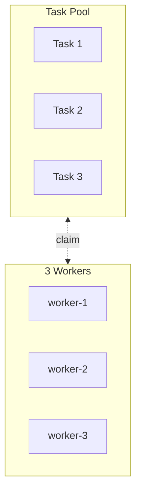
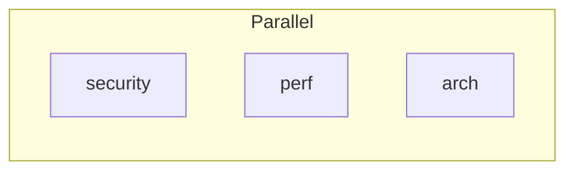
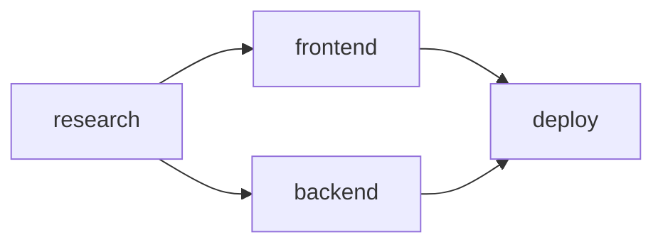

# Swarm Future Features

Components to implement after the Golden Path is complete.

**Source of truth:** `swarm-claude-code.md` (Claude Code v2.1.19)

---

## Phase 6: TaskPool + Swarm Pattern

### `<TaskPool>`

Independent tasks for self-organizing workers (no dependencies between tasks).

**Props:**
| Prop | Type | Maps to |
|------|------|---------|
| `title` | `string` | Section header |
| `tasks` | `{ task: TaskRef, description: string, activeForm?: string }[]` | `TaskCreate` calls |

**Usage:**
```tsx
const files = ['user.rb', 'payment.rb', 'api.rb'];
const fileTasks = files.map(f => defineTask(f.replace('.rb', ''), `Review ${f}`));

<TaskPool title="File Reviews" tasks={fileTasks.map((t, i) => ({
  task: t,
  description: `Review ${files[i]} for security and quality`,
  activeForm: `Reviewing ${files[i]}...`
}))} />
```

**Output:**
```markdown
### File Reviews

```javascript
TaskCreate({ subject: "Review user.rb", description: "Review user.rb for security and quality", activeForm: "Reviewing user.rb..." })
TaskCreate({ subject: "Review payment.rb", description: "Review payment.rb for security and quality", activeForm: "Reviewing payment.rb..." })
TaskCreate({ subject: "Review api.rb", description: "Review api.rb for security and quality", activeForm: "Reviewing api.rb..." })
```

| ID | Subject | Description |
|----|---------|-------------|
| 1 | Review user.rb | Review user.rb for security and quality |
| 2 | Review payment.rb | Review payment.rb for security and quality |
| 3 | Review api.rb | Review api.rb for security and quality |

> No dependencies - tasks can be claimed in any order
```

---

### `<Swarm>`

Self-organizing workers that claim from a TaskPool.

**Props:**
| Prop | Type | Maps to |
|------|------|---------|
| `team` | `TeamRef` | `Task.team_name` |
| `workerCount` | `number` | Number of `Task` calls |
| `workerType` | `AgentType` | `Task.subagent_type` |
| `description` | `string` | `Task.description` |
| `prompt` | `string` | `Task.prompt` |

**Usage:**
```tsx
<Swarm
  team={ReviewTeam}
  workerCount={3}
  workerType={AgentType.GeneralPurpose}
  description="Swarm worker"
  prompt={`You are a swarm worker. Your job:
1. Call TaskList() to see available tasks
2. Find a task with status 'pending' and no owner
3. Claim it: TaskUpdate({ taskId: "X", owner: "$CLAUDE_CODE_AGENT_NAME" })
4. Start it: TaskUpdate({ taskId: "X", status: "in_progress" })
5. Do the work
6. Complete it: TaskUpdate({ taskId: "X", status: "completed" })
7. Send findings to team-lead via Teammate write
8. Repeat until no tasks remain`}
/>
```

**Output:**
```markdown
### Worker Swarm



```javascript
Task({ team_name: "pr-review", name: "worker-1", subagent_type: "general-purpose", description: "Swarm worker", prompt: `...`, run_in_background: true })
Task({ team_name: "pr-review", name: "worker-2", subagent_type: "general-purpose", description: "Swarm worker", prompt: `...`, run_in_background: true })
Task({ team_name: "pr-review", name: "worker-3", subagent_type: "general-purpose", description: "Swarm worker", prompt: `...`, run_in_background: true })
```

> Workers race to claim tasks, naturally load-balance
```

---

## Phase 7: ParallelWorkers

Spawn multiple specialized workers simultaneously.

**Props:**
| Prop | Type | Maps to |
|------|------|---------|
| `team` | `TeamRef` | `Task.team_name` |
| `workers` | `{ worker: WorkerRef, description: string, prompt: string }[]` | Multiple `Task` calls |

**Usage:**
```tsx
<ParallelWorkers team={ReviewTeam} workers={[
  { worker: Security, description: "Security audit", prompt: "Review for vulnerabilities..." },
  { worker: Perf, description: "Performance check", prompt: "Review for performance..." },
  { worker: Arch, description: "Architecture review", prompt: "Review architecture..." }
]} />
```

**Output:**
```markdown
### Parallel Workers



```javascript
// Spawn in parallel (single message, multiple Task calls)
Task({ team_name: "pr-review", name: "security", subagent_type: "compound-engineering:review:security-sentinel", description: "Security audit", prompt: `Review for vulnerabilities...`, run_in_background: true })
Task({ team_name: "pr-review", name: "perf", subagent_type: "compound-engineering:review:performance-oracle", description: "Performance check", prompt: `Review for performance...`, run_in_background: true })
Task({ team_name: "pr-review", name: "arch", subagent_type: "compound-engineering:review:architecture-strategist", description: "Architecture review", prompt: `Review architecture...`, run_in_background: true })
```
```

---

## Phase 8: TeammateTool Operations

### `<Message>`

Agent-to-agent communication via inbox.

**Props:**
| Prop | Type | Maps to |
|------|------|---------|
| `from` | `WorkerRef \| string` | Sender name |
| `to` | `WorkerRef \| string` | `Teammate.target_agent_id` |
| `children` | `string` | `Teammate.value` |

**Usage:**
```tsx
<Message from={Security} to="team-lead">
  Found auth bypass in user.rb:42. Please check performance impact of the fix.
</Message>
```

**Output:**
```markdown
**Message** from `security` to `team-lead`:

```javascript
Teammate({
  operation: "write",
  target_agent_id: "team-lead",
  value: "Found auth bypass in user.rb:42. Please check performance impact of the fix."
})
```
```

---

### `<Broadcast>`

Message to ALL teammates (expensive - sends N messages).

**Props:**
| Prop | Type | Maps to |
|------|------|---------|
| `from` | `WorkerRef \| string` | `Teammate.name` |
| `children` | `string` | `Teammate.value` |

**Usage:**
```tsx
<Broadcast from="team-lead">
  Priority change: Focus on authentication module first.
</Broadcast>
```

**Output:**
```markdown
**Broadcast** from `team-lead`:

> **Warning:** Broadcasting sends N separate messages for N teammates. Prefer `write` for targeted communication.

```javascript
Teammate({
  operation: "broadcast",
  name: "team-lead",
  value: "Priority change: Focus on authentication module first."
})
```
```

---

### Plan Approval Operations (Runtime)

Operations for plan approval workflow. These are typically interactive/runtime.

| Operation | Component | Notes |
|-----------|-----------|-------|
| `approvePlan` | Runtime | Leader approves teammate plan |
| `rejectPlan` | Runtime | Leader rejects with feedback |

**Runtime usage (not TSX component):**
```javascript
// When teammate sends plan_approval_request
Teammate({ operation: "approvePlan", target_agent_id: "architect", request_id: "plan-123" })
Teammate({ operation: "rejectPlan", target_agent_id: "architect", request_id: "plan-123", feedback: "Add error handling" })
```

---

### Team Discovery Operations (Runtime)

Dynamic team formation operations. These are runtime-only, not compile-time.

| Operation | Component | Notes |
|-----------|-----------|-------|
| `discoverTeams` | Runtime | List available teams |
| `requestJoin` | Runtime | Request to join team |
| `approveJoin` | Runtime | Leader accepts join |
| `rejectJoin` | Runtime | Leader declines join |

---

### Teammate-Side Operations (Runtime)

Operations executed by teammates, not authored in commands.

| Operation | Component | Notes |
|-----------|-----------|-------|
| `approveShutdown` | Runtime | Teammate accepts shutdown |
| `rejectShutdown` | Runtime | Teammate declines shutdown |

---

## Phase 8.5: Task Lifecycle Operations

Runtime task operations for complex workflows where workers claim and update tasks.

### `<TaskClaim>`

Claim a task for a specific worker.

**Props:**
| Prop | Type | Maps to |
|------|------|---------|
| `task` | `TaskRef` | `TaskUpdate.taskId` |
| `worker` | `WorkerRef \| string` | `TaskUpdate.owner` |

**Usage:**
```tsx
<TaskClaim task={Research} worker={Researcher} />
```

**Output:**
```javascript
TaskUpdate({ taskId: "1", owner: "researcher" })
```

---

### `<TaskStart>`

Mark a task as in progress.

**Props:**
| Prop | Type | Maps to |
|------|------|---------|
| `task` | `TaskRef` | `TaskUpdate.taskId` |

**Usage:**
```tsx
<TaskStart task={Research} />
```

**Output:**
```javascript
TaskUpdate({ taskId: "1", status: "in_progress" })
```

---

### `<TaskComplete>`

Mark a task as completed.

**Props:**
| Prop | Type | Maps to |
|------|------|---------|
| `task` | `TaskRef` | `TaskUpdate.taskId` |

**Usage:**
```tsx
<TaskComplete task={Research} />
```

**Output:**
```javascript
TaskUpdate({ taskId: "1", status: "completed" })
```

---

### Runtime-Only Operations

These are query operations used during execution, not compile-time:

| Operation | Purpose | Notes |
|-----------|---------|-------|
| `TaskList()` | See all tasks | Runtime query |
| `TaskGet({ taskId })` | Get task details | Runtime query |

---

## Phase 9: Advanced Dependencies

### `createPipeline()` Builder

Fluent API for simple pipelines.

```tsx
const pipeline = createPipeline('OAuth')
  .task('research', 'Research providers')
  .task('plan', 'Create plan')
  .task('build', 'Implement')
  .task('test', 'Write tests')
  .build();

// Access tasks
pipeline.tasks.research  // TaskRef
pipeline.tasks.plan      // TaskRef
pipeline.all()           // TaskRef[] - all tasks
pipeline.first(2)        // TaskRef[] - first 2 tasks
pipeline.last(1)         // TaskRef[] - last task
```

---

### Dependency Combinators

```tsx
// Combine refs from different sources
const deps = combine(Task1, Task2, pool.first(2));

// All from multiple sources
const allDeps = allOf(
  frontendTasks.all(),
  backendTasks.all()
);

// At least N must complete (quorum)
const quorum = atLeast(2, [Task1, Task2, Task3]);
```

**Output for quorum:**
```javascript
// Quorum dependency - at least 2 of 3 must complete
// Implementation: poll TaskList until 2+ are completed
```

---

### Parallel Branches in Pipeline

```tsx
const Research = defineTask('research', 'Research');
const Frontend = defineTask('frontend', 'Frontend');
const Backend = defineTask('backend', 'Backend');
const Deploy = defineTask('deploy', 'Deploy');

<TaskPipeline title="Full Stack">
  <TaskDef task={Research} description="Requirements" />
  <TaskDef task={Frontend} description="Build UI" blockedBy={[Research]} />
  <TaskDef task={Backend} description="Build API" blockedBy={[Research]} />
  <TaskDef task={Deploy} description="Ship it" blockedBy={[Frontend, Backend]} />
</TaskPipeline>
```

**Output:**
```markdown


```javascript
TaskCreate({ subject: "Research", description: "Requirements" })
TaskCreate({ subject: "Frontend", description: "Build UI" })
TaskCreate({ subject: "Backend", description: "Build API" })
TaskCreate({ subject: "Deploy", description: "Ship it" })

TaskUpdate({ taskId: "2", addBlockedBy: ["1"] })
TaskUpdate({ taskId: "3", addBlockedBy: ["1"] })
TaskUpdate({ taskId: "4", addBlockedBy: ["2", "3"] })
```
```

---

## Phase 10: Workflow Factories

Pre-built workflow patterns that return fully-configured refs.

### `createReviewWorkflow()`

```tsx
const workflow = createReviewWorkflow({
  teamName: 'pr-123',
  files: ['user.rb', 'payment.rb'],
  reviewers: [
    PluginAgentType.SecuritySentinel,
    PluginAgentType.PerformanceOracle
  ]
});

// workflow.team      - TeamRef
// workflow.workers   - WorkerRef[]
// workflow.taskPool  - TaskRef[]
// workflow.shutdown  - WorkerRef[] (for ShutdownSequence)
```

### `createPipelineWorkflow()`

```tsx
const workflow = createPipelineWorkflow({
  teamName: 'feature-x',
  stages: [
    { name: 'research', subject: 'Research', type: AgentType.Explore },
    { name: 'plan', subject: 'Plan', type: AgentType.Plan },
    { name: 'build', subject: 'Build', type: AgentType.GeneralPurpose },
    { name: 'test', subject: 'Test', type: AgentType.GeneralPurpose }
  ]
});

// workflow.team     - TeamRef
// workflow.workers  - WorkerRef[]
// workflow.tasks    - TaskRef[]
// workflow.pipeline - { research, plan, build, test }
```

### `createSwarmWorkflow()`

```tsx
const workflow = createSwarmWorkflow({
  teamName: 'file-review',
  files: ['a.rb', 'b.rb', 'c.rb', 'd.rb'],
  workerCount: 3,
  workerType: AgentType.GeneralPurpose
});

// workflow.team     - TeamRef
// workflow.workers  - WorkerRef[]
// workflow.taskPool - TaskRef[]
```

---

## Phase 11: Documentation Components

Helper components for generating reference documentation within workflows.

### `<Callout>`

```tsx
<Callout type="warning">
  Broadcasting sends N messages for N teammates. Use write for targeted messages.
</Callout>
```

**Output:**
```markdown
> **Warning:** Broadcasting sends N messages for N teammates. Use write for targeted messages.
```

### `<CodeBlock>`

```tsx
<CodeBlock lang="javascript" title="Spawn worker">
  {`Task({ team_name: "...", name: "worker", ... })`}
</CodeBlock>
```

**Output:**
````markdown
**Spawn worker:**
```javascript
Task({ team_name: "...", name: "worker", ... })
```
````

### `<AgentTypeDef>`

Document available agent types.

```tsx
<AgentTypeDef
  name="Explore"
  subagentType="Explore"
  tools={['Read', 'Glob', 'Grep', 'LS', 'WebFetch', 'WebSearch']}
  model="haiku"
  bestFor={['Codebase exploration', 'File searches', 'Code understanding']}
/>
```

### `<BackendDef>`

Document spawn backends.

```tsx
<BackendDef
  type="tmux"
  description="Separate panes in tmux session"
  pros={['Visible output', 'Survives leader exit', 'Works in CI']}
  cons={['Requires tmux', 'Slower startup', 'More resources']}
/>
```

---

## Phase 12: Conditional & Iteration

### `<If>`

Conditional rendering.

```tsx
<If condition={isProduction}>
  <TaskDef task={Deploy} description="Deploy to production" />
</If>
```

### `mapToTasks()`

Transform array to tasks.

```tsx
const files = ['a.rb', 'b.rb', 'c.rb'];
const tasks = mapToTasks(files, file => ({
  name: file.replace('.rb', ''),
  subject: `Review ${file}`
}));

// tasks = [TaskRef, TaskRef, TaskRef]
```

### `mapToWorkers()`

Transform array to workers.

```tsx
const types = [
  { name: 'security', type: PluginAgentType.SecuritySentinel },
  { name: 'perf', type: PluginAgentType.PerformanceOracle }
];

const workers = mapToWorkers(types, ({ name, type }) => ({
  name,
  type
}));

// workers = [WorkerRef, WorkerRef]
```

### `batchTasks()` / `batchWorkers()`

Create multiple related items with a common prefix.

```tsx
const { tasks, refs } = batchTasks('review', [
  { suffix: 'security', subject: 'Security Review' },
  { suffix: 'perf', subject: 'Performance Review' },
  { suffix: 'arch', subject: 'Architecture Review' }
]);

// refs.security, refs.perf, refs.arch
```

---

## Summary

| Phase | Features | Priority |
|-------|----------|----------|
| 6 | `<TaskPool>`, `<Swarm>` | High |
| 7 | `<ParallelWorkers>` | High |
| 8 | `<Message>`, `<Broadcast>` | Medium |
| 9 | `createPipeline()`, dependency combinators | Medium |
| 10 | Workflow factories | Medium |
| 11 | Documentation components | Low |
| 12 | Conditional & iteration helpers | Low |

**Recommendation:** Implement phases 6-7 immediately after Golden Path. These unlock the full swarm pattern. Phases 8-12 can be added incrementally based on user feedback.

---

## API Mapping Reference (Future)

| TSX | Claude Code API |
|-----|-----------------|
| `<TaskPool tasks={...}>` | Multiple `TaskCreate` calls (no dependencies) |
| `<Swarm workerCount={3}>` | Multiple `Task` calls with swarm prompt |
| `<ParallelWorkers workers={...}>` | Multiple `Task` calls (parallel) |
| `<Message from={a} to={b}>` | `Teammate({ operation: "write", target_agent_id: b.name, value })` |
| `<Broadcast from={a}>` | `Teammate({ operation: "broadcast", name: a.name, value })` |
