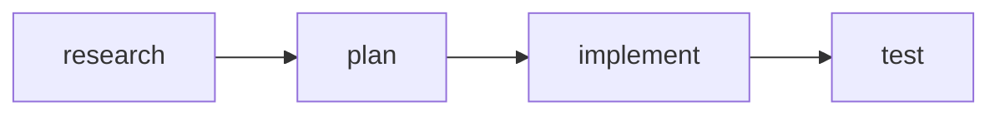
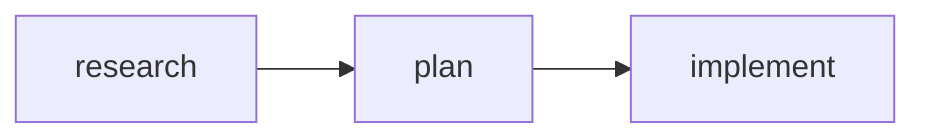

# Swarm Golden Path Implementation

Core components that deliver 80% of swarm authoring value.

**Source of truth:** `swarm-claude-code.md` (Claude Code v2.1.19)

---

## Phase 1: Type-Safe References

### `defineTask(subject, name?)`

```tsx
import { defineTask } from 'react-agentic/swarm';

// Simple usage (name derived from subject)
const Research = defineTask('Research best practices');
// Research.subject = "Research best practices"
// Research.name = "research-best-p" (auto-derived, truncated to 15 chars)

// Explicit name for cleaner mermaid labels
const Plan = defineTask('Create implementation plan', 'plan');
// Plan.subject = "Create implementation plan"
// Plan.name = "plan"

const Implement = defineTask('Build the feature', 'implement');
```

**TaskRef interface:**
```typescript
interface TaskRef {
  subject: string;           // Human-readable title (TaskCreate.subject)
  name: string;              // Short label for mermaid (derived if not provided)
  __id: string;              // UUID for cross-file identity (internal)
  readonly __isTaskRef: true; // Type guard marker
}
```

### `defineWorker(name, type, model?)`

```tsx
import { defineWorker, AgentType, PluginAgentType, Model } from 'react-agentic/swarm';

// Built-in types
const Explorer = defineWorker('explorer', AgentType.Explore, Model.Haiku);
const Planner = defineWorker('planner', AgentType.Plan);
const Builder = defineWorker('builder', AgentType.GeneralPurpose);

// Plugin types (compound-engineering)
const Security = defineWorker('security', PluginAgentType.SecuritySentinel);
const Perf = defineWorker('perf', PluginAgentType.PerformanceOracle);
```

**AgentType enum (built-in):**
| Value | Maps to `subagent_type` |
|-------|------------------------|
| `AgentType.Bash` | `"Bash"` |
| `AgentType.Explore` | `"Explore"` |
| `AgentType.Plan` | `"Plan"` |
| `AgentType.GeneralPurpose` | `"general-purpose"` |

**PluginAgentType enum (compound-engineering):**
| Value | Maps to `subagent_type` |
|-------|------------------------|
| `PluginAgentType.SecuritySentinel` | `"compound-engineering:review:security-sentinel"` |
| `PluginAgentType.PerformanceOracle` | `"compound-engineering:review:performance-oracle"` |
| `PluginAgentType.ArchitectureStrategist` | `"compound-engineering:review:architecture-strategist"` |
| `PluginAgentType.BestPracticesResearcher` | `"compound-engineering:research:best-practices-researcher"` |

**WorkerRef interface:**
```typescript
interface WorkerRef {
  name: string;
  type: string;
  model?: string;
  __id: string;               // UUID for identity (internal)
  readonly __isWorkerRef: true;
}
```

### `defineTeam(name, members?)`

```tsx
import { defineTeam } from 'react-agentic/swarm';

const ReviewTeam = defineTeam('pr-review', [Security, Perf]);

// ReviewTeam.name = "pr-review"
// ReviewTeam.members = [Security, Perf]
```

**TeamRef interface:**
```typescript
interface TeamRef {
  name: string;
  members?: WorkerRef[];
  __id: string;               // UUID for identity (internal)
  readonly __isTeamRef: true;
}
```

---

## Phase 2: TaskDef + TaskPipeline

### `<TaskDef>`

**Props:**
| Prop | Type | Required | Maps to |
|------|------|----------|---------|
| `task` | `TaskRef` | Yes | `subject` from defineTask |
| `description` | `string` | Yes | `TaskCreate.description` |
| `activeForm` | `string` | No | `TaskCreate.activeForm` |
| `blockedBy` | `TaskRef[]` | No | `TaskUpdate.addBlockedBy` |

**Usage:**
```tsx
const Research = defineTask('Research best practices', 'research');
const Plan = defineTask('Create implementation plan', 'plan');

<TaskDef
  task={Research}
  description="Research OAuth2 best practices and compare providers"
  activeForm="Researching OAuth..."
/>

<TaskDef
  task={Plan}
  description="Create implementation plan based on research findings"
  activeForm="Planning..."
  blockedBy={[Research]}
/>
```

**Output (batched format):**
```markdown
#### Task #1: Research best practices

#### Task #2: Create implementation plan

```javascript
// Create all tasks
TaskCreate({
  subject: "Research best practices",
  description: "Research OAuth2 best practices and compare providers",
  activeForm: "Researching OAuth..."
})
TaskCreate({
  subject: "Create implementation plan",
  description: "Create implementation plan based on research findings",
  activeForm: "Planning..."
})

// Set up dependencies
TaskUpdate({ taskId: "2", addBlockedBy: ["1"] })
```

**Blocked by:** #1 (Research best practices)
```

---

### `<TaskPipeline>`

**Props:**
| Prop | Type | Required | Description |
|------|------|----------|-------------|
| `title` | `string` | No | Pipeline title |
| `autoChain` | `boolean` | No | Auto-add `blockedBy` to each subsequent task (default: false) |
| `children` | `TaskDef[]` | Yes | Tasks in sequence |

**Usage:**
```tsx
const Research = defineTask('Research best practices', 'research');
const Plan = defineTask('Create implementation plan', 'plan');
const Implement = defineTask('Build the feature', 'implement');
const Test = defineTask('Write tests', 'test');

<TaskPipeline title="OAuth Implementation" autoChain>
  <TaskDef task={Research} description="Research OAuth2 providers" activeForm="Researching..." />
  <TaskDef task={Plan} description="Design implementation approach" activeForm="Planning..." />
  <TaskDef task={Implement} description="Build OAuth2 integration" activeForm="Implementing..." />
  <TaskDef task={Test} description="Write and run tests" activeForm="Testing..." />
</TaskPipeline>
```

**Output (edge-per-line mermaid, batched code):**
```markdown
### OAuth Implementation



```javascript
// Create all tasks
TaskCreate({ subject: "Research best practices", description: "Research OAuth2 providers", activeForm: "Researching..." })
TaskCreate({ subject: "Create implementation plan", description: "Design implementation approach", activeForm: "Planning..." })
TaskCreate({ subject: "Build the feature", description: "Build OAuth2 integration", activeForm: "Implementing..." })
TaskCreate({ subject: "Write tests", description: "Write and run tests", activeForm: "Testing..." })

// Set up dependencies (autoChain)
TaskUpdate({ taskId: "2", addBlockedBy: ["1"] })
TaskUpdate({ taskId: "3", addBlockedBy: ["2"] })
TaskUpdate({ taskId: "4", addBlockedBy: ["3"] })
```

| ID | Subject | Blocked By |
|----|---------|------------|
| 1 | Research best practices | - |
| 2 | Create implementation plan | #1 |
| 3 | Build the feature | #2 |
| 4 | Write tests | #3 |
```

---

### `createPipeline()` Builder

Convenience builder for sequential pipelines.

**Usage:**
```tsx
import { createPipeline, TaskPipeline, TaskDef } from 'react-agentic/swarm';

const pipeline = createPipeline('OAuth Implementation')
  .task('Research OAuth providers', 'research')
  .task('Create implementation plan', 'plan')
  .task('Build OAuth endpoints', 'implement')
  .build();

// Access individual task refs
const { research, plan, implement } = pipeline.tasks;

// Use in JSX
<TaskPipeline title={pipeline.title}>
  {pipeline.stages.map(stage => (
    <TaskDef
      key={stage.task.__id}
      task={stage.task}
      description={stage.description ?? ''}
      blockedBy={stage.blockedBy}
    />
  ))}
</TaskPipeline>
```

**Builder interface:**
```typescript
interface PipelineBuilder {
  task(subject: string, name?: string, description?: string): PipelineBuilder;
  build(): Pipeline;
}

interface Pipeline {
  title: string;
  tasks: Record<string, TaskRef>;  // Keyed by name
  stages: PipelineStage[];
}

interface PipelineStage {
  task: TaskRef;
  description?: string;
  blockedBy: TaskRef[];  // Auto-set to previous task
}
```

---

## Phase 3: Team + Teammate

### `<Team>`

**Props:**
| Prop | Type | Required | Maps to |
|------|------|----------|---------|
| `team` | `TeamRef` | Yes | `Teammate.team_name` |
| `description` | `string` | No | `Teammate.description` |
| `children` | `Teammate[]` | Yes | Team members |

**Usage:**
```tsx
<Team team={ReviewTeam} description="Code review specialists">
  <Teammate worker={Security} ... />
  <Teammate worker={Perf} ... />
</Team>
```

**Output:**
```markdown
## Team: pr-review

> Code review specialists

```javascript
Teammate({ operation: "spawnTeam", team_name: "pr-review", description: "Code review specialists" })
```

### Members

{children}
```

---

### `<Teammate>`

**Props:**
| Prop | Type | Required | Maps to |
|------|------|----------|---------|
| `worker` | `WorkerRef` | Yes | `Task.name` + `Task.subagent_type` |
| `description` | `string` | Yes | `Task.description` |
| `prompt` | `string` | Yes | `Task.prompt` |
| `model` | `Model` | No | `Task.model` |
| `background` | `boolean` | No | `Task.run_in_background` (default: true) |

**Usage:**
```tsx
<Teammate
  worker={Security}
  description="Security audit"
  prompt={`Review for security vulnerabilities.

Focus on:
- SQL injection
- XSS
- Auth bypass

Send findings to team-lead via:
Teammate({ operation: "write", target_agent_id: "team-lead", value: "..." })`}
/>
```

**Output:**
```markdown
#### security

```javascript
Task({
  team_name: "pr-review",
  name: "security",
  subagent_type: "compound-engineering:review:security-sentinel",
  description: "Security audit",
  prompt: `Review for security vulnerabilities.

Focus on:
- SQL injection
- XSS
- Auth bypass

Send findings to team-lead via:
Teammate({ operation: "write", target_agent_id: "team-lead", value: "..." })`,
  run_in_background: true
})
```
```

**With model:**
```tsx
<Teammate
  worker={Explorer}
  description="Find auth files"
  prompt="Find all authentication-related files"
  model={Model.Haiku}
/>
```

**Output:**
```javascript
Task({
  team_name: "pr-review",
  name: "explorer",
  subagent_type: "Explore",
  description: "Find auth files",
  prompt: `Find all authentication-related files`,
  model: "haiku",
  run_in_background: true
})
```

---

## Phase 4: ShutdownSequence

### `<ShutdownSequence>`

**Props:**
| Prop | Type | Required | Maps to |
|------|------|----------|---------|
| `workers` | `WorkerRef[]` | Yes | `Teammate.target_agent_id` |
| `reason` | `string` | No | `Teammate.reason` |

**Usage:**
```tsx
<ShutdownSequence
  workers={[Security, Perf]}
  reason="All reviews complete"
/>
```

**Output:**
```markdown
## Shutdown

```javascript
// 1. Request shutdown for all workers
Teammate({ operation: "requestShutdown", target_agent_id: "security", reason: "All reviews complete" })
Teammate({ operation: "requestShutdown", target_agent_id: "perf", reason: "All reviews complete" })

// 2. Wait for shutdown_approved messages
// Check ~/.claude/teams/{team}/inboxes/team-lead.json for:
// {"type": "shutdown_approved", "from": "security", ...}
// {"type": "shutdown_approved", "from": "perf", ...}

// 3. Cleanup team resources
Teammate({ operation: "cleanup" })
```
```

---

## Phase 5: Workflow

### `<Workflow>`

**Props:**
| Prop | Type | Required | Description |
|------|------|----------|-------------|
| `name` | `string` | Yes | Workflow name |
| `team` | `TeamRef` | Yes | Primary team |
| `description` | `string` | No | Workflow description |
| `children` | `ReactNode` | Yes | Team, Pipeline, Shutdown |

**Usage:**
```tsx
const Research = defineTask('Research', 'research');
const Plan = defineTask('Plan', 'plan');
const Implement = defineTask('Implement', 'implement');

const Security = defineWorker('security', PluginAgentType.SecuritySentinel);
const Perf = defineWorker('perf', PluginAgentType.PerformanceOracle);
const ReviewTeam = defineTeam('feature-x', [Security, Perf]);

<Workflow name="Feature X" team={ReviewTeam} description="Build feature with review">
  <Team team={ReviewTeam} description="Feature X team">
    <Teammate
      worker={Security}
      description="Security review"
      prompt="Review implementation for security vulnerabilities. Send findings to team-lead."
    />
    <Teammate
      worker={Perf}
      description="Performance review"
      prompt="Review implementation for performance issues. Send findings to team-lead."
    />
  </Team>

  <TaskPipeline title="Implementation" autoChain>
    <TaskDef task={Research} description="Research approach" activeForm="Researching..." />
    <TaskDef task={Plan} description="Create plan" activeForm="Planning..." />
    <TaskDef task={Implement} description="Build feature" activeForm="Building..." />
  </TaskPipeline>

  <ShutdownSequence workers={[Security, Perf]} reason="Feature complete" />
</Workflow>
```

**Output:**
```markdown
# Workflow: Feature X

> Build feature with review

---

## Team: feature-x

> Feature X team

```javascript
Teammate({ operation: "spawnTeam", team_name: "feature-x", description: "Feature X team" })
```

### Members

#### security

```javascript
Task({
  team_name: "feature-x",
  name: "security",
  subagent_type: "compound-engineering:review:security-sentinel",
  description: "Security review",
  prompt: `Review implementation for security vulnerabilities. Send findings to team-lead.`,
  run_in_background: true
})
```

#### perf

```javascript
Task({
  team_name: "feature-x",
  name: "perf",
  subagent_type: "compound-engineering:review:performance-oracle",
  description: "Performance review",
  prompt: `Review implementation for performance issues. Send findings to team-lead.`,
  run_in_background: true
})
```

---

### Implementation



```javascript
// Create all tasks
TaskCreate({ subject: "Research", description: "Research approach", activeForm: "Researching..." })
TaskCreate({ subject: "Plan", description: "Create plan", activeForm: "Planning..." })
TaskCreate({ subject: "Implement", description: "Build feature", activeForm: "Building..." })

// Set up dependencies
TaskUpdate({ taskId: "2", addBlockedBy: ["1"] })
TaskUpdate({ taskId: "3", addBlockedBy: ["2"] })
```

---

## Shutdown

```javascript
Teammate({ operation: "requestShutdown", target_agent_id: "security", reason: "Feature complete" })
Teammate({ operation: "requestShutdown", target_agent_id: "perf", reason: "Feature complete" })

// Wait for shutdown_approved messages...

Teammate({ operation: "cleanup" })
```
```

---

## Complete Example

```tsx
import {
  // Refs
  defineTask,
  defineWorker,
  defineTeam,

  // Enums
  AgentType,
  PluginAgentType,
  Model,

  // Components
  Workflow,
  Team,
  Teammate,
  TaskPipeline,
  TaskDef,
  ShutdownSequence
} from 'react-agentic/swarm';

// Define task refs with explicit names for clean mermaid labels
const Research = defineTask('Research OAuth providers', 'research');
const Plan = defineTask('Create implementation plan', 'plan');
const Implement = defineTask('Implement OAuth', 'implement');
const Test = defineTask('Write tests', 'test');

// Define worker refs
const Researcher = defineWorker('researcher', PluginAgentType.BestPracticesResearcher);
const Planner = defineWorker('planner', AgentType.Plan);
const Builder = defineWorker('builder', AgentType.GeneralPurpose);
const Tester = defineWorker('tester', AgentType.GeneralPurpose);

// Define team
const DevTeam = defineTeam('oauth-feature', [Researcher, Planner, Builder, Tester]);

// Compose workflow
export const OAuthWorkflow = () => (
  <Workflow name="OAuth Implementation" team={DevTeam} description="Implementing OAuth2 authentication">
    <Team team={DevTeam} description="OAuth development team">
      <Teammate
        worker={Researcher}
        description="Research OAuth providers"
        prompt="Research OAuth2 providers and best practices. Send summary to team-lead."
      />
      <Teammate
        worker={Planner}
        description="Create implementation plan"
        prompt="Wait for research. Create detailed implementation plan. Send to team-lead."
      />
      <Teammate
        worker={Builder}
        description="Implement OAuth"
        prompt="Wait for plan. Implement OAuth2 authentication. Notify team-lead when done."
      />
      <Teammate
        worker={Tester}
        description="Write tests"
        prompt="Wait for implementation. Write comprehensive tests. Report results to team-lead."
      />
    </Team>

    <TaskPipeline title="OAuth Pipeline" autoChain>
      <TaskDef task={Research} description="Research OAuth2 providers and best practices" activeForm="Researching..." />
      <TaskDef task={Plan} description="Design implementation approach" activeForm="Planning..." />
      <TaskDef task={Implement} description="Build OAuth2 integration" activeForm="Building..." />
      <TaskDef task={Test} description="Write and run tests" activeForm="Testing..." />
    </TaskPipeline>

    <ShutdownSequence workers={[Researcher, Planner, Builder, Tester]} reason="OAuth implementation complete" />
  </Workflow>
);
```

---

## API Mapping Reference

| TSX | Claude Code API |
|-----|-----------------|
| `<Team team={ref}>` | `Teammate({ operation: "spawnTeam", team_name: ref.name })` |
| `<Teammate worker={ref} prompt={...}>` | `Task({ team_name, name: ref.name, subagent_type: ref.type, prompt, run_in_background: true })` |
| `<TaskDef task={ref} description={...}>` | `TaskCreate({ subject: ref.subject, description })` |
| `blockedBy={[ref1, ref2]}` | `TaskUpdate({ taskId, addBlockedBy: ["1", "2"] })` (IDs resolved via `__id` at emit time) |
| `<ShutdownSequence workers={[...]}>` | `Teammate({ operation: "requestShutdown", target_agent_id })` then `Teammate({ operation: "cleanup" })` |

---

## Summary

| Phase | Components | Emits |
|-------|------------|-------|
| 1 | `defineTask`, `defineWorker`, `defineTeam` | (refs only) |
| 2 | `<TaskDef>`, `<TaskPipeline>`, `createPipeline()` | `TaskCreate`, `TaskUpdate` |
| 3 | `<Team>`, `<Teammate>` | `Teammate(spawnTeam)`, `Task` |
| 4 | `<ShutdownSequence>` | `Teammate(requestShutdown)`, `Teammate(cleanup)` |
| 5 | `<Workflow>` | Full orchestration |

**Total: 5 components + 4 factory functions**
