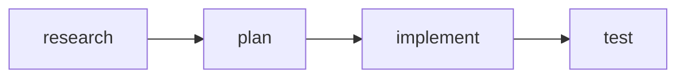
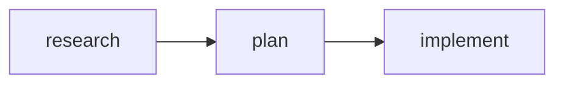

# Swarm Golden Path Implementation

Core components that deliver 80% of swarm authoring value.

**Source of truth:** `swarm-claude-code.md` (Claude Code v2.1.19)

---

## Phase 1: Type-Safe References

### `defineTask(subject, name?)`

```tsx
import { defineTask } from 'react-agentic/swarm';

// Simple usage (name derived from subject)
const Research = defineTask('Research best practices');
// Research.subject = "Research best practices"
// Research.name = "research-best-p" (auto-derived, truncated to 15 chars)

// Explicit name for cleaner mermaid labels
const Plan = defineTask('Create implementation plan', 'plan');
// Plan.subject = "Create implementation plan"
// Plan.name = "plan"

const Implement = defineTask('Build the feature', 'implement');
```

**TaskRef interface:**
```typescript
interface TaskRef {
  subject: string;           // Human-readable title (TaskCreate.subject)
  name: string;              // Short label for mermaid (derived if not provided)
  __id: string;              // UUID for cross-file identity (internal)
  readonly __isTaskRef: true; // Type guard marker
}
```

### `defineWorker(name, type, model?)`

```tsx
import { defineWorker, AgentType, PluginAgentType, Model } from 'react-agentic/swarm';

// Built-in types
const Explorer = defineWorker('explorer', AgentType.Explore, Model.Haiku);
const Planner = defineWorker('planner', AgentType.Plan);
const Builder = defineWorker('builder', AgentType.GeneralPurpose);

// Plugin types (compound-engineering)
const Security = defineWorker('security', PluginAgentType.SecuritySentinel);
const Perf = defineWorker('perf', PluginAgentType.PerformanceOracle);

// Imported Agent as type (cross-file resolution)
import CodeReviewer from './agents/code-reviewer';   // default import
import { SecurityAgent } from './agents/security';    // named import

const Reviewer = defineWorker('reviewer', CodeReviewer);     // resolves Agent name from file
const SecReview = defineWorker('sec-review', SecurityAgent);  // works with named imports too
```

**AgentType enum (built-in):**
| Value | Maps to `subagent_type` |
|-------|------------------------|
| `AgentType.Bash` | `"Bash"` |
| `AgentType.Explore` | `"Explore"` |
| `AgentType.Plan` | `"Plan"` |
| `AgentType.GeneralPurpose` | `"general-purpose"` |

**PluginAgentType enum (compound-engineering):**
| Value | Maps to `subagent_type` |
|-------|------------------------|
| `PluginAgentType.SecuritySentinel` | `"compound-engineering:review:security-sentinel"` |
| `PluginAgentType.PerformanceOracle` | `"compound-engineering:review:performance-oracle"` |
| `PluginAgentType.ArchitectureStrategist` | `"compound-engineering:review:architecture-strategist"` |
| `PluginAgentType.BestPracticesResearcher` | `"compound-engineering:research:best-practices-researcher"` |

**WorkerRef interface:**
```typescript
interface WorkerRef {
  name: string;
  type: string;
  model?: string;
  __id: string;               // UUID for identity (internal)
  readonly __isWorkerRef: true;
}
```

### `defineTeam(name, members?)`

```tsx
import { defineTeam } from 'react-agentic/swarm';

const ReviewTeam = defineTeam('pr-review', [Security, Perf]);

// ReviewTeam.name = "pr-review"
// ReviewTeam.members = [Security, Perf]
```

**TeamRef interface:**
```typescript
interface TeamRef {
  name: string;
  members?: WorkerRef[];
  __id: string;               // UUID for identity (internal)
  readonly __isTeamRef: true;
}
```

---

## Phase 2: TaskDef + TaskPipeline

### `<TaskDef>`

**Props:**
| Prop | Type | Required | Maps to |
|------|------|----------|---------|
| `task` | `TaskRef` | Yes | `subject` from defineTask |
| `prompt` | `string` | Yes | `TaskCreate.prompt` |
| `activeForm` | `string` | No | `TaskCreate.activeForm` |
| `blockedBy` | `TaskRef[]` | No | `TaskUpdate.addBlockedBy` |

**Usage:**
```tsx
const Research = defineTask('Research best practices', 'research');
const Plan = defineTask('Create implementation plan', 'plan');

<TaskDef
  task={Research}
  prompt="Research OAuth2 best practices and compare providers"
  activeForm="Researching OAuth..."
/>

<TaskDef
  task={Plan}
  prompt="Create implementation plan based on research findings"
  activeForm="Planning..."
  blockedBy={[Research]}
/>
```

**Output (batched format):**
```markdown
#### Task #1: Research best practices

#### Task #2: Create implementation plan

```javascript
// Create all tasks
TaskCreate({
  subject: "Research best practices",
  description: "Research OAuth2 best practices and compare providers",
  activeForm: "Researching OAuth..."
})
TaskCreate({
  subject: "Create implementation plan",
  description: "Create implementation plan based on research findings",
  activeForm: "Planning..."
})

// Set up dependencies
TaskUpdate({ taskId: "2", addBlockedBy: ["1"] })
```

**Blocked by:** #1 (Research best practices)
```

---

### `<TaskPipeline>`

**Props:**
| Prop | Type | Required | Description |
|------|------|----------|-------------|
| `title` | `string` | No | Pipeline title |
| `autoChain` | `boolean` | No | Auto-add `blockedBy` to each subsequent task (default: false) |
| `children` | `TaskDef[]` | Yes | Tasks in sequence |

**Usage:**
```tsx
const Research = defineTask('Research best practices', 'research');
const Plan = defineTask('Create implementation plan', 'plan');
const Implement = defineTask('Build the feature', 'implement');
const Test = defineTask('Write tests', 'test');

<TaskPipeline title="OAuth Implementation" autoChain>
  <TaskDef task={Research} prompt="Research OAuth2 providers" activeForm="Researching..." />
  <TaskDef task={Plan} prompt="Design implementation approach" activeForm="Planning..." />
  <TaskDef task={Implement} prompt="Build OAuth2 integration" activeForm="Implementing..." />
  <TaskDef task={Test} prompt="Write and run tests" activeForm="Testing..." />
</TaskPipeline>
```

**Output (edge-per-line mermaid, batched code):**
```markdown
### OAuth Implementation



```javascript
// Create all tasks
TaskCreate({ subject: "Research best practices", description: "Research OAuth2 providers", activeForm: "Researching..." })
TaskCreate({ subject: "Create implementation plan", description: "Design implementation approach", activeForm: "Planning..." })
TaskCreate({ subject: "Build the feature", description: "Build OAuth2 integration", activeForm: "Implementing..." })
TaskCreate({ subject: "Write tests", description: "Write and run tests", activeForm: "Testing..." })

// Set up dependencies (autoChain)
TaskUpdate({ taskId: "2", addBlockedBy: ["1"] })
TaskUpdate({ taskId: "3", addBlockedBy: ["2"] })
TaskUpdate({ taskId: "4", addBlockedBy: ["3"] })
```

| ID | Subject | Blocked By |
|----|---------|------------|
| 1 | Research best practices | - |
| 2 | Create implementation plan | #1 |
| 3 | Build the feature | #2 |
| 4 | Write tests | #3 |
```

---

### `createPipeline()` Builder

Convenience builder for sequential pipelines.

**Usage:**
```tsx
import { createPipeline, TaskPipeline, TaskDef } from 'react-agentic/swarm';

const pipeline = createPipeline('OAuth Implementation')
  .task('Research OAuth providers', 'research')
  .task('Create implementation plan', 'plan')
  .task('Build OAuth endpoints', 'implement')
  .build();

// Access individual task refs
const { research, plan, implement } = pipeline.tasks;

// Use in JSX
<TaskPipeline title={pipeline.title}>
  {pipeline.stages.map(stage => (
    <TaskDef
      key={stage.task.__id}
      task={stage.task}
      prompt={stage.prompt ?? ''}
      blockedBy={stage.blockedBy}
    />
  ))}
</TaskPipeline>
```

**Builder interface:**
```typescript
interface PipelineBuilder {
  task(subject: string, name?: string, prompt?: string): PipelineBuilder;
  build(): Pipeline;
}

interface Pipeline {
  title: string;
  tasks: Record<string, TaskRef>;  // Keyed by name
  stages: PipelineStage[];
}

interface PipelineStage {
  task: TaskRef;
  prompt?: string;
  blockedBy: TaskRef[];  // Auto-set to previous task
}
```

---

## Phase 3: Team + Teammate

### `<Team>`

**Props:**
| Prop | Type | Required | Maps to |
|------|------|----------|---------|
| `team` | `TeamRef` | Yes | `Teammate.team_name` |
| `description` | `string` | No | `Teammate.description` |
| `children` | `Teammate[]` | Yes | Team members |

**Usage:**
```tsx
<Team team={ReviewTeam} description="Code review specialists">
  <Teammate worker={Security} ... />
  <Teammate worker={Perf} ... />
</Team>
```

**Output:**
```markdown
## Team: pr-review

> Code review specialists

```javascript
Teammate({ operation: "spawnTeam", team_name: "pr-review", description: "Code review specialists" })
```

### Members

{children}
```

---

### `<Teammate>`

**Props:**
| Prop | Type | Required | Maps to |
|------|------|----------|---------|
| `worker` | `WorkerRef` | Yes | `Task.name` + `Task.subagent_type` |
| `description` | `string` | Yes | `Task.description` |
| `prompt` | `string` | No* | `Task.prompt` |
| `model` | `Model` | No | `Task.model` |
| `background` | `boolean` | No | `Task.run_in_background` (default: true) |
| `children` | `<Prompt>` | No* | `Task.prompt` (takes precedence over prop) |

*Either `prompt` prop OR `<Prompt>` child required. Child takes precedence.

**Usage (prompt prop - for short prompts):**
```tsx
<Teammate
  worker={Security}
  description="Quick security check"
  prompt="Check for XSS vulnerabilities"
/>
```

**Usage (<Prompt> child - for structured prompts with full JSX):**
```tsx
<Teammate worker={Security} description="Security audit">
  <Prompt>
    <h2>Security Review Task</h2>

    <XmlBlock name="focus_areas">
      <ul>
        <li>SQL injection</li>
        <li>XSS attacks</li>
        <li>Auth bypass</li>
      </ul>
    </XmlBlock>

    <p>Send findings to team-lead via:</p>
    <pre><code>
    Teammate(&#123; operation: "write", target_agent_id: "team-lead", value: "..." &#125;)
    </code></pre>
  </Prompt>
</Teammate>
```

**Usage (template literal - for multi-line string prompts):**
```tsx
<Teammate
  worker={Security}
  description="Security audit"
  prompt={`Review for security vulnerabilities.

Focus on:
- SQL injection
- XSS
- Auth bypass

Send findings to team-lead via:
Teammate({ operation: "write", target_agent_id: "team-lead", value: "..." })`}
/>
```

**Output:**
```markdown
#### security

```javascript
Task({
  team_name: "pr-review",
  name: "security",
  subagent_type: "compound-engineering:review:security-sentinel",
  description: "Security audit",
  prompt: `Review for security vulnerabilities.

Focus on:
- SQL injection
- XSS
- Auth bypass

Send findings to team-lead via:
Teammate({ operation: "write", target_agent_id: "team-lead", value: "..." })`,
  run_in_background: true
})
```
```

**With model:**
```tsx
<Teammate
  worker={Explorer}
  description="Find auth files"
  prompt="Find all authentication-related files"
  model={Model.Haiku}
/>
```

**Output:**
```javascript
Task({
  team_name: "pr-review",
  name: "explorer",
  subagent_type: "Explore",
  description: "Find auth files",
  prompt: `Find all authentication-related files`,
  model: "haiku",
  run_in_background: true
})
```

---

## Phase 4: ShutdownSequence

### `<ShutdownSequence>`

**Props:**
| Prop | Type | Required | Default | Maps to |
|------|------|----------|---------|---------|
| `workers` | `WorkerRef[]` | Yes | — | `Teammate.target_agent_id` |
| `reason` | `string` | No | `"Shutdown requested"` | `Teammate.reason` |
| `cleanup` | `boolean` | No | `true` | Include `Teammate({ operation: "cleanup" })` |
| `team` | `TeamRef` | No | `{team}` placeholder | Team name in inbox path |
| `title` | `string` | No | `"Shutdown"` | Section heading text |

**Usage:**
```tsx
// Basic usage
<ShutdownSequence
  workers={[Security, Perf]}
  reason="All reviews complete"
/>

// With explicit team (for standalone commands)
<ShutdownSequence
  workers={[Security, Perf]}
  team={ReviewTeam}
  reason="All reviews complete"
/>

// Partial shutdown (keep team alive for next phase)
<ShutdownSequence
  workers={[Security]}
  reason="Phase 1 done"
  cleanup={false}
/>

// Custom title
<ShutdownSequence
  workers={[Security, Perf]}
  title="Cleanup Reviewers"
  reason="All reviews complete"
/>
```

**Output (basic usage):**
```markdown
## Shutdown

```javascript
// 1. Request shutdown for all workers
Teammate({ operation: "requestShutdown", target_agent_id: "security", reason: "All reviews complete" })
Teammate({ operation: "requestShutdown", target_agent_id: "perf", reason: "All reviews complete" })

// 2. Wait for shutdown_approved messages
// Check ~/.claude/teams/{team}/inboxes/team-lead.json for:
// {"type": "shutdown_approved", "from": "security", ...}
// {"type": "shutdown_approved", "from": "perf", ...}

// 3. Cleanup team resources
Teammate({ operation: "cleanup" })
```
```

**Output (with `cleanup={false}`):**
```markdown
## Shutdown

```javascript
// 1. Request shutdown for all workers
Teammate({ operation: "requestShutdown", target_agent_id: "security", reason: "Phase 1 done" })

// 2. Wait for shutdown_approved messages
// Check ~/.claude/teams/{team}/inboxes/team-lead.json for:
// {"type": "shutdown_approved", "from": "security", ...}
```
```

---

## Phase 5: Workflow

### `<Workflow>`

**Props:**
| Prop | Type | Required | Description |
|------|------|----------|-------------|
| `name` | `string` | Yes | Workflow name |
| `team` | `TeamRef` | Yes | Primary team (must match first Team child) |
| `description` | `string` | No | Workflow description |
| `children` | `ReactNode` | Yes | Team, Pipeline, Shutdown |

**Validations:**
- `team` prop must match first `<Team>` child's team prop
- Only one `<Team>` child allowed per Workflow
- For multiple teams, use separate Workflows

**Usage:**
```tsx
const Research = defineTask('Research', 'research');
const Plan = defineTask('Plan', 'plan');
const Implement = defineTask('Implement', 'implement');

const Security = defineWorker('security', PluginAgentType.SecuritySentinel);
const Perf = defineWorker('perf', PluginAgentType.PerformanceOracle);
const ReviewTeam = defineTeam('feature-x', [Security, Perf]);

<Workflow name="Feature X" team={ReviewTeam} description="Build feature with review">
  <Team team={ReviewTeam} description="Feature X team">
    <Teammate
      worker={Security}
      description="Security review"
      prompt="Review implementation for security vulnerabilities. Send findings to team-lead."
    />
    <Teammate
      worker={Perf}
      description="Performance review"
      prompt="Review implementation for performance issues. Send findings to team-lead."
    />
  </Team>

  <TaskPipeline title="Implementation" autoChain>
    <TaskDef task={Research} prompt="Research approach" activeForm="Researching..." />
    <TaskDef task={Plan} prompt="Create plan" activeForm="Planning..." />
    <TaskDef task={Implement} prompt="Build feature" activeForm="Building..." />
  </TaskPipeline>

  <ShutdownSequence workers={[Security, Perf]} reason="Feature complete" />
</Workflow>
```

**Output:**
```markdown
## Workflow: Feature X

> Build feature with review

---

### Team: feature-x

> Feature X team

```javascript
Teammate({ operation: "spawnTeam", team_name: "feature-x", description: "Feature X team" })
```

#### Members

##### security

```javascript
Task({
  team_name: "feature-x",
  name: "security",
  subagent_type: "compound-engineering:review:security-sentinel",
  description: "Security review",
  prompt: `Review implementation for security vulnerabilities. Send findings to team-lead.`,
  run_in_background: true
})
```

##### perf

```javascript
Task({
  team_name: "feature-x",
  name: "perf",
  subagent_type: "compound-engineering:review:performance-oracle",
  description: "Performance review",
  prompt: `Review implementation for performance issues. Send findings to team-lead.`,
  run_in_background: true
})
```

---

### Implementation



```javascript
// Create all tasks
TaskCreate({ subject: "Research", description: "Research approach", activeForm: "Researching..." })
TaskCreate({ subject: "Plan", description: "Create plan", activeForm: "Planning..." })
TaskCreate({ subject: "Implement", description: "Build feature", activeForm: "Building..." })

// Set up dependencies
TaskUpdate({ taskId: "2", addBlockedBy: ["1"] })
TaskUpdate({ taskId: "3", addBlockedBy: ["2"] })
```

---

### Shutdown

```javascript
Teammate({ operation: "requestShutdown", target_agent_id: "security", reason: "Feature complete" })
Teammate({ operation: "requestShutdown", target_agent_id: "perf", reason: "Feature complete" })

// Wait for shutdown_approved messages...

Teammate({ operation: "cleanup" })
```
```

**Heading Levels:**
- Workflow uses h2 (allows multiple workflows in one document)
- Children (Team, TaskPipeline, ShutdownSequence) use h3
- Sub-sections use h4+

**Context Propagation:**
- `ShutdownSequence` automatically inherits team from Workflow
- Explicit `team` prop on ShutdownSequence overrides inherited team

---

## Complete Example

```tsx
import {
  // Refs
  defineTask,
  defineWorker,
  defineTeam,

  // Enums
  AgentType,
  PluginAgentType,
  Model,

  // Components
  Workflow,
  Team,
  Teammate,
  TaskPipeline,
  TaskDef,
  ShutdownSequence
} from 'react-agentic/swarm';

// Define task refs with explicit names for clean mermaid labels
const Research = defineTask('Research OAuth providers', 'research');
const Plan = defineTask('Create implementation plan', 'plan');
const Implement = defineTask('Implement OAuth', 'implement');
const Test = defineTask('Write tests', 'test');

// Define worker refs
const Researcher = defineWorker('researcher', PluginAgentType.BestPracticesResearcher);
const Planner = defineWorker('planner', AgentType.Plan);
const Builder = defineWorker('builder', AgentType.GeneralPurpose);
const Tester = defineWorker('tester', AgentType.GeneralPurpose);

// Define team
const DevTeam = defineTeam('oauth-feature', [Researcher, Planner, Builder, Tester]);

// Compose workflow
export const OAuthWorkflow = () => (
  <Workflow name="OAuth Implementation" team={DevTeam} description="Implementing OAuth2 authentication">
    <Team team={DevTeam} description="OAuth development team">
      <Teammate
        worker={Researcher}
        description="Research OAuth providers"
        prompt="Research OAuth2 providers and best practices. Send summary to team-lead."
      />
      <Teammate
        worker={Planner}
        description="Create implementation plan"
        prompt="Wait for research. Create detailed implementation plan. Send to team-lead."
      />
      <Teammate
        worker={Builder}
        description="Implement OAuth"
        prompt="Wait for plan. Implement OAuth2 authentication. Notify team-lead when done."
      />
      <Teammate
        worker={Tester}
        description="Write tests"
        prompt="Wait for implementation. Write comprehensive tests. Report results to team-lead."
      />
    </Team>

    <TaskPipeline title="OAuth Pipeline" autoChain>
      <TaskDef task={Research} prompt="Research OAuth2 providers and best practices" activeForm="Researching..." />
      <TaskDef task={Plan} prompt="Design implementation approach" activeForm="Planning..." />
      <TaskDef task={Implement} prompt="Build OAuth2 integration" activeForm="Building..." />
      <TaskDef task={Test} prompt="Write and run tests" activeForm="Testing..." />
    </TaskPipeline>

    <ShutdownSequence workers={[Researcher, Planner, Builder, Tester]} reason="OAuth implementation complete" />
  </Workflow>
);
```

---

## Phase 6: Documentation + Examples

### Goal

Complete user-facing documentation and real-world examples for the swarm system.

### Documentation: `docs/swarm.md`

Create comprehensive documentation covering:

```markdown
# Swarm System

Type-safe task orchestration for Claude Code's swarm capabilities.

## Quick Start

\`\`\`tsx
import { defineTask, TaskDef, TaskPipeline } from 'react-agentic';

const Research = defineTask('Research best practices', 'research');
const Plan = defineTask('Create implementation plan', 'plan');
const Implement = defineTask('Build the feature', 'implement');

export default () => (
  <Command name="feature-pipeline" description="Feature implementation workflow">
    <TaskPipeline title="Feature Implementation" autoChain>
      <TaskDef task={Research} prompt="Research approach" activeForm="Researching..." />
      <TaskDef task={Plan} prompt="Design solution" activeForm="Planning..." />
      <TaskDef task={Implement} prompt="Build feature" activeForm="Building..." />
    </TaskPipeline>
  </Command>
);
\`\`\`

## Factory Functions

### defineTask(subject, name?)
### defineWorker(name, type, model?)
### defineTeam(name, members?)

## Components

### <TaskDef>
### <TaskPipeline>
### <Team>
### <Teammate>
### <ShutdownSequence>
### <Workflow>

## Builder API

### createPipeline()
```

**Sections to include:**
- Quick Start with minimal example
- Factory functions with all signatures
- Component props tables
- Output format examples
- Builder API usage
- Best practices

---

### Real Examples in `src/app/`

#### 1. `src/app/commands/oauth-pipeline.tsx`

Full OAuth implementation workflow:

```tsx
import { defineTask, TaskDef, TaskPipeline, Command } from 'react-agentic';

// Define tasks with explicit names for clean mermaid labels
const Research = defineTask('Research OAuth providers', 'research');
const SelectProvider = defineTask('Select OAuth provider', 'select');
const DesignFlow = defineTask('Design auth flow', 'design');
const ImplementAuth = defineTask('Implement authentication', 'implement');
const AddTests = defineTask('Add integration tests', 'test');
const Documentation = defineTask('Update documentation', 'docs');

export default () => (
  <Command name="oauth" description="Implement OAuth2 authentication">
    <h1>OAuth2 Implementation Pipeline</h1>

    <TaskPipeline title="OAuth Implementation" autoChain>
      <TaskDef
        task={Research}
        prompt="Research OAuth2 providers (Google, GitHub, Auth0). Compare features, pricing, and integration complexity."
        activeForm="Researching OAuth providers..."
      />
      <TaskDef
        task={SelectProvider}
        prompt="Based on research, select the best provider for our use case. Document decision rationale."
        activeForm="Selecting provider..."
      />
      <TaskDef
        task={DesignFlow}
        prompt="Design the authentication flow including login, callback, token refresh, and logout."
        activeForm="Designing auth flow..."
      />
      <TaskDef
        task={ImplementAuth}
        prompt="Implement the OAuth2 integration following the designed flow."
        activeForm="Implementing OAuth..."
      />
      <TaskDef
        task={AddTests}
        prompt="Write integration tests for the auth flow including edge cases."
        activeForm="Writing tests..."
      />
      <TaskDef
        task={Documentation}
        prompt="Update API docs and add authentication guide for developers."
        activeForm="Updating docs..."
      />
    </TaskPipeline>
  </Command>
);
```

---

#### 2. `src/app/commands/pr-review-pipeline.tsx`

PR review with parallel and sequential tasks:

```tsx
import { defineTask, TaskDef, TaskPipeline, Command } from 'react-agentic';

// Sequential analysis phase
const FetchPR = defineTask('Fetch PR details', 'fetch');
const AnalyzeChanges = defineTask('Analyze code changes', 'analyze');

// Parallel review phase (both blocked by analyze)
const SecurityReview = defineTask('Security review', 'security');
const PerformanceReview = defineTask('Performance review', 'perf');

// Final phase
const GenerateReport = defineTask('Generate review report', 'report');

export default () => (
  <Command name="review-pr" description="Comprehensive PR review pipeline">
    <h1>PR Review Pipeline</h1>

    <TaskPipeline title="PR Analysis">
      <TaskDef
        task={FetchPR}
        prompt="Fetch PR metadata, changed files, and commit history."
        activeForm="Fetching PR..."
      />
      <TaskDef
        task={AnalyzeChanges}
        prompt="Analyze the scope and impact of changes."
        activeForm="Analyzing changes..."
        blockedBy={[FetchPR]}
      />
      <TaskDef
        task={SecurityReview}
        prompt="Review for security vulnerabilities (OWASP top 10, auth issues)."
        activeForm="Security review..."
        blockedBy={[AnalyzeChanges]}
      />
      <TaskDef
        task={PerformanceReview}
        prompt="Review for performance issues (N+1 queries, memory leaks)."
        activeForm="Performance review..."
        blockedBy={[AnalyzeChanges]}
      />
      <TaskDef
        task={GenerateReport}
        prompt="Compile findings into a structured review report."
        activeForm="Generating report..."
        blockedBy={[SecurityReview, PerformanceReview]}
      />
    </TaskPipeline>
  </Command>
);
```

---

#### 3. `src/app/commands/migration-workflow.tsx` (Phase 3+)

Full workflow with team coordination:

```tsx
import {
  defineTask, defineWorker, defineTeam,
  TaskDef, TaskPipeline, Team, Teammate, ShutdownSequence, Workflow,
  AgentType, PluginAgentType, Command
} from 'react-agentic';

// Tasks
const PlanMigration = defineTask('Plan database migration', 'plan');
const BackupData = defineTask('Backup existing data', 'backup');
const RunMigration = defineTask('Execute migration scripts', 'migrate');
const ValidateData = defineTask('Validate migrated data', 'validate');

// Workers
const Planner = defineWorker('planner', AgentType.Plan);
const Executor = defineWorker('executor', AgentType.GeneralPurpose);
const Validator = defineWorker('validator', PluginAgentType.SecuritySentinel);

// Team
const MigrationTeam = defineTeam('db-migration', [Planner, Executor, Validator]);

export default () => (
  <Command name="db-migrate" description="Database migration workflow">
    <Workflow name="Database Migration" team={MigrationTeam}>
      <Team team={MigrationTeam} description="Database migration specialists">
        <Teammate
          worker={Planner}
          description="Plans migration strategy"
          prompt="Analyze schema changes and create migration plan. Send plan to team-lead when ready."
        />
        <Teammate
          worker={Executor}
          description="Executes migration"
          prompt="Wait for plan approval. Execute migration scripts. Report progress to team-lead."
        />
        <Teammate
          worker={Validator}
          description="Validates results"
          prompt="After migration, validate data integrity. Report any issues to team-lead."
        />
      </Team>

      <TaskPipeline title="Migration Steps" autoChain>
        <TaskDef task={PlanMigration} prompt="Create migration plan" activeForm="Planning..." />
        <TaskDef task={BackupData} prompt="Backup current data" activeForm="Backing up..." />
        <TaskDef task={RunMigration} prompt="Run migration scripts" activeForm="Migrating..." />
        <TaskDef task={ValidateData} prompt="Validate migrated data" activeForm="Validating..." />
      </TaskPipeline>

      <ShutdownSequence workers={[Planner, Executor, Validator]} reason="Migration complete" />
    </Workflow>
  </Command>
);
```

---

### Documentation Structure

```
docs/
├── swarm.md              # Main swarm documentation (NEW)
└── README.md             # Update to include swarm in index

src/app/
├── commands/
│   ├── oauth-pipeline.tsx      # Real example: OAuth workflow
│   └── pr-review-pipeline.tsx  # Real example: PR review
└── examples/
    └── migration-workflow.tsx  # Real example: Full workflow (Phase 3+)
```

---

### Success Criteria

Phase 6 is complete when:

1. ✅ `docs/swarm.md` exists with complete API documentation
2. ✅ `docs/README.md` updated to reference swarm documentation
3. ✅ At least 2 real examples in `src/app/commands/`
4. ✅ Examples compile successfully with `npm run build`
5. ✅ Output matches expected format from GOLDEN_PATH.md

---

## API Mapping Reference

| TSX | Claude Code API |
|-----|-----------------|
| `<Team team={ref}>` | `Teammate({ operation: "spawnTeam", team_name: ref.name })` |
| `<Teammate worker={ref} prompt={...}>` | `Task({ team_name, name: ref.name, subagent_type: ref.type, prompt, run_in_background: true })` |
| `<TaskDef task={ref} prompt={...}>` | `TaskCreate({ subject: ref.subject, description: prompt })` |
| `blockedBy={[ref1, ref2]}` | `TaskUpdate({ taskId, addBlockedBy: ["1", "2"] })` (IDs resolved via `__id` at emit time) |
| `<ShutdownSequence workers={[...]}>` | `Teammate({ operation: "requestShutdown", target_agent_id })` then `Teammate({ operation: "cleanup" })` |

---

## Summary

| Phase | Components | Emits |
|-------|------------|-------|
| 1 | `defineTask`, `defineWorker`, `defineTeam` | (refs only) |
| 2 | `<TaskDef>`, `<TaskPipeline>`, `createPipeline()` | `TaskCreate`, `TaskUpdate` |
| 3 | `<Team>`, `<Teammate>` | `Teammate(spawnTeam)`, `Task` |
| 4 | `<ShutdownSequence>` | `Teammate(requestShutdown)`, `Teammate(cleanup)` |
| 5 | `<Workflow>` | Full orchestration |
| 6 | Documentation + Examples | `docs/swarm.md`, real examples |

**Total: 5 components + 4 factory functions + documentation**
