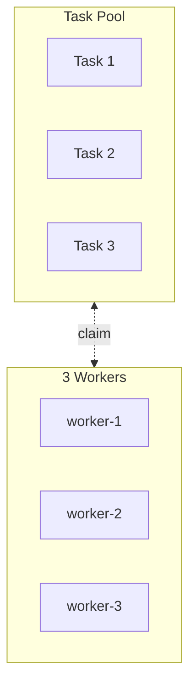
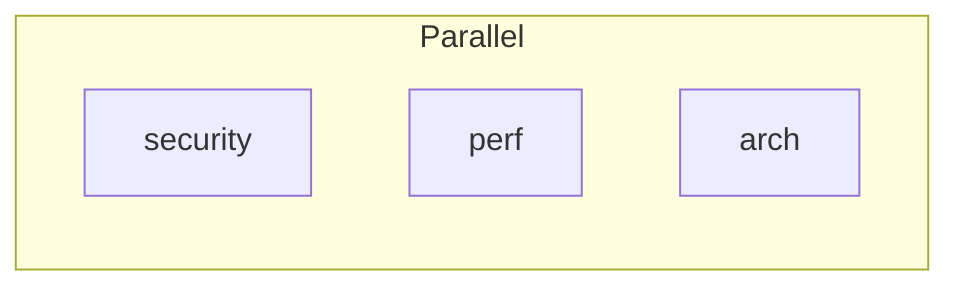

# Swarm Golden Path V2

Building on Golden Path V1. Focused on unlocking the full swarm pattern.

**Status:** READY FOR IMPLEMENTATION

**Source of truth:** `swarm-claude-code.md` (Claude Code v2.1.19)

---

## What V1 Already Provides

| Phase | Components | Status |
|-------|------------|--------|
| 1 | `defineTask`, `defineWorker`, `defineTeam` | Complete |
| 2 | `<TaskDef>`, `<TaskPipeline>`, `createPipeline()` | Complete |
| 3 | `<Team>`, `<Teammate>` | Complete |
| 4 | `<ShutdownSequence>` | Complete |
| 5 | `<Workflow>` | Complete |
| 6 | Documentation + Examples | Complete |

V1 covers the **pipeline pattern** well. V2 focuses on **swarm pattern** and **agent communication**.

---

## V2 Milestones

### V2.0 — Core Swarm (Ship Together)

| Phase | Component | Type | Description |
|-------|-----------|------|-------------|
| 7 | `<TaskPool>` | Component | Independent task queue |
| 8.1 | `SwarmPrompt` | Helper | Type-safe prompt builder |
| 8.2 | `createSwarm()` | Factory | Returns WorkerRef[] for shutdown |
| 8.3 | `<Swarm>` | Component | Self-organizing workers |

**Delivers:** Complete swarm pattern — task pools + self-organizing workers.

### V2.1 — Extensions (Ship After V2.0)

| Phase | Component | Type | Description |
|-------|-----------|------|-------------|
| 9 | `<ParallelWorkers>` | Component | N different specialists in parallel |
| 10 | `<Message>` | Component | Type-safe agent communication |

**Delivers:** Convenience components for parallel work and communication docs.

---

## Dependency Graph

```
V2.0 (Core Swarm)
══════════════════════════════════════════════════════

┌─────────────┐
│  TaskPool   │  ← Phase 7: No dependencies
└─────────────┘

┌─────────────┐    ┌──────────────┐
│ SwarmPrompt │    │ createSwarm()│  ← Phase 8.1 & 8.2: No dependencies
└──────┬──────┘    └──────┬───────┘
       │                  │
       └────────┬─────────┘
                ▼
          ┌───────────┐
          │   Swarm   │  ← Phase 8.3: Uses 8.1 (optional), 8.2 (optional)
          └───────────┘

V2.1 (Extensions)
══════════════════════════════════════════════════════

┌─────────────────┐    ┌───────────┐
│ ParallelWorkers │    │  Message  │  ← Phase 9 & 10: Independent
└─────────────────┘    └───────────┘
```

---

# V2.0 — Core Swarm

---

## Phase 7: TaskPool

Independent tasks for self-organizing workers (no dependencies between tasks).

### Props

| Prop | Type | Required | Description |
|------|------|----------|-------------|
| `title` | `string` | No | Section header |
| `tasks` | `TaskPoolItem[]` | Yes | Tasks to create |

```typescript
interface TaskPoolItem {
  task: TaskRef;
  description: string;
  activeForm?: string;
}
```

### Usage

```tsx
const files = ['user.rb', 'payment.rb', 'api.rb'];
const fileTasks = files.map(f => defineTask(`Review ${f}`, f.replace('.rb', '')));

<TaskPool title="File Reviews" tasks={fileTasks.map((t, i) => ({
  task: t,
  description: `Review ${files[i]} for security and quality`,
  activeForm: `Reviewing ${files[i]}...`
}))} />
```

### Output

```markdown
### File Reviews

```javascript
TaskCreate({ subject: "Review user.rb", description: "Review user.rb for security and quality", activeForm: "Reviewing user.rb..." })
TaskCreate({ subject: "Review payment.rb", description: "Review payment.rb for security and quality", activeForm: "Reviewing payment.rb..." })
TaskCreate({ subject: "Review api.rb", description: "Review api.rb for security and quality", activeForm: "Reviewing api.rb..." })
```

| ID | Subject | Description |
|----|---------|-------------|
| 1 | Review user.rb | Review user.rb for security and quality |
| 2 | Review payment.rb | Review payment.rb for security and quality |
| 3 | Review api.rb | Review api.rb for security and quality |

> No dependencies - tasks can be claimed in any order
```

---

## Phase 8: Swarm

Self-organizing workers that claim from a TaskPool.

### Props

| Prop | Type | Required | Description |
|------|------|----------|-------------|
| `team` | `TeamRef` | Yes | Team to join |
| `workerCount` | `number` | Yes | Number of workers to spawn |
| `workerType` | `AgentType \| PluginAgentType` | Yes | Worker agent type |
| `description` | `string` | Yes | Worker description |
| `prompt` | `string \| SwarmPromptResult` | No* | Worker prompt |
| `children` | `ReactNode` | No* | Custom prompt JSX |
| `model` | `Model` | No | Override model |
| `namePrefix` | `string` | No | Worker name prefix (default: "worker") |

*Either `prompt` OR `children` required. Children take precedence.

### Usage Option 1: SwarmPrompt Helper (Recommended)

```tsx
import { Swarm, SwarmPrompt } from 'react-agentic/swarm';

<Swarm
  team={ReviewTeam}
  workerCount={3}
  workerType={AgentType.GeneralPurpose}
  description="File reviewer"
  prompt={SwarmPrompt.standard({
    workInstructions: "Review the file for security vulnerabilities",
    reportTo: "team-lead"
  })}
/>
```

### Usage Option 2: Simple String

```tsx
<Swarm
  team={ReviewTeam}
  workerCount={3}
  workerType={AgentType.GeneralPurpose}
  description="File reviewer"
  prompt="Claim pending tasks, review files for security issues, report to team-lead."
/>
```

### Usage Option 3: Full Custom with Children

```tsx
<Swarm
  team={ReviewTeam}
  workerCount={3}
  workerType={AgentType.GeneralPurpose}
  description="Advanced reviewer"
>
  <h2>Custom Swarm Worker Protocol</h2>

  <XmlBlock name="task_selection">
    <p>Priority-based task selection:</p>
    <ol>
      <li>TaskList() to get all pending</li>
      <li>Score each by file complexity</li>
      <li>Claim highest-scored task</li>
    </ol>
  </XmlBlock>

  <XmlBlock name="review_protocol">
    <p>For each file:</p>
    <ul>
      <li>Static analysis first</li>
      <li>Pattern matching for vulnerabilities</li>
      <li>Context-aware review</li>
    </ul>
  </XmlBlock>

  <XmlBlock name="reporting">
    <p>Send structured findings to team-lead</p>
  </XmlBlock>
</Swarm>
```

### Output

```markdown
### Worker Swarm



```javascript
Task({ team_name: "review-team", name: "worker-1", subagent_type: "general-purpose", description: "File reviewer", prompt: `...`, run_in_background: true })
Task({ team_name: "review-team", name: "worker-2", subagent_type: "general-purpose", description: "File reviewer", prompt: `...`, run_in_background: true })
Task({ team_name: "review-team", name: "worker-3", subagent_type: "general-purpose", description: "File reviewer", prompt: `...`, run_in_background: true })
```

> Workers race to claim tasks, naturally load-balance
```

---

## Phase 8.1: createSwarm() Factory

Returns `WorkerRef[]` for use in `<ShutdownSequence>`.

### Signature

```typescript
function createSwarm(options: {
  count: number;
  type: AgentType | PluginAgentType;
  namePrefix?: string;  // default: "worker"
  model?: Model;
}): SwarmConfig;

interface SwarmConfig {
  workers: WorkerRef[];  // [worker-1, worker-2, worker-3]
  count: number;
  type: AgentType | PluginAgentType;
  namePrefix: string;
  model?: Model;
}
```

### Usage

```tsx
const reviewSwarm = createSwarm({
  count: 3,
  type: AgentType.GeneralPurpose,
  namePrefix: 'reviewer'
});

// Use in Swarm
<Swarm
  team={ReviewTeam}
  config={reviewSwarm}
  description="File reviewer"
  prompt={SwarmPrompt.standard({ ... })}
/>

// Use workers in ShutdownSequence
<ShutdownSequence
  workers={[...teamMembers, ...reviewSwarm.workers]}
  reason="Review complete"
/>
```

---

## Phase 8.2: SwarmPrompt Builder

Type-safe prompt builder for common swarm patterns.

### Interface

```typescript
interface SwarmPromptOptions {
  // Required: what to do with each task
  workInstructions: string;

  // Required: who receives findings (type-safe)
  reportTo: WorkerRef | 'team-lead' | string;

  // Optional: filter which tasks to claim
  filter?: {
    subjectContains?: string;
    subjectMatches?: RegExp;
    descriptionContains?: string;
  };

  // Optional: exit conditions
  exitAfterEmpty?: number;        // Exit after N empty TaskList checks (default: 2)
  exitAfterTasks?: number;        // Exit after processing N tasks

  // Optional: retry behavior
  retry?: {
    waitSeconds: number;          // Wait between empty checks (default: 30)
    maxAttempts: number;          // Max retry attempts (default: 3)
  };

  // Optional: error handling
  onError?: 'skip' | 'retry' | 'escalate';  // default: 'skip'

  // Optional: additional context
  additionalInstructions?: string;
}
```

### Patterns

#### SwarmPrompt.standard()

Basic swarm loop - claim any pending task.

```tsx
SwarmPrompt.standard({
  workInstructions: "Review the file for security vulnerabilities",
  reportTo: "team-lead"
})
```

Generated prompt:
```markdown
You are a swarm worker.

## Task Loop

1. Call `TaskList()` to see available tasks
2. Find a task where:
   - status = 'pending'
   - no owner assigned
3. If found:
   - Claim: `TaskUpdate({ taskId: "X", owner: "$CLAUDE_CODE_AGENT_NAME" })`
   - Start: `TaskUpdate({ taskId: "X", status: "in_progress" })`
4. Do the work:
   Review the file for security vulnerabilities
5. Complete: `TaskUpdate({ taskId: "X", status: "completed" })`
6. Report findings:
   `Teammate({ operation: "write", target_agent_id: "team-lead", value: JSON.stringify(findings) })`
7. Go to step 1

## Exit Condition

Exit when `TaskList()` returns no pending tasks after 2 consecutive checks.
```

#### SwarmPrompt.filtered()

Only claim tasks matching criteria.

```tsx
SwarmPrompt.filtered({
  filter: { subjectContains: "Audit" },
  workInstructions: "Deep security audit of the file",
  reportTo: SecurityLead,  // WorkerRef - type-safe!
  exitAfterEmpty: 3,
  retry: { waitSeconds: 60, maxAttempts: 5 }
})
```

Generated prompt:
```markdown
You are a swarm worker.

## Task Loop

1. Call `TaskList()` to see available tasks
2. Find a task where:
   - status = 'pending'
   - no owner assigned
   - subject contains "Audit"
3. If found:
   - Claim: `TaskUpdate({ taskId: "X", owner: "$CLAUDE_CODE_AGENT_NAME" })`
   - Start: `TaskUpdate({ taskId: "X", status: "in_progress" })`
4. Do the work:
   Deep security audit of the file
5. Complete: `TaskUpdate({ taskId: "X", status: "completed" })`
6. Report findings:
   `Teammate({ operation: "write", target_agent_id: "security-lead", value: JSON.stringify(findings) })`
7. Go to step 1

## Exit Condition

Exit when `TaskList()` returns no matching tasks after 3 consecutive checks.

## Retry Behavior

If no tasks found, wait 60 seconds before checking again. Max 5 attempts.
```

#### SwarmPrompt.custom()

Escape hatch for advanced patterns.

```tsx
SwarmPrompt.custom({
  preamble: "You are a priority-based swarm worker.",
  taskSelection: `
    1. TaskList() to get all pending
    2. Score each task by file size and complexity
    3. Claim the highest-scored task
  `,
  workInstructions: "Perform thorough code review",
  reporting: `
    Format findings as JSON:
    { file, severity, issues: [...], suggestions: [...] }
  `,
  exitCondition: "Exit after processing 5 tasks or no tasks for 2 minutes"
})
```

---

# V2.1 — Extensions

---

## Phase 9: ParallelWorkers

Spawn multiple specialized workers simultaneously (no coordination, all work in parallel).

### Props

| Prop | Type | Required | Description |
|------|------|----------|-------------|
| `team` | `TeamRef` | Yes | Team to join |
| `workers` | `ParallelWorkerDef[]` | Yes | Worker definitions |

```typescript
interface ParallelWorkerDef {
  worker: WorkerRef;
  description: string;
  prompt: string;
}
```

### Usage

```tsx
<ParallelWorkers team={ReviewTeam} workers={[
  {
    worker: Security,
    description: "Security audit",
    prompt: "Review for vulnerabilities. Send findings to team-lead."
  },
  {
    worker: Perf,
    description: "Performance check",
    prompt: "Review for performance issues. Send findings to team-lead."
  },
  {
    worker: Arch,
    description: "Architecture review",
    prompt: "Review architecture. Send findings to team-lead."
  }
]} />
```

### Output

```markdown
### Parallel Workers



```javascript
// Spawn in parallel (single message, multiple Task calls)
Task({ team_name: "review-team", name: "security", subagent_type: "compound-engineering:review:security-sentinel", description: "Security audit", prompt: `...`, run_in_background: true })
Task({ team_name: "review-team", name: "perf", subagent_type: "compound-engineering:review:performance-oracle", description: "Performance check", prompt: `...`, run_in_background: true })
Task({ team_name: "review-team", name: "arch", subagent_type: "compound-engineering:review:architecture-strategist", description: "Architecture review", prompt: `...`, run_in_background: true })
```
```

### Difference from `<Swarm>`

| Aspect | `<Swarm>` | `<ParallelWorkers>` |
|--------|-----------|---------------------|
| Workers | N identical | N different specialists |
| Prompts | Same prompt | Different prompts |
| Task source | Shared TaskPool | Each has own work |
| Coordination | Race to claim | Independent |

---

## Phase 10: Message

Agent-to-agent targeted communication.

### Props

| Prop | Type | Required | Description |
|------|------|----------|-------------|
| `from` | `WorkerRef \| string` | Yes | Sender |
| `to` | `WorkerRef \| string` | Yes | Recipient |
| `children` | `string` | Yes | Message content |

### Usage

```tsx
<Message from={Security} to="team-lead">
  Found auth bypass in user.rb:42. Critical severity.
</Message>

<Message from="coordinator" to={Reporter}>
  Phase 2 complete. All findings ready for aggregation.
</Message>
```

### Output

```markdown
**Message** from `security` to `team-lead`:

```javascript
Teammate({
  operation: "write",
  target_agent_id: "team-lead",
  value: "Found auth bypass in user.rb:42. Critical severity."
})
```
```

---

## Decisions Made

### Included

| Feature | Rationale |
|---------|-----------|
| `<TaskPool>` | Core swarm pattern - independent task queue |
| `<Swarm>` | Core swarm pattern - self-organizing workers |
| `createSwarm()` | Returns WorkerRef[] for shutdown |
| `SwarmPrompt` | Type-safe prompt builder, reduces boilerplate |
| `<ParallelWorkers>` | Common pattern for parallel specialists |
| `<Message>` | Documents communication patterns, type-safe |

### Excluded

| Feature | Rationale |
|---------|-----------|
| `<TaskClaim>` | Runtime operation, workers handle in prompts |
| `<TaskStart>` | Runtime operation, workers handle in prompts |
| `<TaskComplete>` | Runtime operation, workers handle in prompts |
| `<Broadcast>` | Expensive, rarely needed, use inline JS |
| Workflow factories | Convenience, defer to V3 |
| Dependency combinators | Over-engineering for most cases |

---

## V2.0 Complete Example

```tsx
import {
  // V1 refs
  defineTask, defineWorker, defineTeam,
  AgentType, PluginAgentType,

  // V1 components
  Workflow, Team, Teammate, ShutdownSequence,

  // V2.0 components
  TaskPool, Swarm,

  // V2.0 helpers
  createSwarm, SwarmPrompt
} from 'react-agentic/swarm';

// =============================================================================
// REFS
// =============================================================================

// Specialists (V1 pattern)
const Security = defineWorker('security', PluginAgentType.SecuritySentinel);
const Perf = defineWorker('perf', PluginAgentType.PerformanceOracle);

// Swarm workers (V2.0 factory)
const fileReviewSwarm = createSwarm({
  count: 3,
  type: AgentType.GeneralPurpose,
  namePrefix: 'reviewer'
});

// Team
const ReviewTeam = defineTeam('codebase-review', [Security, Perf]);

// Task pool
const files = ['user.rb', 'payment.rb', 'api.rb', 'auth.rb'];
const fileTasks = files.map(f => defineTask(`Review ${f}`, f.replace('.rb', '')));

// =============================================================================
// WORKFLOW
// =============================================================================

export const CodebaseReviewSwarm = () => (
  <Workflow name="Codebase Review" team={ReviewTeam} description="Full codebase security review">

    {/* Team setup with specialists (V1 pattern) */}
    <Team team={ReviewTeam} description="Code review specialists">
      <Teammate
        worker={Security}
        description="Security patterns analyst"
        prompt="Analyze security patterns across the codebase. Send summary to team-lead when complete."
      />
      <Teammate
        worker={Perf}
        description="Performance patterns analyst"
        prompt="Analyze performance patterns across the codebase. Send summary to team-lead when complete."
      />
    </Team>

    {/* V2.0: Independent task pool for file-by-file review */}
    <TaskPool
      title="File Reviews"
      tasks={fileTasks.map((t, i) => ({
        task: t,
        description: `Review ${files[i]} for security vulnerabilities and code quality`,
        activeForm: `Reviewing ${files[i]}...`
      }))}
    />

    {/* V2.0: Self-organizing worker swarm with SwarmPrompt helper */}
    <Swarm
      team={ReviewTeam}
      config={fileReviewSwarm}
      description="File review worker"
      prompt={SwarmPrompt.filtered({
        filter: { subjectContains: "Review" },
        workInstructions: "Perform deep security review of the file. Check for: hardcoded secrets, injection points, auth bypasses, data leaks.",
        reportTo: "team-lead",
        exitAfterEmpty: 2,
        retry: { waitSeconds: 30, maxAttempts: 3 }
      })}
    />

    {/* Shutdown all workers (V1 pattern, now includes swarm workers) */}
    <ShutdownSequence
      workers={[Security, Perf, ...fileReviewSwarm.workers]}
      reason="Review complete"
    />
  </Workflow>
);
```

---

## V2.1 Additions Example

After V2.0 is complete, V2.1 adds `<ParallelWorkers>` and `<Message>`:

```tsx
import {
  // ... V1 + V2.0 imports ...

  // V2.1 components
  ParallelWorkers, Message
} from 'react-agentic/swarm';

// Additional specialists for parallel review
const Arch = defineWorker('arch', PluginAgentType.ArchitectureStrategist);

export const EnhancedReviewWorkflow = () => (
  <Workflow name="Enhanced Review" team={ReviewTeam}>
    {/* ... Team and TaskPool from V2.0 ... */}

    {/* V2.1: ParallelWorkers instead of multiple <Teammate> */}
    <ParallelWorkers team={ReviewTeam} workers={[
      {
        worker: Security,
        description: "Security audit",
        prompt: "Review for OWASP Top 10. Send findings to team-lead."
      },
      {
        worker: Perf,
        description: "Performance audit",
        prompt: "Review for N+1 queries, memory leaks. Send findings to team-lead."
      },
      {
        worker: Arch,
        description: "Architecture audit",
        prompt: "Review for SOLID violations, coupling issues. Send findings to team-lead."
      }
    ]} />

    {/* V2.1: Document expected message patterns */}
    <Message from={Security} to="team-lead">
      Example: Found SQL injection in user_search. Critical severity.
    </Message>

    {/* ... Swarm and ShutdownSequence ... */}
  </Workflow>
);
```

---

## Alternative: Custom Swarm Prompt

When `SwarmPrompt` helpers don't fit your needs:

```tsx
<Swarm
  team={ReviewTeam}
  config={fileReviewSwarm}
  description="Advanced reviewer"
>
  <h2>Priority-Based File Reviewer</h2>

  <XmlBlock name="objective">
    Process files by risk level, focusing on authentication and payment code first.
  </XmlBlock>

  <XmlBlock name="task_selection">
    <ol>
      <li>TaskList() to get pending tasks</li>
      <li>Score each by keyword priority:
        <ul>
          <li>auth, session, login = 100</li>
          <li>payment, billing, stripe = 90</li>
          <li>api, controller = 70</li>
          <li>other = 50</li>
        </ul>
      </li>
      <li>Claim highest-scored unclaimed task</li>
    </ol>
  </XmlBlock>

  <XmlBlock name="review_protocol">
    For each file:
    <ol>
      <li>Read entire file</li>
      <li>Check OWASP Top 10</li>
      <li>Look for hardcoded secrets</li>
      <li>Verify input validation</li>
      <li>Check error handling (no stack traces leaked)</li>
    </ol>
  </XmlBlock>

  <XmlBlock name="reporting">
    Send structured report to team-lead:
    <pre>{`{
  "file": "path/to/file.rb",
  "riskScore": 85,
  "findings": [
    { "line": 42, "severity": "critical", "issue": "SQL injection", "fix": "Use parameterized query" }
  ]
}`}</pre>
  </XmlBlock>

  <XmlBlock name="exit_condition">
    Exit when no pending tasks after 2 consecutive checks, or after reviewing 10 files.
  </XmlBlock>
</Swarm>
```

---

## API Summary

### V2.0 Exports

```typescript
// Components
export { TaskPool } from './components/TaskPool';
export { Swarm } from './components/Swarm';

// Factory
export { createSwarm } from './factories/createSwarm';

// Helper
export { SwarmPrompt } from './helpers/SwarmPrompt';
```

### V2.1 Exports

```typescript
// Components
export { ParallelWorkers } from './components/ParallelWorkers';
export { Message } from './components/Message';
```

---

## Implementation Order

### V2.0 — Core Swarm (Ship Together)

| Order | Phase | Component | Notes |
|-------|-------|-----------|-------|
| 1 | 7 | `<TaskPool>` | Builds on `<TaskDef>` patterns |
| 2 | 8.1 | `SwarmPrompt` | Helper only, no component |
| 3 | 8.2 | `createSwarm()` | Factory function |
| 4 | 8.3 | `<Swarm>` | Core component, integrates 8.1 & 8.2 |

**V2.0 Done when:**
- [ ] All 4 items implemented
- [ ] `docs/swarm.md` updated with V2.0 components
- [ ] Example: `src/app/commands/swarm-review.tsx`

### V2.1 — Extensions (Ship After V2.0)

| Order | Phase | Component | Notes |
|-------|-------|-----------|-------|
| 5 | 9 | `<ParallelWorkers>` | Similar to Swarm, simpler |
| 6 | 10 | `<Message>` | Simple wrapper |

**V2.1 Done when:**
- [ ] Both items implemented
- [ ] `docs/swarm.md` updated with V2.1 components
- [ ] Example updated with ParallelWorkers and Message

---

## Summary

| Milestone | Components | Status |
|-----------|------------|--------|
| V1 | `defineTask`, `defineWorker`, `defineTeam`, `<TaskDef>`, `<TaskPipeline>`, `<Team>`, `<Teammate>`, `<ShutdownSequence>`, `<Workflow>` | ✅ Complete |
| V2.0 | `<TaskPool>`, `SwarmPrompt`, `createSwarm()`, `<Swarm>` | 🔲 Ready |
| V2.1 | `<ParallelWorkers>`, `<Message>` | 🔲 After V2.0 |
