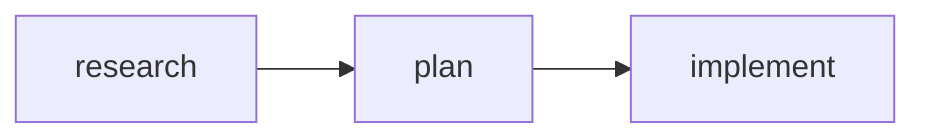
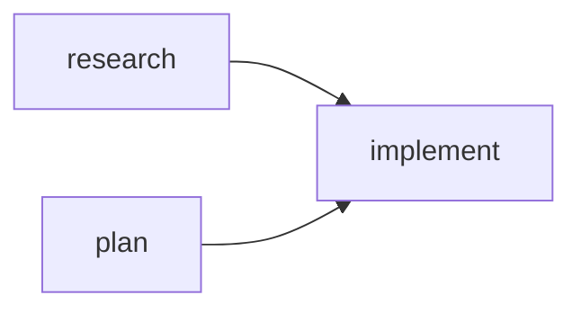

# Phase 2: TaskDef + TaskPipeline — Planning Document

Implementation planning for `<TaskDef>` and `<TaskPipeline>` components.

---

## Objective

Create components that emit Claude Code's task system syntax:
1. `<TaskDef>` — Emits `TaskCreate()` with optional `TaskUpdate()` for dependencies
2. `<TaskPipeline>` — Container with optional `autoChain` for sequential dependencies

---

## Technical Requirements

### From GOLDEN_PATH.md

```tsx
// TaskDef - individual task definition
<TaskDef
  task={Research}
  description="Research OAuth2 best practices and compare providers"
  activeForm="Researching OAuth..."
/>

<TaskDef
  task={Plan}
  description="Create implementation plan based on research findings"
  activeForm="Planning..."
  blockedBy={[Research]}
/>

// TaskPipeline - container with optional auto-chaining
<TaskPipeline title="OAuth Implementation" autoChain>
  <TaskDef task={Research} description="Research OAuth2 providers" activeForm="Researching..." />
  <TaskDef task={Plan} description="Design implementation approach" activeForm="Planning..." />
  <TaskDef task={Implement} description="Build OAuth2 integration" activeForm="Implementing..." />
</TaskPipeline>
```

### Expected Output Format

**Single TaskDef:**
```markdown
#### Task #1: Research best practices

```javascript
TaskCreate({
  subject: "Research best practices",
  description: "Research OAuth2 best practices and compare providers",
  activeForm: "Researching OAuth..."
})
```
```

**TaskDef with blockedBy:**
```markdown
#### Task #2: Create implementation plan

```javascript
TaskCreate({
  subject: "Create implementation plan",
  description: "Create implementation plan based on research findings",
  activeForm: "Planning..."
})

TaskUpdate({ taskId: "2", addBlockedBy: ["1"] })
```

**Blocked by:** #1 (Research best practices)
```

**TaskPipeline with autoChain:**
```markdown
### OAuth Implementation


```javascript
// Create tasks
TaskCreate({ subject: "Research best practices", description: "Research OAuth2 providers", activeForm: "Researching..." })
TaskCreate({ subject: "Create implementation plan", description: "Design implementation approach", activeForm: "Planning..." })
TaskCreate({ subject: "Build the feature", description: "Build OAuth2 integration", activeForm: "Implementing..." })

// Set up dependencies (autoChain)
TaskUpdate({ taskId: "2", addBlockedBy: ["1"] })
TaskUpdate({ taskId: "3", addBlockedBy: ["2"] })
```

| ID | Subject | Blocked By |
|----|---------|------------|
| 1 | Research best practices | - |
| 2 | Create implementation plan | #1 |
| 3 | Build the feature | #2 |
```

---

## Architecture Analysis

### Pipeline Overview

```
TSX Source → Parser → IR Nodes → Emitter → Markdown
```

### New Components Required

| Layer | New Item | Purpose |
|-------|----------|---------|
| IR | `TaskDefNode` | Represents a single task definition |
| IR | `TaskPipelineNode` | Represents a pipeline container |
| Parser | `transformTaskDef()` | Transforms `<TaskDef>` JSX to IR |
| Parser | `transformTaskPipeline()` | Transforms `<TaskPipeline>` JSX to IR |
| Emitter | `emitTaskDef()` | Emits TaskCreate/TaskUpdate markdown |
| Emitter | `emitTaskPipeline()` | Emits pipeline markdown with diagram |
| Component | `TaskDef` | JSX component for authoring |
| Component | `TaskPipeline` | JSX component for authoring |

### Existing Patterns to Reuse

| Pattern | Source | Applies To |
|---------|--------|------------|
| Semantic component props | `src/parser/transformers/semantic.ts` | `transformTaskDef()` |
| Children iteration | `transformBlockChildren()` | `transformTaskPipeline()` |
| JSX component export | `src/jsx.ts` | `TaskDef`, `TaskPipeline` |
| Block node emission | `src/emitter/emitter.ts` | `emitTaskDef()`, `emitTaskPipeline()` |

---

## Decision Points

### 1. Two-Pass ID Resolution Strategy

**The Problem:**
- TaskRefs have no `.id` property (Phase 1 decision)
- Numeric IDs are assigned at emit time based on JSX order
- `blockedBy` props reference TaskRefs that may appear later in the tree
- Need to resolve TaskRef → numeric ID for `TaskUpdate()` calls

**Options:**

| Option | Approach | Pros | Cons |
|--------|----------|------|------|
| A | Transform-time registry | Early resolution, simpler emitter | Transform depends on tree order |
| B | Two-pass emit | Clean separation, no transform-time state | More complex emitter |
| C | Deferred resolution (IR stores refs) | IR captures intent exactly | Requires emitter context |

**Recommendation:** Option C — Deferred resolution

Rationale:
- IR nodes store TaskRef references directly (not IDs)
- Emitter builds `Map<TaskRef, string>` on first pass (collect all TaskDefs)
- Emitter resolves `blockedBy` refs on second pass
- Clean separation: transform captures structure, emitter resolves IDs

**Implementation:**
```typescript
// IR stores refs, not IDs
interface TaskDefNode {
  kind: 'taskDef';
  task: TaskRef;           // Reference to TaskRef object
  description: string;
  activeForm?: string;
  blockedBy?: TaskRef[];   // References to other TaskRefs
}

// Emitter resolves at emit time
class TaskIdResolver {
  private taskIdMap = new Map<TaskRef, string>();
  private counter = 0;

  register(taskRef: TaskRef): string {
    if (!this.taskIdMap.has(taskRef)) {
      this.counter++;
      this.taskIdMap.set(taskRef, String(this.counter));
    }
    return this.taskIdMap.get(taskRef)!;
  }

  resolve(taskRef: TaskRef): string {
    const id = this.taskIdMap.get(taskRef);
    if (!id) throw new Error(`TaskRef not registered: ${taskRef.subject}`);
    return id;
  }
}
```

---

### 2. Where to Store TaskRef in IR?

**Question:** How does the IR node reference the TaskRef object?

**Challenge:**
- IR nodes are serializable data structures (no functions, no object references normally)
- TaskRef is a runtime object with identity semantics
- Need to preserve object identity through transform → emit pipeline

**Options:**

| Option | Approach | Pros | Cons |
|--------|----------|------|------|
| A | Store TaskRef directly in IR | Simple, identity preserved | IR becomes non-serializable |
| B | Store subject string, build map at transform time | Serializable | Loses identity (two tasks with same subject collide) |
| C | Generate UUID for each TaskRef, store in IR | Serializable, unique | Adds complexity to TaskRef |

**Recommendation:** Option A — Store TaskRef directly

Rationale:
- IR is never serialized in current architecture
- Transform and emit happen in same process
- Object identity is preserved naturally
- Simplest implementation

---

### 3. Component JSX Interface

**TaskDef Props:**

| Prop | Type | Required | Maps to |
|------|------|----------|---------|
| `task` | `TaskRef` | Yes | `subject` from `TaskRef.subject` |
| `description` | `string` | Yes | `TaskCreate.description` |
| `activeForm` | `string` | No | `TaskCreate.activeForm` |
| `blockedBy` | `TaskRef[]` | No | `TaskUpdate.addBlockedBy` |

**TaskPipeline Props:**

| Prop | Type | Required | Description |
|------|------|----------|-------------|
| `title` | `string` | No | Section heading |
| `autoChain` | `boolean` | No | Auto-add blockedBy to sequential tasks |
| `children` | `TaskDef[]` | Yes | Child TaskDef components |

**Questions:**

1. **Should TaskPipeline accept non-TaskDef children?**
   - **Recommendation:** No. Enforce `TaskDef[]` only.
   - Rationale: Keeps semantics clear, enables mermaid diagram generation

2. **Should autoChain be enabled by default?**
   - **Recommendation:** No. Default `false`.
   - Rationale: Explicit > implicit. User should opt-in to auto-chaining.

3. **What if a TaskDef has explicit blockedBy AND autoChain is enabled?**
   - **Recommendation:** Merge dependencies. Explicit blockedBy + auto-chain predecessor.
   - Example: With autoChain, Task #3 gets both explicit blockedBy and Task #2 from auto-chain.

---

### 4. Mermaid Diagram Format

**Question:** What format for the pipeline visualization?

**Options:**

| Option | Format | Pros | Cons |
|--------|--------|------|------|
| A | `flowchart LR` | Horizontal, compact | May wrap on narrow terminals |
| B | `flowchart TB` | Vertical, natural reading | Takes more vertical space |
| C | Configurable | User choice | Adds complexity |

**Recommendation:** Option A — `flowchart LR` (Left to Right)

Rationale:
- Matches GOLDEN_PATH.md examples
- Pipeline concept is inherently sequential/horizontal
- More compact for typical 3-5 task pipelines

**Node format:**


**Edge generation:**
- Use task subject as label (truncated if > 15 chars)
- Generate edges based on blockedBy relationships
- For autoChain: add edge from T(n) → T(n+1)

---

### 5. Standalone TaskDef vs Pipeline TaskDef

**Question:** Should TaskDef behave differently inside vs outside TaskPipeline?

**Options:**

| Option | Behavior | Pros | Cons |
|--------|----------|------|------|
| A | Same output format | Consistent, simple | Standalone may feel verbose |
| B | Different output formats | Optimized per context | More complex, inconsistent |
| C | Minimal standalone, full in pipeline | Clean standalone | Context-dependent behavior |

**Recommendation:** Option A — Same output format

Rationale:
- Consistency is more important than optimization
- Users can predict output based on component props
- TaskPipeline adds wrapper (title, mermaid), but TaskDef content is identical

**Standalone TaskDef output:**
```markdown
#### Task #1: Research best practices

```javascript
TaskCreate({
  subject: "Research best practices",
  description: "Research OAuth2 providers",
  activeForm: "Researching..."
})
```
```

**TaskDef inside TaskPipeline:**
Same content, wrapped in pipeline structure.

---

### 6. Error Handling

**Scenarios to handle:**

| Error | Detection | Behavior |
|-------|-----------|----------|
| `blockedBy` ref not in tree | Emit time (ref not in map) | Throw with helpful message |
| Empty `description` | Transform time | Throw: "TaskDef requires description" |
| TaskPipeline with no children | Transform time | Emit empty pipeline (or warning?) |
| Duplicate TaskRef in blockedBy | Transform time | Dedupe silently |
| Circular dependency | Emit time | Warn but don't block (Claude Code handles) |

**Recommendation:** Fail fast with clear messages for required fields. Warn for semantic issues.

---

## File Structure

### New Files

```
src/components/swarm/
├── index.ts                    # Add TaskDef, TaskPipeline exports
├── TaskDef.tsx                 # TaskDef component (NEW)
└── TaskPipeline.tsx            # TaskPipeline component (NEW)

src/ir/
└── swarm-nodes.ts              # TaskDefNode, TaskPipelineNode (NEW)

src/parser/transformers/
└── swarm.ts                    # transformTaskDef, transformTaskPipeline (NEW)

src/emitter/
└── swarm-emitter.ts            # emitTaskDef, emitTaskPipeline (NEW)
```

### Modified Files

```
src/ir/nodes.ts                 # Import and add swarm nodes to BlockNode union
src/ir/index.ts                 # Export swarm nodes
src/parser/transformers/dispatch.ts  # Add swarm component dispatch
src/emitter/emitter.ts          # Add swarm node emission
src/jsx.ts                      # Export TaskDef, TaskPipeline
src/components/swarm/index.ts   # Export new components
```

---

## IR Node Definitions

### TaskDefNode

```typescript
// src/ir/swarm-nodes.ts

import type { TaskRef } from '../components/swarm/refs.js';

/**
 * Task definition node
 * Emits TaskCreate() and optional TaskUpdate() for dependencies
 */
export interface TaskDefNode {
  kind: 'taskDef';
  /** TaskRef from defineTask() - stores subject */
  task: TaskRef;
  /** Task description - maps to TaskCreate.description */
  description: string;
  /** Active form text shown in spinner - maps to TaskCreate.activeForm */
  activeForm?: string;
  /** Tasks that must complete before this one - maps to TaskUpdate.addBlockedBy */
  blockedBy?: TaskRef[];
}
```

### TaskPipelineNode

```typescript
/**
 * Pipeline container node
 * Emits mermaid diagram + table + TaskCreate/TaskUpdate calls
 */
export interface TaskPipelineNode {
  kind: 'taskPipeline';
  /** Pipeline section title */
  title?: string;
  /** Auto-chain tasks sequentially */
  autoChain: boolean;
  /** Child TaskDefNodes */
  children: TaskDefNode[];
}
```

---

## Component Definitions

### TaskDef Component

```typescript
// src/components/swarm/TaskDef.tsx

import type { TaskRef } from './refs.js';

export interface TaskDefProps {
  /** TaskRef from defineTask() */
  task: TaskRef;
  /** Task description */
  description: string;
  /** Active form text shown in spinner (optional) */
  activeForm?: string;
  /** Tasks that must complete first (optional) */
  blockedBy?: TaskRef[];
}

/**
 * Defines a task for Claude Code's task system.
 *
 * @example
 * <TaskDef
 *   task={Research}
 *   description="Research OAuth2 best practices"
 *   activeForm="Researching..."
 * />
 */
export function TaskDef(_props: TaskDefProps): null {
  // Component is processed at compile time, returns null at runtime
  return null;
}
```

### TaskPipeline Component

```typescript
// src/components/swarm/TaskPipeline.tsx

import type { ReactNode } from 'react';

export interface TaskPipelineProps {
  /** Pipeline section title */
  title?: string;
  /** Auto-add blockedBy to each subsequent task */
  autoChain?: boolean;
  /** TaskDef children */
  children: ReactNode;
}

/**
 * Groups tasks into a pipeline with optional auto-chaining.
 *
 * @example
 * <TaskPipeline title="OAuth Implementation" autoChain>
 *   <TaskDef task={Research} description="..." />
 *   <TaskDef task={Plan} description="..." />
 * </TaskPipeline>
 */
export function TaskPipeline(_props: TaskPipelineProps): null {
  return null;
}
```

---

## Transformer Implementation

### transformTaskDef

```typescript
// src/parser/transformers/swarm.ts

import { Node, JsxElement, JsxSelfClosingElement } from 'ts-morph';
import type { TaskDefNode } from '../../ir/swarm-nodes.js';
import type { TaskRef } from '../../components/swarm/refs.js';
import { getAttributeValue } from '../utils/index.js';
import type { TransformContext } from './types.js';

/**
 * Transform <TaskDef> to TaskDefNode
 */
export function transformTaskDef(
  node: JsxElement | JsxSelfClosingElement,
  ctx: TransformContext
): TaskDefNode {
  const opening = Node.isJsxElement(node) ? node.getOpeningElement() : node;

  // Get task prop - must be a TaskRef
  const taskRef = extractTaskRefProp(opening, 'task', ctx);
  if (!taskRef) {
    throw new Error('TaskDef requires a task prop with TaskRef');
  }

  // Get description (required)
  const description = getAttributeValue(opening, 'description');
  if (!description) {
    throw new Error('TaskDef requires a description prop');
  }

  // Get optional props
  const activeForm = getAttributeValue(opening, 'activeForm') ?? undefined;
  const blockedBy = extractTaskRefArrayProp(opening, 'blockedBy', ctx);

  return {
    kind: 'taskDef',
    task: taskRef,
    description,
    activeForm,
    blockedBy: blockedBy.length > 0 ? blockedBy : undefined,
  };
}

/**
 * Extract TaskRef from prop value
 * Handles: task={Research} where Research is a TaskRef variable
 */
function extractTaskRefProp(
  opening: JsxOpeningElement | JsxSelfClosingElement,
  propName: string,
  ctx: TransformContext
): TaskRef | null {
  // Implementation: resolve variable reference to TaskRef object
  // This requires access to the module scope where defineTask was called
  // See "Technical Questions" section for resolution strategy
}

/**
 * Extract TaskRef[] from prop value
 * Handles: blockedBy={[Research, Plan]}
 */
function extractTaskRefArrayProp(
  opening: JsxOpeningElement | JsxSelfClosingElement,
  propName: string,
  ctx: TransformContext
): TaskRef[] {
  // Implementation: similar to extractTaskRefProp but for arrays
}
```

### transformTaskPipeline

```typescript
/**
 * Transform <TaskPipeline> to TaskPipelineNode
 */
export function transformTaskPipeline(
  node: JsxElement,
  ctx: TransformContext
): TaskPipelineNode {
  // Only JsxElement (has children), not self-closing
  const opening = node.getOpeningElement();

  // Get props
  const title = getAttributeValue(opening, 'title') ?? undefined;
  const autoChain = opening.getAttribute('autoChain') !== undefined;

  // Transform children - must all be TaskDef
  const children: TaskDefNode[] = [];
  for (const child of node.getJsxChildren()) {
    if (Node.isJsxElement(child) || Node.isJsxSelfClosingElement(child)) {
      const name = getElementName(child);
      if (name === 'TaskDef') {
        children.push(transformTaskDef(child, ctx));
      } else {
        throw new Error(`TaskPipeline only accepts TaskDef children, got: ${name}`);
      }
    }
  }

  // Apply autoChain logic
  if (autoChain && children.length > 1) {
    for (let i = 1; i < children.length; i++) {
      const prevTask = children[i - 1].task;
      const current = children[i];

      // Merge with existing blockedBy
      if (current.blockedBy) {
        if (!current.blockedBy.includes(prevTask)) {
          current.blockedBy = [prevTask, ...current.blockedBy];
        }
      } else {
        current.blockedBy = [prevTask];
      }
    }
  }

  return {
    kind: 'taskPipeline',
    title,
    autoChain,
    children,
  };
}
```

---

## Emitter Implementation

### TaskIdResolver

```typescript
// src/emitter/swarm-emitter.ts

import type { TaskRef } from '../components/swarm/refs.js';
import type { TaskDefNode, TaskPipelineNode } from '../ir/swarm-nodes.js';

/**
 * Resolves TaskRef objects to numeric IDs
 * Uses object identity (Map key comparison)
 */
export class TaskIdResolver {
  private taskIdMap = new Map<TaskRef, string>();
  private counter = 0;

  /**
   * Register a TaskRef and get its ID
   * Creates new ID if not already registered
   */
  register(taskRef: TaskRef): string {
    if (!this.taskIdMap.has(taskRef)) {
      this.counter++;
      this.taskIdMap.set(taskRef, String(this.counter));
    }
    return this.taskIdMap.get(taskRef)!;
  }

  /**
   * Resolve a TaskRef to its ID
   * Throws if TaskRef was never registered
   */
  resolve(taskRef: TaskRef): string {
    const id = this.taskIdMap.get(taskRef);
    if (!id) {
      throw new Error(
        `TaskRef "${taskRef.subject}" not found. ` +
        `Ensure it has a <TaskDef> before being used in blockedBy.`
      );
    }
    return id;
  }

  /**
   * Get current count of registered tasks
   */
  get count(): number {
    return this.counter;
  }
}
```

### emitTaskDef

```typescript
/**
 * Emit TaskDef to markdown
 * Called from main emitter with resolver context
 */
export function emitTaskDef(
  node: TaskDefNode,
  resolver: TaskIdResolver
): string {
  // Register task and get ID
  const id = resolver.register(node.task);

  const lines: string[] = [];

  // Header
  lines.push(`#### Task #${id}: ${node.task.subject}`);
  lines.push('');

  // TaskCreate code block
  lines.push('```javascript');
  lines.push('TaskCreate({');
  lines.push(`  subject: ${JSON.stringify(node.task.subject)},`);
  lines.push(`  description: ${JSON.stringify(node.description)}${node.activeForm ? ',' : ''}`);
  if (node.activeForm) {
    lines.push(`  activeForm: ${JSON.stringify(node.activeForm)}`);
  }
  lines.push('})');

  // TaskUpdate for dependencies
  if (node.blockedBy && node.blockedBy.length > 0) {
    lines.push('');
    const blockedByIds = node.blockedBy.map(ref => resolver.resolve(ref));
    lines.push(`TaskUpdate({ taskId: "${id}", addBlockedBy: [${blockedByIds.map(id => `"${id}"`).join(', ')}] })`);
  }

  lines.push('```');

  // Human-readable blocked by
  if (node.blockedBy && node.blockedBy.length > 0) {
    lines.push('');
    const blockedByText = node.blockedBy
      .map(ref => `#${resolver.resolve(ref)} (${ref.subject})`)
      .join(', ');
    lines.push(`**Blocked by:** ${blockedByText}`);
  }

  return lines.join('\n');
}
```

### emitTaskPipeline

```typescript
/**
 * Emit TaskPipeline to markdown
 */
export function emitTaskPipeline(
  node: TaskPipelineNode,
  resolver: TaskIdResolver
): string {
  const lines: string[] = [];

  // Title
  if (node.title) {
    lines.push(`### ${node.title}`);
    lines.push('');
  }

  // Register all tasks first (pass 1)
  const taskIds: string[] = [];
  for (const child of node.children) {
    taskIds.push(resolver.register(child.task));
  }

  // Mermaid diagram
  lines.push('```mermaid');
  lines.push('flowchart LR');

  // Generate nodes and edges
  for (let i = 0; i < node.children.length; i++) {
    const child = node.children[i];
    const id = taskIds[i];
    const label = truncateLabel(child.task.subject, 15);

    if (i === 0) {
      lines.push(`    T${id}[${label}]`);
    }

    // Add edges for dependencies
    if (child.blockedBy) {
      for (const blockedByRef of child.blockedBy) {
        const blockedById = resolver.resolve(blockedByRef);
        lines.push(`    T${blockedById} --> T${id}[${label}]`);
      }
    } else if (i > 0 && node.autoChain) {
      // autoChain was already applied in transform, but diagram needs edges
      const prevId = taskIds[i - 1];
      lines.push(`    T${prevId} --> T${id}[${label}]`);
    }
  }

  lines.push('```');
  lines.push('');

  // Code block with all TaskCreate calls
  lines.push('```javascript');
  lines.push('// Create tasks');
  for (const child of node.children) {
    const props = [
      `subject: ${JSON.stringify(child.task.subject)}`,
      `description: ${JSON.stringify(child.description)}`,
    ];
    if (child.activeForm) {
      props.push(`activeForm: ${JSON.stringify(child.activeForm)}`);
    }
    lines.push(`TaskCreate({ ${props.join(', ')} })`);
  }

  // TaskUpdate calls for dependencies
  const hasAnyDeps = node.children.some(c => c.blockedBy && c.blockedBy.length > 0);
  if (hasAnyDeps) {
    lines.push('');
    lines.push('// Set up dependencies');
    for (const child of node.children) {
      if (child.blockedBy && child.blockedBy.length > 0) {
        const id = resolver.resolve(child.task);
        const blockedByIds = child.blockedBy.map(ref => `"${resolver.resolve(ref)}"`);
        lines.push(`TaskUpdate({ taskId: "${id}", addBlockedBy: [${blockedByIds.join(', ')}] })`);
      }
    }
  }

  lines.push('```');
  lines.push('');

  // Summary table
  lines.push('| ID | Subject | Blocked By |');
  lines.push('|----|---------|------------|');
  for (const child of node.children) {
    const id = resolver.resolve(child.task);
    const blockedBy = child.blockedBy
      ? child.blockedBy.map(ref => `#${resolver.resolve(ref)}`).join(', ')
      : '-';
    lines.push(`| ${id} | ${child.task.subject} | ${blockedBy} |`);
  }

  return lines.join('\n');
}

function truncateLabel(text: string, maxLen: number): string {
  if (text.length <= maxLen) return text;
  return text.slice(0, maxLen - 3) + '...';
}
```

---

## Incoherences with Claude Code Doc (To Resolve)

These issues were identified by comparing GOLDEN_PATH.md with the authoritative Claude Code swarm documentation (`swarm-claude-code.md`). Each must be resolved before implementation.

### INC-1. TaskCreate/TaskUpdate Emission Order

**Status:** ✅ RESOLVED

**The Problem:**

GOLDEN_PATH shows **different output patterns** for standalone TaskDef vs TaskPipeline:

**Standalone TaskDef (per-task grouping):**
```javascript
TaskCreate({
  subject: "Create implementation plan",
  ...
})

TaskUpdate({ taskId: "2", addBlockedBy: ["1"] })
```

**TaskPipeline (batched grouping):**
```javascript
// Create tasks
TaskCreate({ ... })  // All creates first
TaskCreate({ ... })

// Set up dependencies
TaskUpdate({ ... })  // Then all updates
TaskUpdate({ ... })
```

**Why This Matters:**

Claude Code assigns IDs sequentially when `TaskCreate` runs. If a TaskDef references a task declared later:

```tsx
<TaskDef task={Plan} blockedBy={[Research]} />  // Gets ID #1, references #2
<TaskDef task={Research} />                      // Gets ID #2
```

The standalone pattern would emit `TaskUpdate({ taskId: "1", addBlockedBy: ["2"] })` before task #2 exists.

**Options:**

| Option | Approach | Pros | Cons |
|--------|----------|------|------|
| A | Always batch (all TaskCreate, then all TaskUpdate) | Safe, consistent | Standalone output more verbose |
| B | Enforce declaration order (blockedBy can only ref earlier tasks) | Simple, per-task output works | Limits flexibility |
| C | Topological sort at emit time | Maximum flexibility | Complex implementation |

**Decision:** ✅ **Option A — Always batch**

**Rationale:**
- Matches Claude Code documentation patterns
- Forward references always work (no ordering constraints)
- Consistent output format for standalone TaskDef and TaskPipeline
- Simple implementation — no constraint checking at transform time

**Impact on GOLDEN_PATH.md:**
- Update standalone TaskDef output to show batched pattern
- All TaskCreate calls first, then all TaskUpdate calls

---

### INC-2. Mermaid Labels Cannot Be Generated from TaskRef

**Status:** ✅ RESOLVED

**The Problem:**

GOLDEN_PATH shows mermaid diagrams with short labels:



But these labels ("research", "plan") appear to come from **variable names** (`Research`, `Plan`), not from `TaskRef.subject` ("Research best practices", "Create implementation plan").

We don't have access to variable names at emit time — only `TaskRef.subject`.

**Options:**

| Option | Approach | Example Output | Pros | Cons |
|--------|----------|----------------|------|------|
| A | Add optional `label` prop to TaskDef | `T1[auth]` | Explicit control | More boilerplate |
| B | First word of subject, lowercased | `T1[research]` | Automatic | May not match intent |
| C | Truncate subject to N chars | `T1[Research be...]` | Shows real content | Can be ugly/long |
| D | Add `name` field to TaskRef | `T1[research]` | Clean | Changes Phase 1 API |
| E | No mermaid diagram | (none) | Simplest | Loses visualization |

**Decision:** ✅ **Option C — Truncate subject**

**Implementation:**
- Truncate `TaskRef.subject` to 15 characters
- Add ellipsis (`...`) if truncated
- Keep original case (no lowercasing)

**Example output:**


**Impact on GOLDEN_PATH.md:**
- Update mermaid examples to show truncated subjects instead of idealized short labels

---

### INC-3. Mermaid Edge Syntax Style

**Status:** ✅ RESOLVED

**The Problem:**

GOLDEN_PATH uses **chained syntax**:


This only works for **linear pipelines**. For complex dependency graphs (e.g., T3 blocked by both T1 and T2), we need **edge-per-line syntax**:



**Options:**

| Option | Approach | Pros | Cons |
|--------|----------|------|------|
| A | Always use chained syntax | Compact, matches GOLDEN_PATH | Only works for linear |
| B | Always use edge-per-line | Supports all graphs | More verbose |
| C | Auto-detect: chained if linear, edges if complex | Best of both | More complex emitter |

**Decision:** ✅ **Option B — Always edge-per-line**

**Rationale:**
- Supports all dependency graphs (linear and non-linear)
- Simpler emitter implementation (one code path)
- Slight verbosity is acceptable trade-off for flexibility

**Example output:**


**Impact on GOLDEN_PATH.md:**
- Update mermaid examples to use edge-per-line syntax

---

### INC-4. Forward Reference Constraint

**Status:** ✅ RESOLVED (by INC-1)

**The Problem:**

Related to INC-1. Should we allow `blockedBy` to reference tasks that appear later in the JSX tree?

```tsx
// Forward reference - Plan references Research before Research is declared
<TaskDef task={Plan} blockedBy={[Research]} />
<TaskDef task={Research} />

// vs. Declaration order - References only go backward
<TaskDef task={Research} />
<TaskDef task={Plan} blockedBy={[Research]} />
```

**Options:**

| Option | Approach | Pros | Cons |
|--------|----------|------|------|
| A | Allow forward references | Maximum flexibility | Requires two-pass or batched output |
| B | Disallow forward references (error at transform) | Simpler, per-task output safe | Limits authoring flexibility |
| C | Allow but warn | Flexibility + visibility | May confuse users |

**Decision:** ✅ **Option A — Allow forward references**

**Rationale:**
- INC-1 chose batched output (all TaskCreate, then all TaskUpdate)
- Batched output naturally supports forward references
- No ordering constraints on authors — more flexible authoring experience

---

### INC-5. Update GOLDEN_PATH.md After Decisions

**Status:** ✅ READY TO IMPLEMENT

All blocking decisions resolved. GOLDEN_PATH.md Phase 2 section needs these updates:

| Item | Current | New |
|------|---------|-----|
| Standalone TaskDef output | Per-task (create + update together) | Batched (all creates, then all updates) |
| Mermaid labels | Idealized (`research`, `plan`) | Truncated subjects (`Research OAuth...`) |
| Mermaid syntax | Chained (`T1 --> T2 --> T3`) | Edge-per-line (`T1 --> T2` on separate lines) |
| Forward references | Implicit | Explicitly allowed |

**Action:** Update GOLDEN_PATH.md before or during Phase 2 implementation.

---

## Technical Questions to Resolve

### Critical

#### 1. How to resolve variable references to TaskRef objects at transform time?

**Status:** ✅ RESOLVED

**The Challenge:**
```tsx
const Research = defineTask('Research best practices');

<TaskDef task={Research} ... />  // How does transformer get the actual TaskRef object?
```

The transformer sees `task={Research}` as AST, but needs the actual `TaskRef` object for identity-based ID resolution.

**Options:**

| Option | Approach | Pros | Cons |
|--------|----------|------|------|
| A | Evaluate the module first | Full access to runtime values | Complex, security concerns |
| B | Track variable declarations in transform | Works for local files | Doesn't work for cross-file imports |
| C | Use string subject as fallback key | Simple | Loses object identity (same subject = same ID) |
| D | Add UUID `__id` to TaskRef | Unique identity always | Requires Phase 1 change |

**Decision:** ✅ **Option D — Add UUID to TaskRef**

**Implementation:**

1. **Phase 1 change** — Add `__id` field to `TaskRef`:
```typescript
// src/components/swarm/refs.ts
export function defineTask(subject: string): TaskRef {
  return {
    subject,
    __id: crypto.randomUUID(),  // Unique identity
    __isTaskRef: true,
  };
}
```

2. **Transform** — Extract `__id` from AST when processing `<TaskDef task={...}>`:
   - Parse the `defineTask()` call to get the `__id` string literal
   - Store `__id` in IR node (not object reference)

3. **Emit** — Use `__id` as key in `TaskIdResolver`:
```typescript
class TaskIdResolver {
  private taskIdMap = new Map<string, string>();  // __id → numeric ID
}
```

**Rationale:**
- Truly unique — No collision even with same subject
- Cross-file safe — UUID travels through AST as string
- Simple implementation — No variable tracking needed

**Phase 1 update required:** Add `__id: string` to `TaskRef` interface and `defineTask()` function

---

#### 2. Emitter Context and Resolver Lifecycle

**Status:** ✅ RESOLVED

**Question:** Where does the `TaskIdResolver` live? How is it passed to emitters?

**Current emitter architecture:**
```typescript
// src/emitter/emitter.ts
export function emit(node: BlockNode): string {
  switch (node.kind) {
    case 'paragraph': return emitParagraph(node);
    // ... etc
  }
}
```

**Challenge:** Need to pass `TaskIdResolver` through emit calls.

**Options:**

| Option | Approach | Pros | Cons |
|--------|----------|------|------|
| A | Global resolver instance | Simple | Not thread-safe, hard to test |
| B | Pass resolver as parameter | Clean, explicit | Requires signature changes to all functions |
| C | Context object parameter | Extensible | Slightly more ceremony |

**Decision:** ✅ **Option C — Context object**

**Implementation:**
```typescript
interface EmitContext {
  taskResolver?: TaskIdResolver;
  // Future: other context needed by emitters (e.g., Phase 3 Team state)
}

export function emit(node: BlockNode, ctx: EmitContext = {}): string {
  switch (node.kind) {
    case 'taskDef':
      ctx.taskResolver ??= new TaskIdResolver();
      return emitTaskDef(node, ctx.taskResolver);
    case 'paragraph':
      return emitParagraph(node);  // Doesn't need ctx
    // ...
  }
}
```

**Rationale:**
- Only functions that need context use it
- Extensible for Phase 3 (Team/Teammate may need shared state)
- Test-friendly — each test creates its own context
- No global state issues

---

#### 3. Integration with existing document nodes

**Status:** ✅ RESOLVED

**Question:** How do TaskDef/TaskPipeline integrate with Command and Agent documents?

**Scenarios:**
```tsx
// Standalone in Command
<Command name="pipeline">
  <TaskPipeline>...</TaskPipeline>
</Command>

// Inside Agent
<Agent name="orchestrator">
  <TaskDef task={...} />
</Agent>
```

**Decision:** ✅ **Option A — Allow TaskDef anywhere**

Add TaskDefNode and TaskPipelineNode to `BaseBlockNode` union, making them usable anywhere block content is allowed.

```typescript
// src/ir/nodes.ts
export type BaseBlockNode =
  | HeadingNode
  | ParagraphNode
  // ... existing nodes
  | TaskDefNode      // NEW
  | TaskPipelineNode // NEW
  ;
```

**Rationale:**
- Maximum flexibility — users decide where TaskDef makes sense
- Typical use: Commands (orchestration)
- Valid use: Orchestrator Agents that set up tasks for sub-workers
- Documentation can be added later if users get confused

---

### Nice to Have

#### 4. Should TaskPipeline support nested pipelines?

**Status:** ✅ RESOLVED

```tsx
<TaskPipeline title="Main">
  <TaskPipeline title="Sub">  // Nested?
    <TaskDef ... />
  </TaskPipeline>
</TaskPipeline>
```

**Decision:** ✅ **No — Do not support nested pipelines**

**Rationale:**
- Claude Code tasks are flat (no nesting concept in the API)
- Nested pipelines would just flatten anyway
- Adds implementation complexity for no benefit
- Can revisit later if a real use case emerges

---

#### 5. Should we support TaskDef outside any Command/Agent?

**Status:** ✅ RESOLVED

**Question:** Is a standalone `.tsx` file with just tasks valid?

```tsx
// tasks.tsx
export default () => (
  <TaskPipeline>
    <TaskDef ... />
  </TaskPipeline>
);
```

**Decision:** ✅ **Yes — Allow standalone task files**

**Rationale:**
- Maximum flexibility
- No extra implementation work (comes free with BaseBlockNode addition)
- Useful for reusable snippets or includes

**Recommendation:** Yes, for flexibility.

The output would be a markdown file with just the pipeline content, usable in prompts or documentation.

---

## Testing Strategy

### Unit Tests

1. **TaskRef ID resolution:**
   ```typescript
   test('TaskIdResolver assigns sequential IDs', () => {
     const resolver = new TaskIdResolver();
     const t1 = defineTask('Task 1');
     const t2 = defineTask('Task 2');

     expect(resolver.register(t1)).toBe('1');
     expect(resolver.register(t2)).toBe('2');
     expect(resolver.register(t1)).toBe('1'); // Same task, same ID
   });
   ```

2. **TaskDef transformation:**
   ```typescript
   test('transformTaskDef creates TaskDefNode', () => {
     const source = `<TaskDef task={Research} description="Test" />`;
     const node = transformTaskDef(parseJsx(source), mockContext);

     expect(node.kind).toBe('taskDef');
     expect(node.description).toBe('Test');
   });
   ```

3. **autoChain behavior:**
   ```typescript
   test('autoChain adds blockedBy to sequential tasks', () => {
     const pipeline = transformTaskPipeline(parseJsx(`
       <TaskPipeline autoChain>
         <TaskDef task={T1} description="First" />
         <TaskDef task={T2} description="Second" />
       </TaskPipeline>
     `), mockContext);

     expect(pipeline.children[0].blockedBy).toBeUndefined();
     expect(pipeline.children[1].blockedBy).toContain(T1);
   });
   ```

4. **emitTaskDef output:**
   ```typescript
   test('emitTaskDef produces correct markdown', () => {
     const node: TaskDefNode = {
       kind: 'taskDef',
       task: { subject: 'Research', __isTaskRef: true },
       description: 'Research OAuth2',
     };
     const resolver = new TaskIdResolver();
     const output = emitTaskDef(node, resolver);

     expect(output).toContain('#### Task #1: Research');
     expect(output).toContain('TaskCreate({');
   });
   ```

### Integration Tests

1. **Full pipeline compile:**
   ```typescript
   test('compiles TaskPipeline to expected markdown', async () => {
     const result = await compile('fixtures/oauth-pipeline.tsx');
     expect(result).toMatchSnapshot();
   });
   ```

2. **Cross-file TaskRef resolution:**
   ```typescript
   test('resolves imported TaskRefs', async () => {
     // tasks.ts exports Research
     // workflow.tsx imports and uses Research
     const result = await compile('fixtures/workflow.tsx');
     expect(result).not.toContain('TaskRef not found');
   });
   ```

---

## Implementation Order

1. **Define IR nodes** — `src/ir/swarm-nodes.ts`
2. **Add to BlockNode union** — `src/ir/nodes.ts`
3. **Create TaskIdResolver** — `src/emitter/swarm-emitter.ts`
4. **Implement emitters** — `emitTaskDef()`, `emitTaskPipeline()`
5. **Implement transformers** — `transformTaskDef()`, `transformTaskPipeline()`
6. **Add to dispatch** — `src/parser/transformers/dispatch.ts`
7. **Add to main emitter** — `src/emitter/emitter.ts`
8. **Create component stubs** — `TaskDef.tsx`, `TaskPipeline.tsx`
9. **Update exports** — `jsx.ts`, `swarm/index.ts`
10. **Write tests** — Unit and integration
11. **Add documentation** — Update docs/README.md

---

## Dependencies

- **Phase 1 complete:** `TaskRef`, `defineTask()`, type guards
- No external dependencies
- No changes to existing Command/Agent functionality

---

## Success Criteria

Phase 2 is complete when:

1. ✅ `<TaskDef>` compiles to `TaskCreate()` markdown
2. ✅ `blockedBy` prop compiles to `TaskUpdate()` call
3. ✅ `<TaskPipeline>` compiles to mermaid + code + table
4. ✅ `autoChain` prop auto-adds sequential dependencies
5. ✅ TaskRef → ID resolution works across multiple TaskDefs
6. ✅ Cross-file TaskRef imports work (with documented limitations)
7. ✅ All unit and integration tests pass
8. ✅ Documentation updated

---

## Next Steps After Phase 2

Phase 3 (`<Team>` + `<Teammate>`) will:
- Add IR nodes: `teamNode`, `teammateNode`
- Add transformers: `transformTeam()`, `transformTeammate()`
- Add emitters: emit `Teammate({ operation: "spawnTeam" })` and `Task({ team_name, ... })`
- Consume `WorkerRef` and `TeamRef` from Phase 1

---

## Incoherences with Specs (To Resolve)

These inconsistencies were found between Phase 2 Planning, GOLDEN_PATH.md, and the specs in `claudedocs/experimentals/swarm/docs/specs/`.

### SPEC-1. TaskRef Interface Fields

**Status:** ✅ RESOLVED

**The Problem:**

Three different sources define TaskRef differently:

| Source | Interface |
|--------|-----------|
| **Phase 1 impl** (`refs.ts`) | `{ subject, __isTaskRef }` |
| **Phase 2 Planning** (decided) | `{ subject, __id (UUID), __isTaskRef }` |
| **Golden Path** | Says "No .id or .name" |
| **Specs** (`enums.ts`) | `{ id, name, subject }` |

**Decision:** ✅ **Option C — Merge designs**

**Final TaskRef interface:**
```typescript
export interface TaskRef {
  subject: string;              // Human-readable title (TaskCreate.subject)
  name?: string;                // Optional short label (mermaid diagrams)
  __id: string;                 // UUID for cross-file identity
  readonly __isTaskRef: true;   // Type guard marker
}
```

**Rationale:**
- Keep `__isTaskRef` for type guards (established pattern in react-agentic)
- Keep `__id` (UUID) for cross-file identity (Phase 2 planning decision)
- Add optional `name` for mermaid labels (specs benefit)
- If `name` not provided, derive from `subject` (truncate/first word)

**Phase 1 update required:** Add `name?: string` and `__id: string` to TaskRef

---

### SPEC-2. `defineTask()` Function Signature

**Status:** ✅ RESOLVED

**The Problem:**

| Source | Signature | Example |
|--------|-----------|---------|
| **Phase 1 impl** | `defineTask(subject)` | `defineTask('Research best practices')` |
| **Golden Path** | `defineTask(subject)` | `defineTask('Research best practices')` |
| **Specs** | `defineTask(name, subject)` | `defineTask('research', 'Research best practices')` |

**Decision:** ✅ **Option C — Optional second param `(subject, name?)`**

**Final signature:**
```typescript
export function defineTask(subject: string, name?: string): TaskRef {
  return {
    subject,
    name: name ?? deriveNameFromSubject(subject),
    __id: crypto.randomUUID(),
    __isTaskRef: true,
  };
}

function deriveNameFromSubject(subject: string): string {
  // Truncate to 15 chars, lowercase, replace spaces
  return subject.slice(0, 15).toLowerCase().replace(/\s+/g, '-');
}
```

**Usage:**
```typescript
// Simple — name auto-derived
const Research = defineTask('Research best practices');
// Research.name = 'research-best-p'

// Explicit name for cleaner mermaid labels
const Research = defineTask('Research best practices', 'research');
// Research.name = 'research'
```

**Rationale:**
- Backward compatible with existing Phase 1 usage
- Optional explicit control for mermaid label clarity
- Aligns with SPEC-1 decision (TaskRef has optional `name`)

---

### SPEC-3. TaskDef Props — Inline vs Ref

**Status:** ✅ RESOLVED

**The Problem:**

| Source | Required Props |
|--------|----------------|
| **Phase 2 Planning** | `task` (required), `description`, `activeForm?`, `blockedBy?` |
| **Golden Path** | Same as planning |
| **Specs** | `task?` (optional), `name?`, `subject?`, `description`, `blockedBy?`, `blockedByIds?` |

**Decision:** ✅ **Option A — Require `task` prop only**

**Final TaskDef props:**
```typescript
interface TaskDefProps {
  task: TaskRef;           // Required — use defineTask() to create
  description: string;     // Required
  activeForm?: string;     // Optional
  blockedBy?: TaskRef[];   // Optional
}
```

**Usage:**
```tsx
// Standard pattern
const Research = defineTask('Research best practices');
<TaskDef task={Research} description="..." />

// Quick inline (still uses defineTask)
<TaskDef task={defineTask('Quick task')} description="..." />
```

**Rationale:**
- Golden path enforces best practices (type-safe refs)
- Single pattern — one way to do things
- Simpler implementation and documentation
- Inline pattern can be added later if real need emerges
- Specs' inline pattern diverges from golden path philosophy

---

### SPEC-4. Update GOLDEN_PATH.md with Decided Formats

**Status:** ✅ RESOLVED

**The Problem:**

Phase 2 Planning made format decisions that aren't reflected in GOLDEN_PATH.md:

| Item | Planning Decision | Golden Path (current) |
|------|-------------------|----------------------|
| Mermaid format | Edge-per-line | Chained `T1 --> T2 --> T3` |
| Mermaid labels | Truncated 15 chars | Idealized (`research`, `plan`) |
| Output format | Batched (all TaskCreate, then TaskUpdate) | Per-task for standalone |

**Decision:** ✅ **Option A — Update GOLDEN_PATH.md now before implementation**

**Updates needed:**

1. **Phase 1 section:**
   - Update `defineTask(subject, name?)` signature
   - Update TaskRef interface to show `name?` field
   - Add note about `__id` for internal identity

2. **Phase 2 section:**
   - Update mermaid examples to edge-per-line format
   - Update mermaid labels to show truncated subjects (or explicit names)
   - Update standalone TaskDef output to batched format
   - Update TaskPipeline output to match

**Action:** Update GOLDEN_PATH.md before starting Phase 2 implementation

---

### SPEC-5. Pipeline Builder Pattern

**Status:** ✅ RESOLVED

**The Problem:**

Specs include a `createPipeline()` builder pattern not mentioned in Planning or Golden Path.

**Decision:** ✅ **Option A — Include in Phase 2 (minimal version)**

**Sub-decisions:**

| Question | Decision |
|----------|----------|
| Q1: Builder signature | Match `defineTask(subject, name?)` — `.task(subject, name?)` |
| Q2: Builder output | Creates TaskRefs only, user maps to `<TaskDef>` in JSX |
| Q3: Builder scope | Minimal: `.task()` and `.build()` only |
| Q4: File location | Separate file: `src/components/swarm/pipeline-builder.ts` |

**Final builder design:**

```typescript
// src/components/swarm/pipeline-builder.ts

export interface PipelineStage {
  task: TaskRef;
  description?: string;
  blockedBy: TaskRef[];
}

export interface Pipeline {
  title: string;
  tasks: Record<string, TaskRef>;  // Keyed by name
  stages: PipelineStage[];
}

export interface PipelineBuilder {
  task(subject: string, name?: string, description?: string): PipelineBuilder;
  build(): Pipeline;
}

export function createPipeline(title: string): PipelineBuilder {
  const tasks: Record<string, TaskRef> = {};
  const stages: PipelineStage[] = [];
  let previousTask: TaskRef | null = null;

  return {
    task(subject: string, name?: string, description?: string) {
      const taskRef = defineTask(subject, name);
      const key = taskRef.name;
      tasks[key] = taskRef;
      stages.push({
        task: taskRef,
        description,
        blockedBy: previousTask ? [previousTask] : [],
      });
      previousTask = taskRef;
      return this;
    },
    build() {
      return { title, tasks, stages };
    },
  };
}
```

**Usage:**
```tsx
const pipeline = createPipeline('OAuth Implementation')
  .task('Research OAuth providers', 'research')
  .task('Create implementation plan', 'plan')
  .task('Build OAuth endpoints', 'implement')
  .build();

// Use in JSX
<TaskPipeline title={pipeline.title}>
  {pipeline.stages.map(stage => (
    <TaskDef
      key={stage.task.__id}
      task={stage.task}
      description={stage.description ?? ''}
      blockedBy={stage.blockedBy}
    />
  ))}
</TaskPipeline>
```

**Rationale:**
- Minimal builder keeps Phase 2 focused
- Matches `defineTask` signature for consistency
- Builder creates refs only — user controls JSX rendering
- Can add helpers (`.all()`, `.first(n)`) in future phase

---

### SPEC-6. Worker/TeamRef `id` Field (Phase 3 Preview)

**Status:** ✅ RESOLVED

**The Problem:**

Same pattern as TaskRef — specs have explicit `id` field that Phase 1 doesn't have:

| Source | WorkerRef Interface |
|--------|---------------------|
| **Phase 1 impl** | `{ name, type, model?, __isWorkerRef }` |
| **Specs** | `{ id, name, type, model? }` |

**Decision:** ✅ **Option A — Add `__id` to Worker/TeamRef now (Phase 1 update)**

**Final interfaces:**

```typescript
// WorkerRef
export interface WorkerRef {
  name: string;
  type: string;
  model?: string;
  __id: string;                  // NEW: UUID for identity
  readonly __isWorkerRef: true;
}

export function defineWorker(
  name: string,
  type: AgentType | PluginAgentType | string,
  model?: Model | string
): WorkerRef {
  return {
    name,
    type,
    model,
    __id: crypto.randomUUID(),
    __isWorkerRef: true,
  };
}

// TeamRef
export interface TeamRef {
  name: string;
  members?: WorkerRef[];
  __id: string;                  // NEW: UUID for identity
  readonly __isTeamRef: true;
}

export function defineTeam(name: string, members?: WorkerRef[]): TeamRef {
  return {
    name,
    members,
    __id: crypto.randomUUID(),
    __isTeamRef: true,
  };
}
```

**Rationale:**
- Consistent pattern across all ref types (TaskRef, WorkerRef, TeamRef)
- Ready for Phase 3 identity resolution needs
- Simple change — add `__id` field to existing Phase 1 implementation

**Phase 1 update required:** Add `__id: string` to WorkerRef and TeamRef interfaces

---

## Resolution Summary

| ID | Issue | Decision |
|----|-------|----------|
| SPEC-1 | TaskRef fields | ✅ Merge: `{ subject, name?, __id, __isTaskRef }` |
| SPEC-2 | defineTask signature | ✅ `defineTask(subject, name?)` — optional second param |
| SPEC-3 | TaskDef inline vs ref | ✅ Require `task` prop only |
| SPEC-4 | Update GOLDEN_PATH | ✅ Update now before implementation |
| SPEC-5 | Builder pattern | ✅ Include minimal builder in Phase 2 |
| SPEC-6 | Worker/TeamRef id | ✅ Add `__id` now (Phase 1 update) |

---

## Phase 1 Updates Required

Before starting Phase 2 implementation, update Phase 1 (`src/components/swarm/refs.ts`):

1. **TaskRef interface:**
   - Add `name?: string` field
   - Add `__id: string` field (UUID)

2. **defineTask function:**
   - Change signature to `defineTask(subject: string, name?: string)`
   - Generate UUID for `__id`
   - Derive `name` from subject if not provided

3. **WorkerRef interface:**
   - Add `__id: string` field (UUID)

4. **defineWorker function:**
   - Generate UUID for `__id`

5. **TeamRef interface:**
   - Add `__id: string` field (UUID)

6. **defineTeam function:**
   - Generate UUID for `__id`
