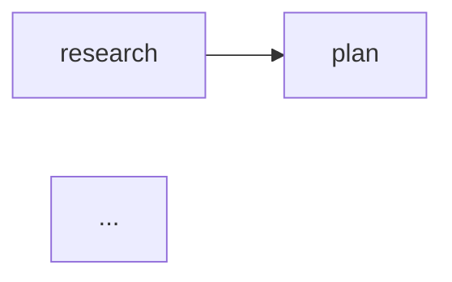

# Phase 5: Workflow — Planning Document

Implementation planning for `<Workflow>` component.

---

## Document Hierarchy

| Document | Purpose | Authority |
|----------|---------|-----------|
| **swarm-claude-code.md** | Claude Code primitives (Task, Teammate, TaskCreate) | API reference |
| **GOLDEN_PATH.md** | TSX component API design | **Source of truth for implementation** |
| **specs/*** | Component specifications (older, some out of sync) | Needs sync after Phase 5 |

**Key insight:** GOLDEN_PATH defines the type-safe ref system (`defineTeam()`, `defineWorker()`, `defineTask()`) used by react-agentic. The specs predate this design and use string-based APIs in some places.

---

## Objective

Create a container component that orchestrates Team, TaskPipeline, and ShutdownSequence into a cohesive workflow with:
1. Workflow-level metadata (name, description)
2. Team context propagation to children
3. Full orchestration output structure

---

## Technical Requirements

### From GOLDEN_PATH.md

**Props:**
| Prop | Type | Required | Description |
|------|------|----------|-------------|
| `name` | `string` | Yes | Workflow name |
| `team` | `TeamRef` | Yes | Primary team |
| `description` | `string` | No | Workflow description |
| `children` | `ReactNode` | Yes | Team, Pipeline, Shutdown |

**Usage:**
```tsx
const ReviewTeam = defineTeam('feature-x', [Security, Perf]);

<Workflow name="Feature X" team={ReviewTeam} description="Build feature with review">
  <Team team={ReviewTeam} description="Feature X team">
    <Teammate worker={Security} ... />
    <Teammate worker={Perf} ... />
  </Team>

  <TaskPipeline title="Implementation" autoChain>
    <TaskDef task={Research} ... />
    <TaskDef task={Plan} ... />
  </TaskPipeline>

  <ShutdownSequence workers={[Security, Perf]} reason="Feature complete" />
</Workflow>
```

### Expected Output Format

**Updated based on INC-5 decision (Workflow h2, children h3):**

```markdown
## Workflow: Feature X

> Build feature with review

---

### Team: feature-x

> Feature X team

```javascript
Teammate({ operation: "spawnTeam", team_name: "feature-x", description: "Feature X team" })
```

#### Members

##### security

```javascript
Task({
  team_name: "feature-x",
  ...
})
```

##### perf
...

---

### Implementation



```javascript
// Create all tasks
TaskCreate({ ... })
...
```

---

### Shutdown

```javascript
Teammate({ operation: "requestShutdown", target_agent_id: "security", reason: "Feature complete" })
Teammate({ operation: "requestShutdown", target_agent_id: "perf", reason: "Feature complete" })

// Wait for shutdown_approved messages...

Teammate({ operation: "cleanup" })
```
```

---

## Architecture Analysis

### Pipeline Overview

```
TSX Source → Parser → IR Nodes → Emitter → Markdown
```

### Design Approaches

Two viable approaches for implementing Workflow:

| Approach | How It Works | Pros | Cons |
|----------|--------------|------|------|
| **A: Container IR Node** | New `WorkflowNode` that wraps child nodes | Clean IR representation, full control | More IR nodes, more emitter code |
| **B: Transform-time Composition** | Workflow transforms children with context injection | Simpler IR, reuses existing emitters | Less explicit, context must be threaded |

### Dependencies from Previous Phases

| Phase | Item | Used By |
|-------|------|---------|
| Phase 1 | `TeamRef`, `defineTeam()` | `team` prop |
| Phase 2 | `TaskPipelineNode` | Child transformation |
| Phase 3 | `TeamNode`, `TeammateNode` | Child transformation |
| Phase 4 | `ShutdownSequenceNode` | Child transformation, team context |

---

## Incoherences and Technical Issues (To Discuss)

These issues require resolution before implementation.

---

### INC-1. Team Context Propagation to ShutdownSequence

**Status:** 🔴 CRITICAL — NEEDS RESOLUTION

**The Problem:**

ShutdownSequence from Phase 4 has an optional `team` prop. When inside Workflow, it should inherit the team automatically:

```tsx
<Workflow name="Feature X" team={ReviewTeam}>
  ...
  <ShutdownSequence workers={[Security, Perf]} reason="Done" />
  <!-- Should automatically know team=ReviewTeam -->
</Workflow>
```

**Current Behavior:**
- ShutdownSequence uses `{team}` placeholder if no `team` prop provided
- No context threading exists in the transformer

**Question:** How should team context flow from Workflow to ShutdownSequence?

**Options:**

| Option | Approach | Pros | Cons |
|--------|----------|------|------|
| A | Transformer context injection | Clean, automatic | Requires TransformContext extension |
| B | Post-transform IR modification | Explicit, no context change | Multi-pass complexity |
| C | Require explicit team prop on ShutdownSequence | Simple, no magic | Redundant, violates DRY |
| D | Workflow transforms children differently | Full control | Different code path for children |

**Recommendation:** Option A — Transformer context injection

**Implementation sketch:**
```typescript
interface TransformContext {
  // ... existing fields
  workflowTeam?: { teamId: string; teamName: string };  // NEW
}

// In transformWorkflow:
const childCtx = { ...ctx, workflowTeam: { teamId, teamName } };
// Transform children with childCtx

// In transformShutdownSequence:
const teamName = teamRef?.teamName ?? ctx.workflowTeam?.teamName;
```

---

### INC-2. Workflow `team` Prop vs Child Team Component

**Status:** 🔴 NEEDS RESOLUTION

**The Problem:**

GOLDEN_PATH shows both:
1. `team` prop on Workflow: `<Workflow team={ReviewTeam}>`
2. `<Team team={ReviewTeam}>` as a child

**Questions:**
1. Must they match?
2. Can Workflow have a team prop without a Team child?
3. Can Workflow have multiple Team children?

**Analysis:**

The GOLDEN_PATH example uses the same team:
```tsx
<Workflow name="Feature X" team={ReviewTeam}>
  <Team team={ReviewTeam}> <!-- Same team -->
```

But the spec doesn't explicitly require matching.

**Options:**

| Option | Behavior | Pros | Cons |
|--------|----------|------|------|
| A | team prop = metadata only | Simple, no validation | May confuse users |
| B | team prop must match first Team child | Enforces consistency | Validation complexity |
| C | team prop required, Team child optional | Flexible | Different use cases unclear |
| D | team prop sets context, Team child optional | DRY, smart defaults | Magic behavior |

**Recommendation:** Option A — team prop = metadata only for context

**Rationale:**
- Workflow.team provides context for ShutdownSequence
- Team child is the actual spawn operation
- They serve different purposes (context vs action)
- User responsibility to keep consistent

**Alternative:** Option B if we want strict validation

---

### INC-3. Workflow Without Team Child

**Status:** 🟡 FOR DISCUSSION

**The Problem:**

Is this valid?

```tsx
<Workflow name="Pipeline Only" team={EmptyTeamRef}>
  <TaskPipeline autoChain>
    <TaskDef task={Research} ... />
    <TaskDef task={Plan} ... />
  </TaskPipeline>
</Workflow>
```

**Use Case:** Standalone task pipeline without worker agents

**Options:**

| Option | Behavior | Pros | Cons |
|--------|----------|------|------|
| A | Allow, team prop optional | Maximum flexibility | What's the point of Workflow then? |
| B | Require team prop, allow empty Team | Consistent API | Awkward |
| C | Require at least one Team child | Clear purpose | Less flexible |

**Recommendation:** Option A — Allow, team prop optional

**Rationale:**
- Workflow provides structure and separators
- TaskPipeline-only workflows are valid for orchestration
- User chooses when to include Team

**If team prop becomes optional:**
```typescript
interface WorkflowProps {
  name: string;
  team?: TeamRef;  // Optional
  description?: string;
  children: ReactNode;
}
```

---

### INC-4. Multiple Teams in Workflow

**Status:** 🟡 FOR DISCUSSION

**The Problem:**

Can a Workflow contain multiple Team components?

```tsx
<Workflow name="Multi-Phase" team={Team1}>
  <Team team={Team1}>...</Team>
  <TaskPipeline>...</TaskPipeline>
  <ShutdownSequence workers={...} cleanup={false} />

  <Team team={Team2}>...</Team>  <!-- Second team -->
  <TaskPipeline>...</TaskPipeline>
  <ShutdownSequence workers={...} />
</Workflow>
```

**Use Case:** Multi-phase workflows with different teams

**Question:** Which team does ShutdownSequence inherit?

**Options:**

| Option | Behavior | Pros | Cons |
|--------|----------|------|------|
| A | Workflow.team prop provides context | Explicit, single source | Doesn't match multiple teams |
| B | Nearest preceding Team sibling | Smart, contextual | Complex tracking |
| C | Always require explicit team on ShutdownSequence in multi-team | Safe, explicit | Breaks auto-inheritance |

**Recommendation:** Option A — Workflow.team provides context

**Rationale:**
- Keep it simple: one Workflow = one primary team context
- For multi-phase, use nested Workflows or explicit team props
- Avoids complex sibling tracking

---

### INC-5. TaskPipeline Title vs Workflow Name

**Status:** 🟡 FOR DISCUSSION

**The Problem:**

GOLDEN_PATH shows TaskPipeline with title inside Workflow:

```tsx
<Workflow name="Feature X">
  <TaskPipeline title="Implementation">
    ...
  </TaskPipeline>
</Workflow>
```

**Output:**
```markdown
# Workflow: Feature X

...

## Implementation  <!-- From TaskPipeline title -->

```mermaid
...
```
```

**Questions:**
1. Should TaskPipeline heading level change inside Workflow?
2. Currently TaskPipeline emits `## title` — is this correct inside Workflow?

**Analysis:**

Current heading levels:
- Workflow: `# Workflow: {name}`
- Team: `## Team: {name}`
- TaskPipeline: `## {title}`
- ShutdownSequence: `## {title}`

All children at h2 seems consistent.

**Decision:** Keep current heading levels, all major sections at h2

---

### INC-6. Workflow IR Node Design

**Status:** 🔴 NEEDS RESOLUTION

**The Problem:**

Should Workflow have its own IR node, or should it transform directly?

**Option A: WorkflowNode IR**

```typescript
interface WorkflowNode {
  kind: 'workflow';
  name: string;
  teamId?: string;
  teamName?: string;
  description?: string;
  children: BlockNode[];
}
```

**Option B: Direct transformation (no IR node)**

Workflow transformer:
1. Emits heading and description
2. Transforms children with team context
3. Returns GroupNode containing all blocks

**Comparison:**

| Aspect | Option A (IR Node) | Option B (Direct) |
|--------|-------------------|-------------------|
| IR Representation | Explicit workflow node | Group of blocks |
| Emitter | `emitWorkflow()` function | Uses existing emitters |
| Context threading | In emitter | In transformer |
| Separators (---) | Emitter handles | Transformer inserts |

**Recommendation:** Option A — WorkflowNode IR

**Rationale:**
- Consistent with Team, TaskPipeline, ShutdownSequence pattern
- Clear semantic meaning in IR
- Emitter can handle formatting consistently
- Future extensibility (workflow-level mermaid, validation)

---

### INC-7. Separator (`---`) Placement

**Status:** 🟡 FOR DISCUSSION

**The Problem:**

GOLDEN_PATH output shows `---` separators between sections:

```markdown
# Workflow: Feature X

> Build feature with review

---

## Team: feature-x

...

---

## Implementation

...

---

## Shutdown

...
```

**Questions:**
1. Who emits the separators — Workflow or children?
2. Between all children or only major sections?

**Options:**

| Option | Approach | Pros | Cons |
|--------|----------|------|------|
| A | Workflow emitter adds separators between children | Centralized, consistent | Workflow knows about children types |
| B | Each major component starts with separator | Distributed | Double separators possible |
| C | Workflow adds separator after header, children handle rest | Hybrid | Split logic |

**Recommendation:** Option A — Workflow emitter adds separators

**Implementation:**
```typescript
function emitWorkflow(node: WorkflowNode): string {
  const sections: string[] = [];

  // Header
  sections.push(`# Workflow: ${node.name}`);
  if (node.description) {
    sections.push(`> ${node.description}`);
  }

  // Children with separators
  for (const child of node.children) {
    sections.push('---');
    sections.push(emitBlock(child));
  }

  return sections.join('\n\n');
}
```

---

### INC-8. Child Ordering and Validation

**Status:** 🟡 FOR DISCUSSION

**The Problem:**

Should Workflow enforce ordering of children?

**GOLDEN_PATH suggests:**
1. Team (optional but typical)
2. TaskPipeline (optional)
3. ShutdownSequence (optional)

**Options:**

| Option | Behavior | Pros | Cons |
|--------|----------|------|------|
| A | No validation, any order | Maximum flexibility | May produce odd output |
| B | Validate typical order | Helpful error messages | Restrictive |
| C | Warn but don't block | Best of both | Warning fatigue |

**Recommendation:** Option A — No validation, any order

**Rationale:**
- Users may have valid reasons for different ordering
- Workflow is a container, not a strict orchestrator
- TSX authoring already provides structure hints

---

### INC-9. Workflow Inside Command

**Status:** 🔴 NEEDS RESOLUTION

**The Problem:**

Can Workflow be used inside Command? GOLDEN_PATH Phase 6 example shows:

```tsx
<Command name="db-migrate" description="Database migration workflow">
  <Workflow name="Database Migration" team={MigrationTeam}>
    ...
  </Workflow>
</Command>
```

**Analysis:**
- Workflow is meant to be a top-level orchestration container
- Command is also a top-level document type
- Nesting Workflow inside Command suggests Workflow is just another block

**Question:** Is Workflow a document type or a block element?

**Options:**

| Option | Workflow Is | Where Valid |
|--------|-------------|-------------|
| A | Block element | Inside Command, anywhere |
| B | Document type | Top-level only (like Agent) |
| C | Both (dual-use) | Depends on context |

**Recommendation:** Option A — Block element

**Rationale:**
- GOLDEN_PATH shows it inside Command
- Workflow provides structure, Command provides frontmatter/invocation
- More flexible composition

**Implication:** `WorkflowNode` goes in `BaseBlockNode` union (like Team, TaskPipeline)

---

### INC-10. Workflow as Standalone Document

**Status:** 🟡 FOR DISCUSSION

**The Problem:**

Can Workflow be used without Command wrapper?

```tsx
// standalone-workflow.tsx
export default () => (
  <Workflow name="OAuth Implementation" team={DevTeam}>
    ...
  </Workflow>
);
```

**Question:** What output format would this produce?

**Options:**

| Option | Output |
|--------|--------|
| A | Error: Workflow must be inside Command | Restricts usage |
| B | Just the workflow markdown, no frontmatter | Valid markdown file |
| C | Create implicit Command wrapper | Magic behavior |

**Recommendation:** Option B — Valid markdown file without frontmatter

**Rationale:**
- Matches how other block elements work
- User can wrap in Command if they need frontmatter
- Flexibility for different use cases

---

### INC-11. `team` Prop Type: Required vs Optional

**Status:** 🔴 NEEDS RESOLUTION

**The Problem:**

GOLDEN_PATH shows:
```
| team | TeamRef | Yes | Primary team |
```

But INC-3 suggests team might be optional for TaskPipeline-only workflows.

**Current GOLDEN_PATH:** Required
**Practical use cases:** Optional may be useful

**Decision needed:** Required or optional?

**Recommendation:** Keep as required per GOLDEN_PATH

**Rationale:**
- GOLDEN_PATH is source of truth
- If user needs TaskPipeline-only, they can:
  1. Use TaskPipeline directly without Workflow
  2. Create a dummy team reference
- Keeps Workflow semantically clear: orchestration WITH a team

---

### INC-12. Description Rendering

**Status:** 🟡 FOR DISCUSSION

**The Problem:**

How should Workflow description render?

**GOLDEN_PATH shows:**
```markdown
# Workflow: Feature X

> Build feature with review
```

Description as blockquote, matching Team component pattern.

**Options:**

| Option | Format | Example |
|--------|--------|---------|
| A | Blockquote | `> Build feature with review` |
| B | Paragraph | `Build feature with review` |
| C | Italic | `*Build feature with review*` |

**Decision:** Option A — Blockquote (matches GOLDEN_PATH and Team)

---

### INC-13. Specs vs GOLDEN_PATH: Workflow `team` Prop Type

**Status:** 🔴 CRITICAL — NEEDS RESOLUTION

**The Problem:**

The specs and GOLDEN_PATH define different APIs:

**specs/examples.md (Example 9):**
```tsx
<Workflow name="PR Review" team="pr-123" description="Review PR #123">
```
- `team` is a **string** (`"pr-123"`)

**GOLDEN_PATH.md (Phase 5):**
```tsx
<Workflow name="Feature X" team={ReviewTeam} description="Build feature">
```
- `team` is a **TeamRef** (type-safe reference)

**Question:** Which API is authoritative?

**Analysis:**

GOLDEN_PATH header states: `**Source of truth:** swarm-claude-code.md (Claude Code v2.1.19)`

However, GOLDEN_PATH defines a type-safe ref system (`defineTeam()`, `defineWorker()`, `defineTask()`) that provides:
- Compile-time type checking
- Auto-generated UUIDs for cross-file identity
- Consistent with Phase 1-4 implementation

The specs appear to use an older string-based approach.

**Options:**

| Option | Approach | Pros | Cons |
|--------|----------|------|------|
| A | Use TeamRef (GOLDEN_PATH) | Type safety, consistent with Phases 1-4 | Specs are out of sync |
| B | Use string (specs) | Simpler, matches specs | Loses type safety, inconsistent |
| C | Support both | Maximum flexibility | Complex API, confusing |

**Recommendation:** Option A — Use TeamRef (GOLDEN_PATH)

**Rationale:**
- GOLDEN_PATH is the implementation guide we're following
- Phases 1-4 already implemented TeamRef/WorkerRef/TaskRef
- Type safety is a core design principle of react-agentic
- Specs need updating to match GOLDEN_PATH

**Action:** Update specs to match GOLDEN_PATH after Phase 5 implementation.

---

### INC-14. Specs vs GOLDEN_PATH: ShutdownSequence Prop Name

**Status:** 🔴 CRITICAL — NEEDS RESOLUTION

**The Problem:**

**specs/examples.md:**
```tsx
<ShutdownSequence teammates={['reviewer']} />
```
- Prop name: `teammates`
- Type: `string[]`

**GOLDEN_PATH.md:**
```tsx
<ShutdownSequence workers={[Security, Perf]} reason="Feature complete" />
```
- Prop name: `workers`
- Type: `WorkerRef[]`

**Current Phase 4 Implementation:**
```tsx
// ShutdownSequence.tsx
workers: WorkerRef[];
```

**Analysis:**

Phase 4 was already implemented following GOLDEN_PATH with `workers: WorkerRef[]`.

**Decision:** ✅ RESOLVED — Use `workers: WorkerRef[]` per Phase 4 implementation

**Action:** Update specs to match GOLDEN_PATH/Phase 4.

---

### INC-15. Specs vs GOLDEN_PATH: Team Prop Name

**Status:** 🔴 CRITICAL — NEEDS RESOLUTION

**The Problem:**

**specs/examples.md:**
```tsx
<Team name="pr-123">
```
- Prop name: `name`
- Type: `string`

**GOLDEN_PATH.md:**
```tsx
<Team team={ReviewTeam} description="Feature X team">
```
- Prop name: `team`
- Type: `TeamRef`

**Current Phase 3 Implementation:**
```tsx
// Team.tsx
team: TeamRef;
```

**Analysis:**

Phase 3 was already implemented following GOLDEN_PATH with `team: TeamRef`.

**Decision:** ✅ RESOLVED — Use `team: TeamRef` per Phase 3 implementation

**Action:** Update specs to match GOLDEN_PATH/Phase 3.

---

### INC-16. Workflow Output Format: Extra Team Line

**Status:** 🟡 FOR DISCUSSION

**The Problem:**

**specs/examples.md output:**
```markdown
# Workflow: PR Review

> Review PR #123

**Team:** `pr-123`

---
```

**GOLDEN_PATH.md output:**
```markdown
# Workflow: Feature X

> Build feature with review

---

## Team: feature-x
```

The specs add `**Team:** \`pr-123\`` after the description, before the separator.
GOLDEN_PATH does NOT have this line.

**Question:** Should Workflow emit a team reference line?

**Options:**

| Option | Format | Pros | Cons |
|--------|--------|------|------|
| A | No team line (GOLDEN_PATH) | Cleaner, Team child shows team | Less explicit at top level |
| B | Add team line (specs) | Explicit team visibility | Redundant with Team child |

**Recommendation:** Option A — No team line (follow GOLDEN_PATH)

**Rationale:**
- GOLDEN_PATH is source of truth
- The `<Team>` child already shows `## Team: {name}` with full details
- Adding a line would be redundant

---

## Specs Sync Required

**Important:** After Phase 5 implementation, the following spec files need updating to match GOLDEN_PATH:

| Spec File | Changes Needed |
|-----------|----------------|
| `specs/examples.md` | Update Example 9 (Workflow) with TeamRef, WorkerRef |
| `specs/Workflow.spec.tsx` | Update props to use TeamRef |
| `specs/Team.spec.tsx` | Verify uses TeamRef (already implemented) |
| `specs/ShutdownSequence.spec.tsx` | Verify uses WorkerRef (already implemented) |
| `specs/index.md` | Update helper documentation if needed |

---

## File Structure

### New Files

```
src/components/swarm/
├── index.ts                    # Add Workflow export
└── Workflow.tsx                # Workflow component (NEW)
```

### Modified Files

```
src/ir/swarm-nodes.ts           # Add WorkflowNode
src/ir/nodes.ts                 # Add to BaseBlockNode union
src/parser/transformers/swarm.ts    # Add transformWorkflow
src/parser/transformers/dispatch.ts # Add Workflow dispatch
src/emitter/swarm-emitter.ts    # Add emitWorkflow
src/emitter/emitter.ts          # Add workflow case
src/jsx.ts                      # Export Workflow
src/components/swarm/index.ts   # Export Workflow
```

---

## IR Node Definition

### WorkflowNode

```typescript
// src/ir/swarm-nodes.ts (add to existing file)

/**
 * Workflow IR node - orchestration container
 *
 * Emits as:
 * 1. # Workflow: {name}
 * 2. > {description} (optional blockquote)
 * 3. --- separator
 * 4. Each child with --- separators between
 */
export interface WorkflowNode {
  kind: 'workflow';
  /** Workflow name - emits as h1 heading */
  name: string;
  /** TeamRef.__id for context propagation */
  teamId?: string;
  /** TeamRef.name for ShutdownSequence context */
  teamName?: string;
  /** Optional description - emits as blockquote */
  description?: string;
  /** Child nodes (Team, TaskPipeline, ShutdownSequence, etc.) */
  children: BlockNode[];
}
```

---

## Component Definition

### Workflow Component

```typescript
// src/components/swarm/Workflow.tsx

import type { TeamRef } from './refs.js';
import type { ReactNode } from 'react';

export interface WorkflowProps {
  /**
   * Workflow name.
   * Emits as h1 heading: # Workflow: {name}
   */
  name: string;

  /**
   * Primary team for this workflow.
   * Provides context for ShutdownSequence children.
   */
  team: TeamRef;

  /**
   * Optional description.
   * Emits as blockquote under heading.
   */
  description?: string;

  /**
   * Workflow contents: Team, TaskPipeline, ShutdownSequence.
   */
  children: ReactNode;
}

/**
 * Orchestration container for Claude Code swarm workflows.
 *
 * Composes Team, TaskPipeline, and ShutdownSequence with:
 * - Workflow-level heading and description
 * - Team context propagation to children
 * - Separator formatting between sections
 *
 * @example
 * <Workflow name="Feature X" team={ReviewTeam} description="Build feature">
 *   <Team team={ReviewTeam}>
 *     <Teammate worker={Security} ... />
 *   </Team>
 *   <TaskPipeline title="Implementation" autoChain>
 *     <TaskDef task={Research} ... />
 *   </TaskPipeline>
 *   <ShutdownSequence workers={[Security]} reason="Done" />
 * </Workflow>
 */
export function Workflow(_props: WorkflowProps): null {
  return null;
}
```

---

## Transformer Implementation

### transformWorkflow

```typescript
// src/parser/transformers/swarm.ts (add to existing file)

/**
 * Transform Workflow component to WorkflowNode IR
 *
 * Validations (per INC-2, INC-4):
 * - team prop must match first Team child
 * - Only one Team child allowed
 */
export function transformWorkflow(
  node: JsxElement | JsxSelfClosingElement,
  ctx: TransformContext
): WorkflowNode {
  const openingElement = Node.isJsxElement(node)
    ? node.getOpeningElement()
    : node;

  // Extract name prop (required)
  const name = getAttributeValue(openingElement, 'name');
  if (!name) {
    throw ctx.createError('Workflow requires a name prop', node);
  }

  // Extract team prop (required)
  const teamRef = extractTeamRefFromAttribute(openingElement, 'team', ctx);
  if (!teamRef) {
    throw ctx.createError('Workflow requires a team prop with a defineTeam() reference', node);
  }

  // Extract description prop (optional)
  const description = getAttributeValue(openingElement, 'description');

  // Create child context with workflow team for context propagation (INC-1)
  const childCtx: TransformContext = {
    ...ctx,
    workflowTeam: {
      teamId: teamRef.teamId,
      teamName: teamRef.teamName,
    },
  };

  // Transform children with team context
  const children: BlockNode[] = [];
  let teamChildCount = 0;
  let firstTeamNode: TeamNode | null = null;

  if (Node.isJsxElement(node)) {
    for (const child of node.getJsxChildren()) {
      if (Node.isJsxText(child)) continue;

      if (Node.isJsxElement(child) || Node.isJsxSelfClosingElement(child)) {
        const childName = getElementName(child);

        // Track Team children for validation (INC-2, INC-4)
        if (childName === 'Team') {
          teamChildCount++;
          if (teamChildCount > 1) {
            throw ctx.createError('Workflow can only contain one Team child. Use separate Workflows for multiple teams.', child);
          }
        }

        const block = transformToBlock(child, childCtx);
        if (block) {
          children.push(block);

          // Capture first Team for validation
          if (block.kind === 'team' && !firstTeamNode) {
            firstTeamNode = block as TeamNode;
          }
        }
      }
    }
  }

  // Validate team prop matches first Team child (INC-2)
  if (firstTeamNode && firstTeamNode.teamId !== teamRef.teamId) {
    throw ctx.createError(
      `Workflow team prop must match Team child. ` +
      `Workflow team: "${teamRef.teamName}", Team child: "${firstTeamNode.teamName}"`,
      node
    );
  }

  return {
    kind: 'workflow',
    name,
    teamId: teamRef.teamId,
    teamName: teamRef.teamName,
    description: description || undefined,
    children,
  };
}
```

### Update transformShutdownSequence

```typescript
// Modify transformShutdownSequence to use workflow context

export function transformShutdownSequence(
  node: JsxElement | JsxSelfClosingElement,
  ctx: TransformContext
): ShutdownSequenceNode {
  // ... existing code ...

  // Extract team (optional) - prefer explicit prop, fall back to workflow context
  const teamRef = extractTeamRefFromAttribute(openingElement, 'team', ctx);
  const teamName = teamRef?.teamName ?? ctx.workflowTeam?.teamName;  // NEW

  return {
    kind: 'shutdownSequence',
    workers,
    reason,
    includeCleanup,
    teamName,  // Now populated from workflow context
    title,
  };
}
```

### Update TransformContext

```typescript
// src/parser/transformers/types.ts

export interface TransformContext {
  // ... existing fields ...

  /**
   * Workflow team context for child components
   * Set by transformWorkflow, consumed by transformShutdownSequence
   */
  workflowTeam?: {
    teamId: string;
    teamName: string;
  };
}
```

---

## Emitter Implementation

### emitWorkflow

```typescript
// src/emitter/swarm-emitter.ts (add to existing file)

/**
 * Emit Workflow node to markdown
 *
 * Output structure (per INC-5, INC-7):
 * 1. ## Workflow: {name}     (h2 - allows multiple workflows in one doc)
 * 2. > {description} (optional blockquote)
 * 3. --- separator
 * 4. Children (each separated by ---)
 */
export function emitWorkflow(
  node: WorkflowNode,
  emitBlock: (block: BlockNode) => string
): string {
  const sections: string[] = [];

  // Header (h2 per INC-5)
  sections.push(`## Workflow: ${node.name}`);

  // Description as blockquote (INC-12)
  if (node.description) {
    sections.push('');
    sections.push(`> ${node.description}`);
  }

  // Children with separators (INC-7)
  for (const child of node.children) {
    sections.push('');
    sections.push('---');
    sections.push('');
    sections.push(emitBlock(child));
  }

  return sections.join('\n');
}
```

---

## Testing Strategy

### Unit Tests

1. **Workflow transformation:**
   ```typescript
   test('transformWorkflow creates node with name and team', () => {
     const source = `
       <Workflow name="Test" team={TestTeam}>
         <Team team={TestTeam}>
           <Teammate worker={Worker1} description="Test" prompt="Do test" />
         </Team>
       </Workflow>
     `;
     const node = transformWorkflow(parseJsx(source), mockContext);

     expect(node.kind).toBe('workflow');
     expect(node.name).toBe('Test');
     expect(node.teamName).toBe('test-team');
     expect(node.children).toHaveLength(1);
   });
   ```

2. **Team context propagation:**
   ```typescript
   test('ShutdownSequence inherits team from Workflow', () => {
     const source = `
       <Workflow name="Test" team={TestTeam}>
         <ShutdownSequence workers={[Worker1]} reason="Done" />
       </Workflow>
     `;
     const node = transformWorkflow(parseJsx(source), mockContext);
     const shutdown = node.children[0] as ShutdownSequenceNode;

     expect(shutdown.teamName).toBe('test-team');  // Inherited
   });
   ```

3. **Missing name prop:**
   ```typescript
   test('throws error for missing name', () => {
     const source = `<Workflow team={TestTeam}><Team team={TestTeam}/></Workflow>`;
     expect(() => transformWorkflow(parseJsx(source), mockContext))
       .toThrow('Workflow requires a name prop');
   });
   ```

4. **Missing team prop:**
   ```typescript
   test('throws error for missing team', () => {
     const source = `<Workflow name="Test"><TaskPipeline/></Workflow>`;
     expect(() => transformWorkflow(parseJsx(source), mockContext))
       .toThrow('Workflow requires a team prop');
   });
   ```

### Integration Tests

1. **Full compile:**
   ```typescript
   test('compiles Workflow to expected markdown', async () => {
     const result = await compile('fixtures/workflow-complete.tsx');
     expect(result).toMatchSnapshot();
   });
   ```

2. **Workflow inside Command:**
   ```typescript
   test('compiles Command with Workflow child', async () => {
     const result = await compile('fixtures/command-with-workflow.tsx');
     expect(result).toContain('# Workflow:');
   });
   ```

---

## Implementation Order

1. **Update TransformContext** — Add `workflowTeam` field to types
2. **Define IR node** — Add `WorkflowNode` to `swarm-nodes.ts`
3. **Add to BaseBlockNode union** — `src/ir/nodes.ts`
4. **Implement emitter** — `emitWorkflow()` in swarm-emitter.ts
5. **Implement transformer** — `transformWorkflow()` in swarm.ts
6. **Update ShutdownSequence transformer** — Use workflow context
7. **Add to dispatch** — `src/parser/transformers/dispatch.ts`
8. **Add to main emitter** — `src/emitter/emitter.ts`
9. **Create component stub** — `Workflow.tsx`
10. **Update exports** — `jsx.ts`, `swarm/index.ts`
11. **Write tests** — Unit and integration

### Post-Phase 5: Specs Sync

After Phase 5 is complete:
12. **Update specs/examples.md** — Fix Example 9 to use TeamRef/WorkerRef
13. **Verify specs/Workflow.spec.tsx** — Ensure matches GOLDEN_PATH

---

## Dependencies

- **Phase 1 complete:** `TeamRef`, `defineTeam()`
- **Phase 2 complete:** `TaskPipelineNode`, `emitTaskPipeline()`
- **Phase 3 complete:** `TeamNode`, `emitTeam()`
- **Phase 4 complete:** `ShutdownSequenceNode`, `emitShutdownSequence()`

---

## Success Criteria

Phase 5 is complete when:

1. ✅ `<Workflow>` compiles to `# Workflow: {name}` heading
2. ✅ Description renders as blockquote
3. ✅ Team context flows to ShutdownSequence children
4. ✅ Children separated by `---`
5. ✅ Workflow works inside Command
6. ✅ All existing phase 1-4 tests still pass
7. ✅ New unit and integration tests pass
8. ✅ Component exported from `react-agentic/swarm`

---

## Next Steps After Phase 5

Phase 6 (Documentation + Examples) will:
- Create `docs/swarm.md` with full API documentation
- Add real examples in `src/app/commands/`
- Update `docs/README.md` to reference swarm docs
- Ensure all examples compile successfully

---

## Resolution Summary

| ID | Issue | Status | Decision |
|----|-------|--------|----------|
| INC-1 | Team context propagation | ✅ RESOLVED | Option A — TransformContext injection |
| INC-2 | team prop vs Team child | ✅ RESOLVED | Option B — Must match first Team child |
| INC-3 | Workflow without Team | ✅ RESOLVED | Team child required (resolved by INC-2) |
| INC-4 | Multiple Teams | ✅ RESOLVED | Option A — Single team per Workflow |
| INC-5 | Heading levels | ✅ RESOLVED | Option A — Workflow h2, children h3 |
| INC-6 | IR node design | ✅ RESOLVED | Option A — Dedicated WorkflowNode |
| INC-7 | Separator placement | ✅ RESOLVED | Option A — Workflow emitter adds them |
| INC-8 | Child ordering | ✅ RESOLVED | Option A — No validation |
| INC-9 | Workflow inside Command | ✅ RESOLVED | Option A — Block element |
| INC-10 | Standalone Workflow | ✅ RESOLVED | Option B — Valid markdown, no frontmatter |
| INC-11 | team prop required | ✅ RESOLVED | Required (resolved by INC-2) |
| INC-12 | Description rendering | ✅ RESOLVED | Blockquote format |
| INC-13 | Specs: API design authority | ✅ RESOLVED | GOLDEN_PATH is authoritative |
| INC-14 | Specs: ShutdownSequence prop name | ✅ RESOLVED | Use `workers: WorkerRef[]` per Phase 4 |
| INC-15 | Specs: Team prop name | ✅ RESOLVED | Use `team: TeamRef` per Phase 3 |
| INC-16 | Specs: Extra team line in output | ✅ RESOLVED | No team line (follow GOLDEN_PATH) |

---

## Decisions Summary

All decisions have been confirmed:

### Key Decisions

1. **INC-1: Team Context Propagation** → TransformContext injection
2. **INC-2: team prop vs Team child** → Must match first Team child (validation)
3. **INC-4: Multiple Teams** → Single team per Workflow (error if multiple)
4. **INC-5: Heading levels** → Workflow h2, children h3
5. **INC-6: WorkflowNode IR** → Dedicated WorkflowNode
6. **INC-9: Block element** → Workflow in BaseBlockNode union
7. **INC-13: API authority** → GOLDEN_PATH is authoritative, update specs after

---

## Implementation Notes

### Context Threading Pattern (INC-1)

The key addition is `workflowTeam` in TransformContext:

```typescript
// When entering Workflow
const childCtx = { ...ctx, workflowTeam: { teamId, teamName } };

// In ShutdownSequence transformer
const teamName = explicitTeamProp ?? ctx.workflowTeam?.teamName ?? undefined;
```

This pattern:
- Doesn't affect other transformers
- Falls back gracefully (no context = no team = placeholder)
- Explicit prop overrides context
- Matches React context pattern conceptually

### Heading Level Adjustment (INC-5)

**Challenge:** Existing emitters output h2:
- `emitTeam()` → `## Team: {name}`
- `emitTaskPipeline()` → `## {title}`
- `emitShutdownSequence()` → `## {title}`

But inside Workflow (which is h2), children need to be h3.

**Solution: Option A** — Post-process headings in Workflow emitter (✅ DECIDED):

```typescript
export function emitWorkflow(node: WorkflowNode, emitBlock): string {
  // ...

  for (const child of node.children) {
    sections.push('---');

    // Emit child and adjust heading levels
    let childOutput = emitBlock(child);
    // Convert ## to ### for h2→h3, ### to #### for h3→h4, etc.
    childOutput = childOutput.replace(/^(#{2,})/gm, '#$1');

    sections.push(childOutput);
  }

  return sections.join('\n\n');
}
```

### Emitter Block Callback

The emitter needs to recursively emit child blocks:

```typescript
export function emitWorkflow(
  node: WorkflowNode,
  emitBlock: (block: BlockNode) => string  // Callback from main emitter
): string {
  // ...
  for (const child of node.children) {
    sections.push(emitBlock(child));  // Use callback
  }
}
```

This avoids circular imports between swarm-emitter and main emitter.
