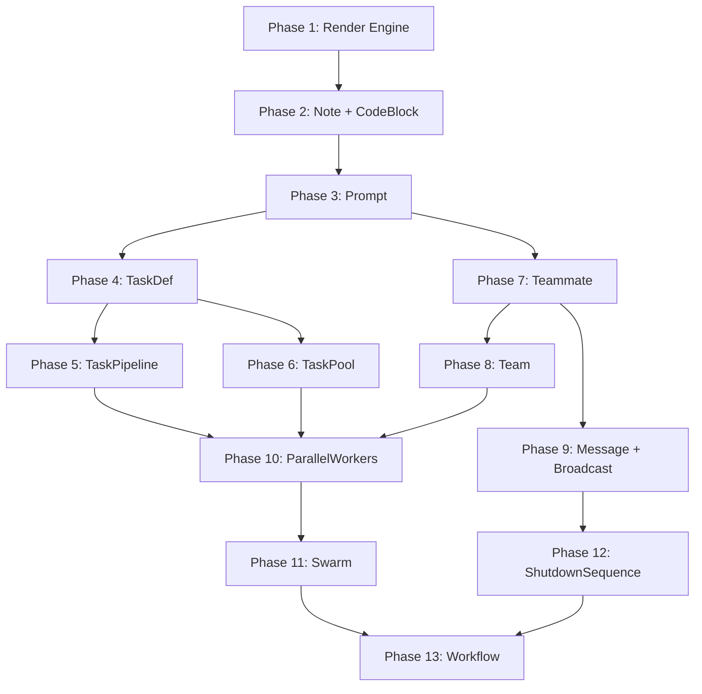
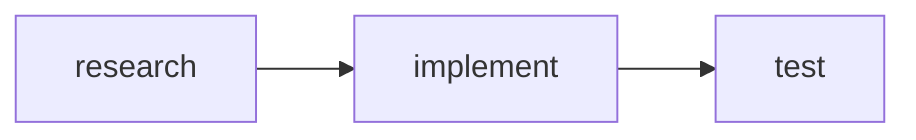

# TSX-to-Markdown Implementation Plan

> Foundation (enums, refs, helpers) already exists in `docs/specs/enums.ts`

---

## Phase Overview



---

## Phase 1: Render Engine

**Goal:** Core rendering system to transform TSX to markdown strings.

**Files:**
- [ ] `src/render/context.ts` - RenderContext interface
- [ ] `src/render/engine.ts` - renderToMarkdown function
- [ ] `src/render/utils.ts` - escaping, formatting helpers

**Deliverables:**
```typescript
interface RenderContext {
  indent: number;
  parent?: string;
}

function renderToMarkdown(element: ReactElement): string;
function escapeMarkdown(text: string): string;
function codeBlock(code: string, lang?: string): string;
```

**Test:**
```typescript
const result = renderToMarkdown(<div>Hello</div>);
expect(typeof result).toBe('string');
```

**Dependencies:** None

---

## Phase 2: Callout + CodeBlock

**Goal:** Simple helper components for callouts and code.

**Files:**
- [ ] `src/components/Note.tsx`
- [ ] `src/components/CodeBlock.tsx`

**Deliverables:**
```tsx
<Callout type={CalloutType.Warning}>Be careful!</Callout>
// → > ⚠️ **Warning:** Be careful!

<CodeBlock lang={CodeLanguage.TypeScript}>
  const x = 1;
</CodeBlock>
// → ```typescript
//   const x = 1;
//   ```
```

**Test:**
```typescript
expect(render(<Callout type={CalloutType.Info}>Hi</Callout>))
  .toBe('> ℹ️ **Info:** Hi');
```

**Dependencies:** Phase 1

---

## Phase 3: Prompt

**Goal:** Prompt container with variable interpolation.

**Files:**
- [ ] `src/components/Prompt.tsx`

**Deliverables:**
```tsx
<Prompt vars={{ file: 'user.rb' }}>
  Review ${file} for security
</Prompt>
// → "Review user.rb for security"
```

**Test:**
```typescript
expect(render(
  <Prompt vars={{ x: 'hello' }}>${x} world</Prompt>
)).toBe('hello world');
```

**Dependencies:** Phase 1

---

## Phase 4: TaskDef

**Goal:** Single task definition with blockedBy support.

**Files:**
- [ ] `src/components/TaskDef.tsx`

**Deliverables:**
```tsx
const Research = defineTask('research', 'Research');
const Plan = defineTask('plan', 'Plan');

<TaskDef task={Research} description="Research best practices" />
<TaskDef task={Plan} description="Create plan" blockedBy={[Research]} />
```

**Output:**
```markdown
- **#1 Research** (`research`)
  - Description: Research best practices

- **#2 Plan** (`plan`)
  - Description: Create plan
  - Blocked By: #1 (research)
```

**Test:**
```typescript
const T1 = defineTask('a', 'A');
const T2 = defineTask('b', 'B');
const md = render(<TaskDef task={T2} description="..." blockedBy={[T1]} />);
expect(md).toContain('Blocked By: #1');
```

**Dependencies:** Phase 1

---

## Phase 5: TaskPipeline

**Goal:** Sequential tasks with auto-chaining and mermaid diagrams.

**Files:**
- [ ] `src/components/TaskPipeline.tsx`

**Deliverables:**
```tsx
<TaskPipeline title="OAuth Flow" autoChain>
  <TaskDef name="research" subject="Research" description="..." />
  <TaskDef name="implement" subject="Implement" description="..." />
  <TaskDef name="test" subject="Test" description="..." />
</TaskPipeline>
```

**Output:**
```markdown
### OAuth Flow



- **#1 Research** ...
- **#2 Implement** (blocked by #1) ...
- **#3 Test** (blocked by #2) ...
```

**Test:**
```typescript
const md = render(
  <TaskPipeline autoChain>
    <TaskDef name="a" subject="A" description="..." />
    <TaskDef name="b" subject="B" description="..." />
  </TaskPipeline>
);
expect(md).toContain('T1[a] --> T2[b]');
```

**Dependencies:** Phase 4

---

## Phase 6: TaskPool

**Goal:** Independent task pool for swarm processing.

**Files:**
- [ ] `src/components/TaskPool.tsx`

**Deliverables:**
```tsx
const pool = createFileReviewPool(['user.rb', 'payment.rb']);

<TaskPool title="File Reviews" tasks={pool.tasks.map(t => ({
  task: t,
  description: 'Review for security'
}))} />
```

**Output:**
```markdown
### File Reviews

| ID | Name | Subject | Description |
|----|------|---------|-------------|
| 1 | user-rb | Review user.rb | Review for security |
| 2 | payment-rb | Review payment.rb | Review for security |
```

**Test:**
```typescript
const pool = createTaskPool([{ name: 'a', subject: 'A' }]);
const md = render(<TaskPool tasks={pool.tasks.map(t => ({ task: t, description: 'x' }))} />);
expect(md).toContain('| 1 | a |');
```

**Dependencies:** Phase 4

---

## Phase 7: Teammate

**Goal:** Team member agent definition.

**Files:**
- [ ] `src/components/Teammate.tsx`

**Deliverables:**
```tsx
const Security = defineWorker('security', PluginAgentType.SecuritySentinel);

<Teammate worker={Security}>
  <Prompt>Review for vulnerabilities</Prompt>
</Teammate>
```

**Output:**
```markdown
#### security

```javascript
Task({
  name: "security",
  subagent_type: "security-sentinel",
  prompt: "Review for vulnerabilities",
  run_in_background: true
})
```
```

**Test:**
```typescript
const worker = defineWorker('x', AgentType.GeneralPurpose);
const md = render(<Teammate worker={worker}><Prompt>Do work</Prompt></Teammate>);
expect(md).toContain('name: "x"');
expect(md).toContain('Do work');
```

**Dependencies:** Phase 3

---

## Phase 8: Team

**Goal:** Team container for multiple teammates.

**Files:**
- [ ] `src/components/Team.tsx`

**Deliverables:**
```tsx
const ReviewTeam = defineTeam('reviewers', [Worker1, Worker2]);

<Team ref={ReviewTeam} description="Code review team">
  <Teammate worker={Worker1}>...</Teammate>
  <Teammate worker={Worker2}>...</Teammate>
</Team>
```

**Output:**
```markdown
## Team: reviewers

> Code review team

```javascript
Teammate({ operation: "spawnTeam", team_name: "reviewers" })
```

### Members

#### worker-1
...

#### worker-2
...
```

**Test:**
```typescript
const team = defineTeam('t', []);
const md = render(<Team ref={team}>...</Team>);
expect(md).toContain('## Team: t');
```

**Dependencies:** Phase 7

---

## Phase 9: Message + Broadcast

**Goal:** Agent-to-agent communication components.

**Files:**
- [ ] `src/components/Message.tsx`
- [ ] `src/components/Broadcast.tsx`

**Deliverables:**
```tsx
<Message type={MessageType.Text} from={Worker1} to={Worker2}>
  Please review the auth module
</Message>

<Broadcast from={Leader}>
  All tasks complete, shutting down
</Broadcast>
```

**Test:**
```typescript
const a1 = defineWorker('a1', AgentType.GeneralPurpose);
const a2 = defineWorker('a2', AgentType.GeneralPurpose);
const md = render(<Message type={MessageType.Text} from={a1} to={a2}>Hi</Message>);
expect(md).toContain('from `a1`');
expect(md).toContain('to `a2`');
```

**Dependencies:** Phase 7

---

## Phase 10: ParallelWorkers

**Goal:** Spawn multiple workers in parallel.

**Files:**
- [ ] `src/components/ParallelWorkers.tsx`

**Deliverables:**
```tsx
<ParallelWorkers
  teamName="reviewers"
  workers={[
    { name: 'security', type: PluginAgentType.SecuritySentinel },
    { name: 'perf', type: PluginAgentType.PerformanceOracle }
  ]}
>
  <Prompt name="security">Review security</Prompt>
  <Prompt name="perf">Review performance</Prompt>
</ParallelWorkers>
```

**Test:**
```typescript
const md = render(<ParallelWorkers teamName="t" workers={[...]} />);
expect(md).toContain('Parallel Workers');
```

**Dependencies:** Phase 5, Phase 6, Phase 8

---

## Phase 11: Swarm

**Goal:** Self-organizing worker pool.

**Files:**
- [ ] `src/components/Swarm.tsx`

**Deliverables:**
```tsx
<Swarm
  teamName="workers"
  workerCount={3}
  workerType={AgentType.GeneralPurpose}
  taskPool={pool}
>
  <Prompt>Claim and complete tasks from the pool</Prompt>
</Swarm>
```

**Test:**
```typescript
const pool = createTaskPool([...]);
const md = render(<Swarm teamName="w" workerCount={2} taskPool={pool}>...</Swarm>);
expect(md).toContain('Worker Pool');
expect(md).toContain('2 workers');
```

**Dependencies:** Phase 10

---

## Phase 12: ShutdownSequence

**Goal:** Graceful shutdown code generation.

**Files:**
- [ ] `src/components/ShutdownSequence.tsx`

**Deliverables:**
```tsx
<ShutdownSequence teammates={['worker-1', 'worker-2']} />
```

**Output:**
```markdown
## Shutdown Sequence

```javascript
// Request shutdown for each teammate
for (const teammate of ['worker-1', 'worker-2']) {
  Teammate({
    operation: 'requestShutdown',
    target_agent_id: teammate
  });
}
// Wait for confirmations...
```
```

**Test:**
```typescript
const md = render(<ShutdownSequence teammates={['a', 'b']} />);
expect(md).toContain('requestShutdown');
expect(md).toContain("'a'");
```

**Dependencies:** Phase 9

---

## Phase 13: Workflow

**Goal:** Top-level workflow container.

**Files:**
- [ ] `src/components/Workflow.tsx`

**Deliverables:**
```tsx
<Workflow name="PR Review" team="reviewers" version="1.0">
  <Team name="reviewers">...</Team>
  <TaskPipeline>...</TaskPipeline>
  <ShutdownSequence teammates={[...]} />
</Workflow>
```

**Output:**
```markdown
# Workflow: PR Review

> Version: 1.0

## Team: reviewers
...

## Task Pipeline
...

## Shutdown Sequence
...
```

**Test:**
```typescript
const md = render(<Workflow name="Test" team="t">...</Workflow>);
expect(md).toContain('# Workflow: Test');
```

**Dependencies:** Phase 11, Phase 12

---

## Summary

| Phase | Component(s) | Dependencies | Est. Lines |
|-------|--------------|--------------|------------|
| 1 | Render Engine | - | ~150 |
| 2 | Callout, CodeBlock | 1 | ~80 |
| 3 | Prompt | 1 | ~60 |
| 4 | TaskDef | 1 | ~100 |
| 5 | TaskPipeline | 4 | ~120 |
| 6 | TaskPool | 4 | ~100 |
| 7 | Teammate | 3 | ~80 |
| 8 | Team | 7 | ~80 |
| 9 | Message, Broadcast | 7 | ~100 |
| 10 | ParallelWorkers | 5, 6, 8 | ~120 |
| 11 | Swarm | 10 | ~100 |
| 12 | ShutdownSequence | 9 | ~60 |
| 13 | Workflow | 11, 12 | ~100 |

**Total:** ~1,250 lines

---

## Parallel Execution Options

These phases can run in parallel:

- **Group A:** Phase 5 (TaskPipeline) + Phase 6 (TaskPool) — both depend only on Phase 4
- **Group B:** Phase 7 (Teammate) can start right after Phase 3
- **Group C:** Phase 9 (Message/Broadcast) can run alongside Phase 8

```
Timeline:
────────────────────────────────────────────────────
P1 ──► P2 ──► P3 ──┬──► P7 ──► P8 ──┬──► P10 ──► P11 ──┐
                   │                │                   │
                   └──► P4 ──┬──► P5 ──┘                ├──► P13
                             │                          │
                             └──► P6 ──────────────────►┤
                                                        │
                   P9 ──────────────────► P12 ──────────┘
```

---

## Quick Start

```bash
# After completing each phase, run tests:
npm test -- --grep "Phase X"

# After Phase 4, you can render basic tasks:
npx ts-node -e "
import { renderToMarkdown } from './src/render';
import { TaskDef, defineTask } from './src/components';

const Task1 = defineTask('research', 'Research');
console.log(renderToMarkdown(<TaskDef task={Task1} description='...' />));
"
```
