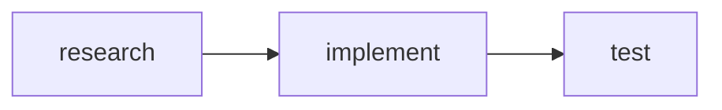
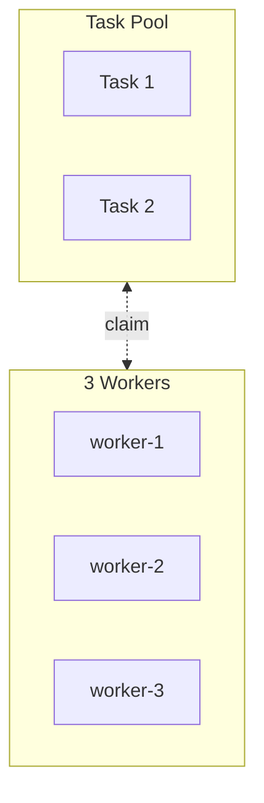
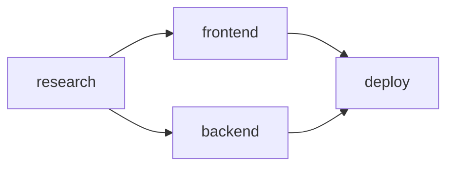

# TSX → Markdown Examples

Quick reference showing TSX input and expected markdown output.

---

## 1. Simple Team

### TSX
```tsx
const Security = defineWorker('security', PluginAgentType.SecuritySentinel);
const ReviewTeam = defineTeam('reviewers', [Security]);

<Team team={ReviewTeam} description="Code review team">
  <Teammate worker={Security} description="Security review">
    <Prompt>Review for vulnerabilities</Prompt>
  </Teammate>
</Team>
```

### Output
```markdown
## Team: reviewers

> Code review team

```javascript
Teammate({ operation: "spawnTeam", team_name: "reviewers" })
```

### Members

#### security

```javascript
Task({
  team_name: "reviewers",
  name: "security",
  subagent_type: "compound-engineering:review:security-sentinel",
  description: "Security review",
  prompt: `Review for vulnerabilities`,
  run_in_background: true
})
```
```

---

## 2. Task Pipeline (Auto-Chain)

### TSX
```tsx
const Research = defineTask('Research', 'research');
const Implement = defineTask('Implement', 'implement');
const Test = defineTask('Test', 'test');

<TaskPipeline title="OAuth Flow" autoChain>
  <TaskDef task={Research} description="Find best practices" />
  <TaskDef task={Implement} description="Build endpoints" />
  <TaskDef task={Test} description="Write tests" />
</TaskPipeline>
```

### Output
```markdown
### OAuth Flow

> Auto-chained: each task blocked by previous



- **#1 Research** (`research`)
  - Description: Find best practices

- **#2 Implement** (`implement`)
  - Description: Build endpoints
  - Blocked By: #1

- **#3 Test** (`test`)
  - Description: Write tests
  - Blocked By: #2
```

---

## 3. Task Pool (Independent)

### TSX
```tsx
const pool = createFileReviewPool(['user.rb', 'payment.rb']);

<TaskPool title="File Reviews" tasks={pool.tasks.map(t => ({
  task: t,
  description: 'Security review'
}))} />
```

### Output
```markdown
### File Reviews

| ID | Name | Subject | Description |
|----|------|---------|-------------|
| 1 | user-rb | Review user.rb | Security review |
| 2 | payment-rb | Review payment.rb | Security review |

```javascript
TaskCreate({ subject: "Review user.rb", description: "Security review" })
TaskCreate({ subject: "Review payment.rb", description: "Security review" })
```
```

---

## 4. Swarm

### TSX
```tsx
<Swarm teamName="audit" workerCount={3} workerType={AgentType.GeneralPurpose}>
  <Prompt>Claim tasks, review file, mark complete, repeat.</Prompt>
</Swarm>
```

### Output
```markdown
### Self-Organizing Swarm



```javascript
Task({ team_name: "audit", name: "worker-1", subagent_type: "general-purpose", prompt: `...`, run_in_background: true })
Task({ team_name: "audit", name: "worker-2", subagent_type: "general-purpose", prompt: `...`, run_in_background: true })
Task({ team_name: "audit", name: "worker-3", subagent_type: "general-purpose", prompt: `...`, run_in_background: true })
```
```

---

## 5. Message

### TSX
```tsx
<Message type={MessageType.Text} from="team-lead" to="security">
  Please prioritize auth module
</Message>
```

### Output
```markdown
**Message** from `team-lead` to `security`:

```javascript
Teammate({
  operation: "write",
  target_agent_id: "security",
  value: "Please prioritize auth module"
})
```
```

---

## 6. Broadcast

### TSX
```tsx
<Broadcast from="team-lead">
  All tasks complete. Shutting down.
</Broadcast>
```

### Output
```markdown
**Broadcast** from `team-lead`:

> ⚠️ Sends N messages for N teammates

```javascript
Teammate({
  operation: "broadcast",
  name: "team-lead",
  value: "All tasks complete. Shutting down."
})
```
```

---

## 7. Shutdown Sequence

### TSX
```tsx
const Security = defineWorker('security', PluginAgentType.SecuritySentinel);
const Perf = defineWorker('perf', PluginAgentType.PerformanceOracle);

<ShutdownSequence
  workers={[Security, Perf]}
  reason="Work complete"
/>
```

### Output
```markdown
### Shutdown

```javascript
// 1. Request shutdown for all workers
Teammate({ operation: "requestShutdown", target_agent_id: "security", reason: "Work complete" })
Teammate({ operation: "requestShutdown", target_agent_id: "perf", reason: "Work complete" })

// 2. Wait for shutdown_approved messages
// Check ~/.claude/teams/{team}/inboxes/team-lead.json for:
// {"type": "shutdown_approved", "from": "security", ...}
// {"type": "shutdown_approved", "from": "perf", ...}

// 3. Cleanup team resources
Teammate({ operation: "cleanup" })
```
```

---

## 8. Parallel Workers

### TSX
```tsx
const Security = defineWorker('security', PluginAgentType.SecuritySentinel);
const Perf = defineWorker('perf', PluginAgentType.PerformanceOracle);
const ReviewTeam = defineTeam('review', [Security, Perf]);

<Team team={ReviewTeam} description="Parallel reviewers">
  <Teammate worker={Security} description="Security check" prompt="Check vulnerabilities" />
  <Teammate worker={Perf} description="Performance check" prompt="Check performance" />
</Team>
```

### Output
```markdown
### Team: review

> Parallel reviewers

```javascript
Teammate({ operation: "spawnTeam", team_name: "review", description: "Parallel reviewers" })
```

#### Members

##### security

```javascript
Task({
  team_name: "review",
  name: "security",
  subagent_type: "compound-engineering:review:security-sentinel",
  description: "Security check",
  prompt: `Check vulnerabilities`,
  run_in_background: true
})
```

##### perf

```javascript
Task({
  team_name: "review",
  name: "perf",
  subagent_type: "compound-engineering:review:performance-oracle",
  description: "Performance check",
  prompt: `Check performance`,
  run_in_background: true
})
```
```

---

## 9. Complete Workflow

### TSX
```tsx
// Define refs first (type-safe)
const Reviewer = defineWorker('reviewer', AgentType.GeneralPurpose);
const ReviewTeam = defineTeam('pr-123', [Reviewer]);

<Workflow name="PR Review" team={ReviewTeam} description="Review PR #123">
  <Team team={ReviewTeam}>
    <Teammate worker={Reviewer} description="Code quality review">
      <Prompt>Review code quality</Prompt>
    </Teammate>
  </Team>
  <ShutdownSequence workers={[Reviewer]} reason="Review complete" />
</Workflow>
```

### Output
```markdown
## Workflow: PR Review

> Review PR #123

---

### Team: pr-123

```javascript
Teammate({ operation: "spawnTeam", team_name: "pr-123" })
```

#### Members

##### reviewer

```javascript
Task({
  team_name: "pr-123",
  name: "reviewer",
  subagent_type: "general-purpose",
  description: "Code quality review",
  prompt: `Review code quality`,
  run_in_background: true
})
```

---

### Shutdown

```javascript
// 1. Request shutdown for all workers
Teammate({ operation: "requestShutdown", target_agent_id: "reviewer", reason: "Review complete" })

// 2. Wait for shutdown_approved messages
// Check ~/.claude/teams/pr-123/inboxes/team-lead.json for:
// {"type": "shutdown_approved", "from": "reviewer", ...}

// 3. Cleanup team resources
Teammate({ operation: "cleanup" })
```
```

**Notes:**
- Workflow uses h2 (allows multiple workflows in one doc)
- Children (Team, Shutdown) use h3
- `team` prop must match first `<Team>` child
- ShutdownSequence inherits team context from Workflow

---

## 10. Callout & CodeBlock

### TSX
```tsx
<Callout type={CalloutType.Warning}>Don't forget to cleanup!</Callout>

<CodeBlock lang={CodeLanguage.TypeScript}>
const x = 1;
</CodeBlock>
```

### Output
```markdown
> ⚠️ **Warning:** Don't forget to cleanup!

```typescript
const x = 1;
```
```

---

## 11. Prompt with Variables

### TSX
```tsx
<Prompt vars={{ file: 'user.rb', concern: 'security' }}>
  Review ${file} for ${concern} issues
</Prompt>
```

### Output
```markdown
Review user.rb for security issues
```

---

## 12. Complex Pipeline (Parallel Stages)

### TSX
```tsx
const Research = defineTask('Research', 'research');
const Frontend = defineTask('Frontend', 'frontend');
const Backend = defineTask('Backend', 'backend');
const Deploy = defineTask('Deploy', 'deploy');

<TaskPipeline title="Full Stack">
  <TaskDef task={Research} description="Requirements" />
  <TaskDef task={Frontend} description="Build UI" blockedBy={[Research]} />
  <TaskDef task={Backend} description="Build API" blockedBy={[Research]} />
  <TaskDef task={Deploy} description="Ship it" blockedBy={[Frontend, Backend]} />
</TaskPipeline>
```

### Output
```markdown
### Full Stack



- **#1 Research** - Requirements
- **#2 Frontend** - Build UI (blocked by #1)
- **#3 Backend** - Build API (blocked by #1)
- **#4 Deploy** - Ship it (blocked by #2, #3)
```
