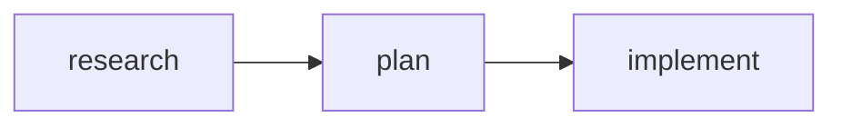

# Swarm System

Type-safe task orchestration for Claude Code's multi-agent capabilities. Build pipelines, coordinate teams, and manage agent lifecycles with full TypeScript support.

## Quick Start

```tsx
import { Command, defineTask, TaskDef, TaskPipeline } from 'react-agentic';

const Research = defineTask('Research best practices', 'research');
const Plan = defineTask('Create implementation plan', 'plan');
const Implement = defineTask('Build the feature', 'implement');

export default () => (
  <Command name="feature-pipeline" description="Feature implementation workflow">
    <TaskPipeline title="Feature Implementation" autoChain>
      <TaskDef task={Research} description="Research approach" activeForm="Researching..." />
      <TaskDef task={Plan} description="Design solution" activeForm="Planning..." />
      <TaskDef task={Implement} description="Build feature" activeForm="Building..." />
    </TaskPipeline>
  </Command>
);
```

**Output:**



---

## Factory Functions

Factory functions create type-safe references that connect to Claude Code's task and agent systems.

### defineTask(subject, name?)

Creates a type-safe task reference.

| Parameter | Type | Required | Description |
|-----------|------|----------|-------------|
| `subject` | `string` | Yes | Human-readable title (maps to `TaskCreate.subject`) |
| `name` | `string` | No | Short label for mermaid diagrams (derived from subject if not provided) |

**Returns:** `TaskRef`

```tsx
// Simple usage (name auto-derived from subject)
const Research = defineTask('Research best practices');
// Research.name = "research-best-p" (truncated to 15 chars)

// Explicit name for cleaner labels
const Research = defineTask('Research best practices', 'research');
// Research.name = "research"
```

### defineWorker(name, type, model?)

Creates a type-safe worker reference for Claude Code subagents.

| Parameter | Type | Required | Description |
|-----------|------|----------|-------------|
| `name` | `string` | Yes | Worker identifier |
| `type` | `AgentType \| PluginAgentType` | Yes | Claude Code subagent type |
| `model` | `Model` | No | Model preference (haiku, sonnet, opus) |

**Returns:** `WorkerRef`

```tsx
import { defineWorker, AgentType, PluginAgentType, Model } from 'react-agentic';

// Built-in agent types
const Explorer = defineWorker('explorer', AgentType.Explore, Model.Haiku);
const Planner = defineWorker('planner', AgentType.Plan);
const Builder = defineWorker('builder', AgentType.GeneralPurpose);

// Plugin agent types (compound-engineering)
const Security = defineWorker('security', PluginAgentType.SecuritySentinel);
const Perf = defineWorker('perf', PluginAgentType.PerformanceOracle);
```

### defineTeam(name, members?)

Creates a type-safe team reference.

| Parameter | Type | Required | Description |
|-----------|------|----------|-------------|
| `name` | `string` | Yes | Team identifier |
| `members` | `WorkerRef[]` | No | Array of worker references |

**Returns:** `TeamRef`

```tsx
const ReviewTeam = defineTeam('pr-review', [Security, Perf]);
```

---

## Components

### `<TaskDef>`

Defines a single task in a pipeline.

| Prop | Type | Required | Description |
|------|------|----------|-------------|
| `task` | `TaskRef` | Yes | Task reference from `defineTask()` |
| `description` | `string` | Yes | Task description (maps to `TaskCreate.description`) |
| `activeForm` | `string` | No | Present-tense form shown during execution |
| `blockedBy` | `TaskRef[]` | No | Tasks that must complete before this one |

```tsx
const Research = defineTask('Research options', 'research');
const Plan = defineTask('Create plan', 'plan');

<TaskDef
  task={Research}
  description="Research OAuth2 providers and compare options"
  activeForm="Researching..."
/>

<TaskDef
  task={Plan}
  description="Create implementation plan based on research"
  activeForm="Planning..."
  blockedBy={[Research]}
/>
```

**Output:**

```javascript
TaskCreate({ subject: "Research options", description: "Research OAuth2 providers and compare options", activeForm: "Researching..." })
TaskCreate({ subject: "Create plan", description: "Create implementation plan based on research", activeForm: "Planning..." })

TaskUpdate({ taskId: "2", addBlockedBy: ["1"] })
```

### `<TaskPipeline>`

Groups tasks into a pipeline with optional auto-chaining.

| Prop | Type | Required | Description |
|------|------|----------|-------------|
| `title` | `string` | No | Pipeline section heading |
| `autoChain` | `boolean` | No | Auto-add `blockedBy` to sequential tasks (default: false) |
| `children` | `TaskDef[]` | Yes | Task definitions |

**With autoChain (sequential pipeline):**

```tsx
<TaskPipeline title="OAuth Implementation" autoChain>
  <TaskDef task={Research} description="Research providers" activeForm="Researching..." />
  <TaskDef task={Plan} description="Create plan" activeForm="Planning..." />
  <TaskDef task={Implement} description="Build integration" activeForm="Building..." />
</TaskPipeline>
```

**Without autoChain (explicit dependencies - DAG):**

```tsx
<TaskPipeline title="PR Review">
  <TaskDef task={Fetch} description="Fetch PR" />
  <TaskDef task={Analyze} description="Analyze changes" blockedBy={[Fetch]} />
  <TaskDef task={Security} description="Security review" blockedBy={[Analyze]} />
  <TaskDef task={Perf} description="Performance review" blockedBy={[Analyze]} />
  <TaskDef task={Report} description="Generate report" blockedBy={[Security, Perf]} />
</TaskPipeline>
```

**Output includes:**

1. Mermaid flowchart visualization
2. JavaScript `TaskCreate` and `TaskUpdate` calls
3. Summary table with dependencies

### `<Team>`

Spawns a team of workers for parallel execution.

| Prop | Type | Required | Description |
|------|------|----------|-------------|
| `team` | `TeamRef` | Yes | Team reference from `defineTeam()` |
| `description` | `string` | No | Team description |
| `children` | `Teammate[]` | Yes | Team members |

```tsx
<Team team={ReviewTeam} description="Code review specialists">
  <Teammate worker={Security} description="Security review" prompt="..." />
  <Teammate worker={Perf} description="Performance review" prompt="..." />
</Team>
```

**Output:**

```javascript
Teammate({ operation: "spawnTeam", team_name: "pr-review", description: "Code review specialists" })
```

### `<Teammate>`

Defines a worker within a team.

| Prop | Type | Required | Description |
|------|------|----------|-------------|
| `worker` | `WorkerRef` | Yes | Worker reference from `defineWorker()` |
| `description` | `string` | Yes | Short description for `Task.description` |
| `prompt` | `string` | No* | Full prompt instructions |
| `model` | `Model` | No | Override worker's model |
| `mode` | `TaskMode` | No | Task execution mode (e.g., `"plan"` for plan approval) |
| `background` | `boolean` | No | Run in background (default: true) |
| `children` | `<Prompt>` | No* | Alternative to `prompt` prop for complex prompts |

*Either `prompt` prop OR `<Prompt>` child required.

**Simple prompt:**

```tsx
<Teammate
  worker={Security}
  description="Security audit"
  prompt="Review for OWASP top 10 vulnerabilities. Send findings to team-lead."
/>
```

**Complex prompt with `<Prompt>` child:**

```tsx
<Teammate worker={Security} description="Security audit">
  <Prompt>
    <h2>Security Review</h2>
    <XmlBlock name="focus_areas">
      <ul>
        <li>SQL injection</li>
        <li>XSS attacks</li>
        <li>Auth bypass</li>
      </ul>
    </XmlBlock>
    <p>Send findings to team-lead.</p>
  </Prompt>
</Teammate>
```

**Output:**

```javascript
Task({
  team_name: "pr-review",
  name: "security",
  subagent_type: "compound-engineering:review:security-sentinel",
  description: "Security audit",
  prompt: `Review for OWASP top 10 vulnerabilities. Send findings to team-lead.`,
  run_in_background: true
})
```

### `<ShutdownSequence>`

Gracefully shuts down workers at the end of a workflow.

| Prop | Type | Required | Description |
|------|------|----------|-------------|
| `workers` | `WorkerRef[]` | Yes | Workers to shut down |
| `reason` | `string` | No | Shutdown reason (default: "Shutdown requested") |
| `cleanup` | `boolean` | No | Include cleanup operation (default: true) |
| `team` | `TeamRef` | No | Team reference (inherited from Workflow if nested) |
| `title` | `string` | No | Section heading (default: "Shutdown") |

```tsx
<ShutdownSequence
  workers={[Security, Perf]}
  reason="All reviews complete"
/>
```

**Output:**

```javascript
// 1. Request shutdown for all workers
Teammate({ operation: "requestShutdown", target_agent_id: "security", reason: "All reviews complete" })
Teammate({ operation: "requestShutdown", target_agent_id: "perf", reason: "All reviews complete" })

// 2. Wait for shutdown_approved messages
// Check ~/.claude/teams/{team}/inboxes/team-lead.json for:
// {"type": "shutdown_approved", "from": "security", ...}
// {"type": "shutdown_approved", "from": "perf", ...}

// 3. Cleanup team resources
Teammate({ operation: "cleanup" })
```

### `<Workflow>`

Orchestrates Team, TaskPipeline, and ShutdownSequence with context propagation.

| Prop | Type | Required | Description |
|------|------|----------|-------------|
| `name` | `string` | Yes | Workflow name (appears in heading) |
| `team` | `TeamRef` | Yes | Primary team (propagated to children) |
| `description` | `string` | No | Workflow description |
| `children` | `ReactNode` | Yes | Team, TaskPipeline, ShutdownSequence |

```tsx
<Workflow name="Feature X" team={FeatureTeam} description="Build feature with review">
  <Team team={FeatureTeam}>
    <Teammate worker={Security} description="Security" prompt="..." />
    <Teammate worker={Perf} description="Performance" prompt="..." />
  </Team>

  <TaskPipeline title="Implementation" autoChain>
    <TaskDef task={Research} description="Research" />
    <TaskDef task={Plan} description="Plan" />
    <TaskDef task={Implement} description="Build" />
  </TaskPipeline>

  <ShutdownSequence workers={[Security, Perf]} reason="Complete" />
</Workflow>
```

---

## Builder API

### createPipeline()

Fluent builder for creating pipelines programmatically.

```tsx
import { createPipeline, TaskPipeline, TaskDef } from 'react-agentic';

const pipeline = createPipeline('OAuth Implementation')
  .task('Research OAuth providers', 'research')
  .task('Create implementation plan', 'plan')
  .task('Build OAuth integration', 'implement')
  .build();

// Access individual task refs by name
const { research, plan, implement } = pipeline.tasks;

// Use in JSX
<TaskPipeline title={pipeline.title}>
  {pipeline.stages.map(stage => (
    <TaskDef
      key={stage.task.__id}
      task={stage.task}
      description={stage.description ?? ''}
      blockedBy={stage.blockedBy}
    />
  ))}
</TaskPipeline>
```

**Builder Interface:**

```typescript
interface PipelineBuilder {
  task(subject: string, name?: string, description?: string): PipelineBuilder;
  build(): Pipeline;
}

interface Pipeline {
  title: string;
  tasks: Record<string, TaskRef>;  // Keyed by name
  stages: PipelineStage[];
}

interface PipelineStage {
  task: TaskRef;
  description?: string;
  blockedBy: TaskRef[];  // Auto-set to previous task
}
```

---

## Enums Reference

### AgentType

Built-in Claude Code subagent types.

| Value | Maps to `subagent_type` |
|-------|-------------------------|
| `AgentType.Bash` | `"Bash"` |
| `AgentType.Explore` | `"Explore"` |
| `AgentType.Plan` | `"Plan"` |
| `AgentType.GeneralPurpose` | `"general-purpose"` |

### PluginAgentType

Plugin agent types (compound-engineering).

| Value | Maps to `subagent_type` |
|-------|-------------------------|
| `PluginAgentType.SecuritySentinel` | `"compound-engineering:review:security-sentinel"` |
| `PluginAgentType.PerformanceOracle` | `"compound-engineering:review:performance-oracle"` |
| `PluginAgentType.ArchitectureStrategist` | `"compound-engineering:review:architecture-strategist"` |
| `PluginAgentType.BestPracticesResearcher` | `"compound-engineering:research:best-practices-researcher"` |

### Model

Claude model options.

| Value | Maps to `model` |
|-------|-----------------|
| `Model.Haiku` | `"haiku"` |
| `Model.Sonnet` | `"sonnet"` |
| `Model.Opus` | `"opus"` |

### TaskMode

Task execution modes.

| Value | Maps to `mode` |
|-------|----------------|
| `TaskMode.Plan` | `"plan"` |

Use `mode="plan"` to require plan approval before execution.

---

## Best Practices

### Use explicit task names for readability

```tsx
// Good - clean mermaid labels
const Research = defineTask('Research OAuth providers', 'research');

// Avoid - auto-derived names can be truncated
const Research = defineTask('Research OAuth providers and compare features');
// Name becomes: "research-oauth-"
```

### Use autoChain for sequential pipelines

```tsx
// Good - concise for linear workflows
<TaskPipeline title="Implementation" autoChain>
  <TaskDef task={Step1} ... />
  <TaskDef task={Step2} ... />
  <TaskDef task={Step3} ... />
</TaskPipeline>

// Use explicit blockedBy for DAGs
<TaskPipeline title="Review">
  <TaskDef task={Analyze} ... />
  <TaskDef task={Security} blockedBy={[Analyze]} ... />
  <TaskDef task={Perf} blockedBy={[Analyze]} ... />
  <TaskDef task={Report} blockedBy={[Security, Perf]} ... />
</TaskPipeline>
```

### Keep prompts actionable

```tsx
// Good - clear instructions with communication pattern
<Teammate
  worker={Security}
  description="Security audit"
  prompt="Review for OWASP top 10 vulnerabilities. Send findings to team-lead when complete."
/>

// Avoid - vague instructions
<Teammate
  worker={Security}
  description="Security"
  prompt="Do security stuff."
/>
```

### Match team prop in Workflow to first Team child

```tsx
const MyTeam = defineTeam('my-team', [Worker1, Worker2]);

// Good - team props match
<Workflow name="My Workflow" team={MyTeam}>
  <Team team={MyTeam}>...</Team>
</Workflow>

// Error - mismatch between Workflow.team and Team.team
<Workflow name="My Workflow" team={MyTeam}>
  <Team team={DifferentTeam}>...</Team>
</Workflow>
```

---

## Examples

See the complete examples in `src/app/examples/`:

| Example | Description |
|---------|-------------|
| `oauth-pipeline.tsx` | Basic TaskPipeline with `autoChain` |
| `pr-review-pipeline.tsx` | DAG with parallel tasks using `blockedBy` |
| `migration-workflow.tsx` | Full Workflow with Team, Pipeline, and Shutdown |

Build examples:

```bash
node dist/cli/index.js build "src/app/examples/*.tsx"
```

Output appears in `.claude/commands/`.
